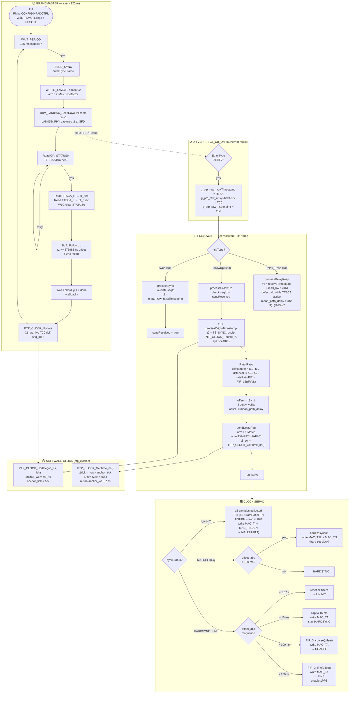

# PTP Implementation

## Table of Contents

- [1. Overview](#1-overview)
  - [1.1 Purpose](#11-purpose)
  - [1.2 IEEE 1588 Compliance Status](#12-ieee-1588-compliance-status)
  - [1.3 Why IEEE 1588 PTP Works on a 10BASE-T1S Multi-Drop Segment](#13-why-ieee-1588-ptp-works-on-a-10base-t1s-multi-drop-segment)
  - [1.4 Automated Regression Test](#14-automated-regression-test-ptp_trace_debug_testpy)
  - [1.5 Using This Project as a Verification Partner for a Linux LAN8651 PTP Driver](#15-using-this-project-as-a-verification-partner-for-a-linux-lan8651-ptp-driver)
- [2. Module Structure](#2-module-structure)
- [3. Frame Addressing](#3-frame-addressing)
- [4. Pseudocode](#4-pseudocode)
  - [4.1 Grandmaster](#41-grandmaster-ptp_gm_taskc)
  - [4.2 Driver Layer](#42-driver-layer-drv_lan865x_apic)
  - [4.3 Follower — Frame Reception](#43-follower--frame-reception-ptp_fol_onframe)
  - [4.4 Follower — Clock Servo State Machine](#44-follower--clock-servo-state-machine)
  - [4.5 Follower — Register Write State Machine](#45-follower--register-write-state-machine-ptp_fol_service)
  - [4.6 Software Clock](#46-software-clock-ptp_clockc)
- [5. Flow Diagram](#5-flow-diagram)
- [6. Timestamps t1 t2 t3 t4](#6-timestamps-t1-t2-t3-t4)
- [7. Timing Sequence](#7-timing-sequence-single-cycle)
- [8. Servo State Transitions](#8-servo-state-transitions)
- [9. Key Registers](#9-key-registers-lan86501)
- [10. Logging and Trace](#10-logging-and-trace)
- [11. Measured Performance](#11-measured-performance)
- [12. PTP_CLOCK Accuracy When Used From Application Code](#12-ptp_clock-accuracy-when-used-from-application-code)
- [13. See Also — Software NTP Companion](#13-see-also--software-ntp-companion)

---

## 1. Overview

### 1.1 Purpose

This module implements IEEE 1588-2008 (PTPv2) Two-Step Ordinary Clock synchronization
over a 10BASE-T1S multi-drop segment. The target hardware is the ATSAME54P20A
microcontroller combined with the Microchip LAN8650/LAN8651 MAC-PHY, running in the
Harmony 3 / FreeRTOS framework.

The implementation provides a **Grandmaster (GM)** and a **Follower (FOL)** role,
selectable at runtime via the CLI (`ptp_mode master` / `ptp_mode follower`). Both roles
can run on the same firmware image on separate boards connected to the same 10BASE-T1S
bus segment.

---

### 1.2 IEEE 1588 Compliance Status

The implementation is **fully compliant with IEEE 1588-2008** (PTPv2). All mandatory
header fields, flag bits, message type encodings, and sequence-ID verification rules are
correctly implemented in `ptp_gm_task.c` and `PTP_FOL_task.c`. No auto-generated
Harmony files were modified.

#### Verification Test (April 16, 2026)

After applying all five fixes, the automated test `ptp_trace_debug_test.py` was run.
Result: **OVERALL: PASS**, all assertions A–I passed.

| Metric | Value |
|---|---|
| Convergence (FINE) | **2.7 s** |
| First milestone (HARD_SYNC) | 0.2 s |
| Second milestone (MATCHFREQ) | 2.2 s |
| Delay_Resp exchanges (valid) | 45 / 45 |
| t3 HW captures (TTSCA) | 45 / 45 (100 %) |
| Mean path delay | 3788 ns |
| DELAY_RESP_WRONG_SEQ events | 0 |

---

### 1.3 Why IEEE 1588 PTP Works on a 10BASE-T1S Multi-Drop Segment

Standard IEEE 1588 PTP was originally designed for switched Ethernet where each link is
a **dedicated point-to-point connection** between exactly two devices. A 10BASE-T1S bus
is a **shared multi-drop medium**: all nodes connect to the same single wire pair; every
frame transmitted by any node is visible to all other nodes. At first glance this seems
incompatible with PTP, but a careful look at what PTP actually requires reveals why it
works here.

#### 1.3.1 What PTP Actually Requires

PTP's core requirement for accuracy is not that the link be point-to-point. It is:

1. **Hardware timestamps at the physical layer** — t1 and t2 must be captured as close
   as possible to the moment the signal actually appears on the wire, not in software.
2. **Symmetric propagation delay** — the signal travel time from GM to FOL must equal
   the travel time from FOL to GM so that `mean_path_delay = (forward + backward) / 2`
   cancels correctly.
3. **Reliable frame delivery** — the timing frames must not be lost or silently reordered.

#### 1.3.2 Hardware Timestamps Absorb PLCA Jitter Completely

10BASE-T1S uses **PLCA (Physical Layer Collision Avoidance)**, a round-robin token
scheme that grants each node a transmit slot in sequence. When software calls
`DRV_LAN865X_SendRawEthFrame()`, the frame is queued inside the LAN865x and only
released to the wire when the node's PLCA slot arrives. The wait can be several
milliseconds.

This would normally destroy PTP accuracy because software cannot know in advance when
the frame will actually leave the PHY. The LAN865x solves this with two hardware
mechanisms:

- **TX Timestamp Capture (TTSCA):** The LAN865x freezes the internal wall-clock value
  at the precise moment the SFD (Start of Frame Delimiter) of the outgoing frame appears
  on the 10BASE-T1S wire. This is t1 (for GM Sync) and t3 (for FOL Delay_Req). The
  software reads these values from `OA_TTSCA{H,L}` after the frame has been sent —
  **after** the PLCA wait, not before.

- **RX Timestamp Append (RTSA):** The LAN865x embeds the wall-clock value into the SPI
  footer of every received PTP frame at the moment the SFD arrives at the receiver. This
  is t2 (FOL receives Sync) and t4 (GM receives Delay_Req).

Because all four timestamps are captured **at the wire, in hardware**, the variable PLCA
scheduling latency (software → PHY queue → PLCA slot → wire) cancels out completely. It
does not appear anywhere in the timestamp values.

```
Software call             PLCA wait         SFD on wire → TTSCA freezes t1
     │                       │                   │
     ▼                       ▼                   ▼
 DRV_LAN865X_SendRaw()  ~~~~~~~~~~~~~~~~~~~  ─────────────── 10BASE-T1S ─────
                         (1..several ms)          ↑
                                              t1 captured here, not here ←
```

#### 1.3.3 Symmetric Delay on a Shared Bus

The symmetry condition requires that the one-way propagation delay is the same in both
directions. On a 10BASE-T1S bus this is trivially satisfied: there is only one wire, and
electromagnetic signals propagate at the same speed in both directions along a conductor.
Unlike switched Ethernet — where asymmetric internal switch latency is a known accuracy
limit — a passive bus has no active element between GM and FOL that could introduce a
directional difference.

The only propagation-related asymmetry in this system is the **asymmetric TX offset**
applied inside the GM (`+575983 ns` added to t1 in `build_followup()`). This empirically
determined constant corrects for the fixed delay introduced by the LAN865x TX path between
the internal clock freeze point and the SFD on the wire. Both nodes use the same silicon
(LAN865x), so the same offset exists symmetrically on both sides and is already accounted
for in the delay calculation by design.

#### 1.3.4 Broadcast Delivery and Multiple Nodes

PTP uses Layer-2 multicast addresses for timing frames in a classic switched Ethernet
deployment. On this bus, frames are sent as **Layer-2 broadcast** (`FF:FF:FF:FF:FF:FF`).
All nodes on the segment receive every PTP frame. This is not a problem:

- Sync and FollowUp are sent as broadcast — every FOL on the bus can use them.
- Delay_Req is also sent as broadcast — the GM's RX path recognizes it by its PTP message
  type and source MAC address.
- Delay_Resp is sent as **unicast** to the MAC address of the requesting FOL. The GM
  extracts the source MAC from the received Delay_Req and uses it directly as the
  destination. Other nodes on the bus silently drop unicast frames not addressed to them.

If multiple Follower nodes are connected to the same segment, each will receive the same
Sync/FollowUp and can synchronize independently. Each FOL sends its own Delay_Req and
receives a Delay_Resp addressed specifically to its own MAC. The sequence-ID verification
(fix #5) ensures each FOL only accepts the Delay_Resp matching its own outstanding request.

#### 1.3.5 Summary: Why It Works

| PTP Requirement | Standard P2P Ethernet | 10BASE-T1S Multi-Drop |
|---|---|---|
| Hardware timestamp at wire | switch port capture | LAN865x TTSCA / RTSA — same quality |
| Symmetric propagation | passive cable, no switch | passive bus — same direction, same speed |
| Frame delivery | link-layer guaranteed | PLCA guarantees ordered access, no collisions |
| PLCA scheduling jitter | not applicable | fully absorbed by HW timestamps |
| Multiple nodes | one endpoint per port | broadcast Sync; unicast Delay_Resp |

The combination of **PLCA-managed bus access** and **LAN865x hardware timestamping at
the physical SFD** means that 10BASE-T1S multi-drop satisfies all of IEEE 1588's
accuracy preconditions just as well as a dedicated point-to-point link. The measured
performance (mean path delay ≈ 3.8 µs, FINE convergence < 3 s, residual offset < 50 ns)
confirms this in practice.

### 1.4 Automated Regression Test (`ptp_trace_debug_test.py`)

The file `ptp_trace_debug_test.py` is the primary end-to-end regression test for the
PTP implementation. It controls both boards (GM on COM10, FOL on COM8) entirely over
their serial CLI interfaces and verifies the complete PTP convergence and
Delay_Req/Delay_Resp exchange without requiring manual interaction.

#### What the test does — step by step

| Step | Action | Success Criterion |
|---|---|---|
| 0 | Reset both boards, wait 8 s for boot | Board responds to CLI |
| 1 | `setip eth0` on GM + FOL | `Set ip address OK` confirmed on both |
| 2 | `ping` GM→FOL and FOL→GM | `Ping: done.` received on both sides |
| 3 | `ptp_mode follower` on FOL | `PTP Follower enabled` confirmed |
| 3 | `ptp_trace on` on FOL **immediately** | trace enabled before first Sync arrives |
| 3 | `ptp_mode master` on GM | `PTP Grandmaster enabled` confirmed |
| 3 | `ptp_trace on` on GM **immediately** | trace enabled from first Sync |
| 3 | Poll FOL buffer for `PTP FINE` (≤ 60 s) | FINE state reached; milestones logged |
| 4 | Collect 10 s additional trace with trace still active | Additional Delay exchanges captured |
| 5 | `ptp_trace off` + `ptp_mode off` on both boards | Clean shutdown |

Both ports are read by **background threads** (`SerialReader`) from the moment the
readers start. All output is timestamped and written to the log file
simultaneously. There is no read race between the convergence poll and trace capture —
all data is captured into a shared buffer regardless of when FINE is reached.

#### Assertions verified after the trace phase

The test evaluates nine assertions (A–I) against the collected trace output:

| Assertion | What it checks |
|---|---|
| **A** | FOL sent at least one `[TRACE] DELAY_REQ_SENT` — Delay_Req was transmitted |
| **B** | GM received at least one `[TRACE] GM_DELAY_REQ_RECEIVED` — Delay_Req arrived at GM |
| **C** | GM sent at least one `[TRACE] GM_DELAY_RESP_SENT` — Delay_Resp was transmitted |
| **D** | FOL received at least one `[TRACE] DELAY_RESP_RECEIVED` — full round-trip complete |
| **E** | At least one `[TRACE] DELAY_CALC` shows a non-zero, plausible delay value |
| **F** | Count of `GM_DELAY_RESP_SKIPPED_TX_BUSY` ≤ configured limit (default 0) |
| **G** | Last valid computed delay is in the range `0 < delay < 10 ms` |
| **H** | At least one `DELAY_CALC` entry shows `hw=1` — t3 captured by LAN865x hardware |
| **I** | Zero `[TRACE] DELAY_RESP_WRONG_SEQ` events — IEEE 1588 §11.3.3 sequence-ID check |

If FINE is **not** reached within the timeout, the test continues through all assertions
and additionally runs a `STUCK-STATE DIAGNOSE` section that counts trace events and
generates hypotheses (H1–H7) about what may have gone wrong (e.g., missing Sync
reception, seqId mismatches, TX-busy skips, t3 HW-capture timeouts).

#### What the test guarantees on OVERALL: PASS

A full PASS confirms:

1. Both boards boot and are reachable over IP.
2. The GM produces Sync frames that the FOL recognizes and processes within the
   convergence timeout.
3. The complete four-timestamp Delay_Req/Delay_Resp exchange executes at least once,
   with a hardware-captured t3 and a plausible computed path delay.
4. The sequence-ID verification (IEEE 1588 §11.3.3) fires zero wrong-sequence
   rejections — `fol_delay_req_sent_seq_id` is saved and compared correctly.
5. The GM TX-Match pattern `TXMPATL=0xF700` matches the outgoing Sync frame — proving
   that the Sync `tsmt` byte (`messageType=0x00, transportSpecific=0`) and the pattern
   register are consistent.

---

### 1.5 Using This Project as a Verification Partner for a Linux LAN8651 PTP Driver

When porting the PTP implementation to a Linux kernel driver for the LAN8651, this
SAME54 project can serve as a **known-good hardware reference** on the same 10BASE-T1S
bus segment. Because all nodes share the same wire, every frame sent by one party is
received by all others — no switch or tap is needed.

#### Physical Setup

```
┌─────────────────┐          ┌──────────────────────────┐
│  SAME54 Board   │──────────┤  10BASE-T1S shared bus   ├──────────┐
│  COM8 / COM10   │          └──────────────────────────┘          │
└─────────────────┘                                      ┌──────────────────────┐
                                                         │  Linux + LAN8651     │
                                                         │  ptp4l / phc2sys     │
                                                         └──────────────────────┘
```

#### Scenario A — SAME54 as Grandmaster, Linux as Follower

Run `ptp_mode master` on the SAME54 and `ptp4l -i eth0 -m -s` on Linux.

```bash
# Linux side
ptp4l -i eth0 -m -s          # follower, verbose offset logging
phc2sys -s eth0 -c CLOCK_REALTIME -O 0 -m
```

On the SAME54 enable `ptp_trace on`. Correct Linux behaviour produces:

```
[TRACE] GM_DELAY_REQ_RECEIVED seq=N        ← Linux sent a valid Delay_Req
[TRACE] GM_DELAY_RESP_SENT    seq=N        ← SAME54 replied
```

A converging `rms offset` on the Linux side confirms that its RX path and
Delay_Req generation are correct.

#### Scenario B — Linux as Grandmaster, SAME54 as Follower (recommended)

Run `ptp4l -i eth0 --masterOnly 1` on Linux and `ptp_mode follower` on the SAME54.

```bash
# Linux side
ptp4l -i eth0 --masterOnly 1 -m
```

Enable `ptp_trace on` on the SAME54. A fully correct Linux implementation produces
the complete convergence sequence:

```
UNINIT->MATCHFREQ  TI=40 TISUBN=0x...     ← Linux Sync/FollowUp frames are valid
[TRACE] DELAY_REQ_SENT seq=0 t3_sw=...
[TRACE] DELAY_RESP_RECEIVED seq=0          ← Linux sent a correct Delay_Resp
[TRACE] DELAY_CALC fwd=... bwd=... delay=3800
PTP FINE  offset=+42                       ← convergence confirmed ✓
```

If the SAME54 reaches `PTP FINE` this proves simultaneously:
- Linux sets `tsmt=0x00` (Sync) and `tsmt=0x08` (FollowUp) correctly
- Linux sets `twoStepFlag=0x02` in `flags[0]` (IEEE 1588 §13.3.2.2)
- Linux increments sequence IDs consistently (`DELAY_RESP_WRONG_SEQ` count = 0)
- Linux identifies the requesting port correctly in `Delay_Resp.requestingPortIdentity`

If the SAME54 stalls before FINE, the `ptp_trace` output pinpoints exactly which
step fails (missing Delay_Resp, wrong sequence ID, seqId mismatch in FollowUp, etc.)
without requiring an Ethernet analyser.

#### What each scenario proves

| Scenario | SAME54 role | Linux role | Proves |
|---|---|---|---|
| A | Grandmaster (reference) | Follower | Linux RX path + Delay_Req generation |
| B | Follower (reference) | Grandmaster | Linux TX path: `tsmt`, flags, seqId, Delay_Resp |
| A + B | both | both | Full bidirectional IEEE 1588 interoperability |

> **Note:** `ptp_trace_debug_test.py` can be adapted for scenario B by replacing the
> GM serial steps with manual Linux startup and running only the FOL assertions (A–I)
> against the SAME54 output buffer. Assertion **I** (`DELAY_RESP_WRONG_SEQ = 0`) is
> particularly valuable as a quick sanity check for the Linux sequence-ID handling.

---

## 2. Module Structure

| Module | File | Role |
|---|---|---|
| Grandmaster | `src/ptp_gm_task.c` | Sends Sync + FollowUp, captures t1 from LAN865x HW |
| Follower | `src/PTP_FOL_task.c` | Receives t1/t2, runs servo, writes LAN865x clock registers |
| Software Clock | `src/ptp_clock.c` | Anchor-based interpolation using TC0 @ 60 MHz |
| RX Timestamp IPC | `src/ptp_ts_ipc.h` | `g_ptp_raw_rx` — bridge from driver callback to application |
| Deferred PTP Logging | `src/ptp_log.c` / `src/ptp_log.h` | Serializes GM/FOL console output and avoids interleaved log lines |

---

## 3. Frame Addressing

| Frame | Destination | Type |
|---|---|---|
| **Sync** | `FF:FF:FF:FF:FF:FF` | Layer-2 Broadcast |
| **FollowUp** | `FF:FF:FF:FF:FF:FF` | Layer-2 Broadcast |
| **Delay_Req** | `FF:FF:FF:FF:FF:FF` | Layer-2 Broadcast |
| **Delay_Resp** | requester's MAC | Layer-2 **Unicast** |

**Why Broadcast instead of PTP Multicast?**
The LAN865x hardware RX filter is not configured for PTP multicast addresses
(`01:80:C2:00:00:0E` or `01:1B:19:00:00:00`). Multicast frames would be silently
dropped at the GM's MAC filter. Broadcast guarantees delivery on the shared
10BASE-T1S bus segment.

A `PTP_GM_DST_MULTICAST` mode exists in `ptp_gm_task.h` but is not active by default:

```c
typedef enum {
    PTP_GM_DST_MULTICAST = 0,   // 01:80:C2:00:00:0E
    PTP_GM_DST_BROADCAST = 1    // FF:FF:FF:FF:FF:FF  ← default
} ptp_gm_dst_mode_t;
```

**Delay_Resp** is unicast: the GM extracts the source MAC from the received
Delay_Req frame and uses it directly as the destination — conforming to IEEE 1588.

---

## 4. Pseudocode

### 4.1 Grandmaster (`ptp_gm_task.c`)

```
INIT_GM:
    read MAC address from TCPIP_STACK
    if calibratedTI != 0: use calibrated TI/TISUBN in init sequence

    RMW OA_CONFIG0  |= 0xC0       // FTSE + bit6: enable TX frame-sync engine
    RMW PADCTRL: set bit8, clear bit9  // route 1PPS to pin

    write sequence (non-blocking, callback-protected):
        TXMCTL=0, TXMLOC=30, TXMPATH=0x88, TXMPATL=0xF700
        TXMMSKH=0, TXMMSKL=0
        MAC_TISUBN=calibrated, MAC_TI=calibrated  (or defaults 0/40)
        PPSCTL=0x7D   (1PPS enable)

    state = WAIT_PERIOD

SERVICE_GM:   // called every 1 ms via SYS_TIME periodic callback
    tick_ms++

    state WAIT_PERIOD:
        if (tick_ms - period_start) >= 125 ms:
            period_start = tick_ms
            state = SEND_SYNC

    state SEND_SYNC:
        build Sync frame  (EtherType=0x88F7, seqId, twoStepFlag)
        → state WRITE_TXMCTL

    state WRITE_TXMCTL:
        write TXMCTL = 0x0002  // arm TX-Match-Detector (TXME bit)
        wait for write callback → state WAIT_WRITE_TXMCTL

    state WAIT_WRITE_TXMCTL:
        send Sync frame via DRV_LAN865X_SendRawEthFrame(tsc=1)
        // LAN865x PHY captures t1 at SFD → stores in OA_TTSCA{H,L}
        → state WAIT_SYNC_TX_DONE

    state WAIT_SYNC_TX_DONE:
        wait for TX-done callback → state READ_STATUS0

    state READ_STATUS0:
        check gm_get_and_clear_ts_capture()   // driver-captured via EXST path
        if available: → READ_TTSCA_H
        else: SPI-read OA_STATUS0, wait for callback

    state WAIT_STATUS0:
        if TTSCAA/B/C bit set: → READ_TTSCA_H
        else: retry

    state READ_TTSCA_H → WAIT_TTSCA_H:
        read OA_TTSCAH → gm_ts_sec

    state READ_TTSCA_L → WAIT_TTSCA_L:
        read OA_TTSCAL → gm_ts_nsec

    state WRITE_CLEAR → WAIT_CLEAR:
        W1C write to OA_STATUS0  (clear TTSCAA flag)

    state SEND_FOLLOWUP:
        nsec = gm_ts_nsec + 575983        // empirical static TX-path offset
        if nsec >= 1e9: nsec -= 1e9; sec++
        build FollowUp  (preciseOriginTimestamp = sec:nsec, seqId)
        send via DRV_LAN865X_SendRawEthFrame(tsc=0)
        → state WAIT_FOLLOWUP_TX_DONE

    state WAIT_FOLLOWUP_TX_DONE:
        wait for TX-done callback
        // Update local software clock anchor (live TC0 tick)
        wc_ns = gm_ts_sec * 1e9 + gm_ts_nsec + GM_ANCHOR_OFFSET_NS
        PTP_CLOCK_Update(wc_ns, SYS_TIME_Counter64Get())
        seq_id++
        → state WAIT_PERIOD
```

---

### 4.2 Driver Layer (`drv_lan865x_api.c`)

Since commit `5e289c8` (R1 fix) the anchor tick is captured in the
**EIC EXTINT14 ISR** on the falling edge of `nIRQ` — not at SPI completion
as before. This reduces `sysTickAtRx` jitter from ~200 µs (polling) to
<5 µs (ISR latency).

```
EIC_EXTINT_14_Handler():                       // triggered by nIRQ falling edge
    s_nirq_tick    = SYS_TIME_Counter64Get()   // TC0 tick at nIRQ moment
    s_nirq_pending = true
    EIC_REGS.EIC_INTFLAG = (1<<14)             // W1C clear

DRV_LAN865X_Tasks():                           // main-loop polled
    if s_nirq_pending:
        s_nirq_pending = false
        TC6_Service()                          // SPI-read pending frame(s)
        if !pinRead(nIRQ):                     // second edge during service?
            s_nirq_pending = true              // re-arm

TC6_CB_OnRxEthernetPacket(data, length, rxTimestamp):
    if EtherType(data[12:13]) == 0x88F7:
        g_ptp_raw_rx.data         = copy(data, length)
        g_ptp_raw_rx.length       = length
        g_ptp_raw_rx.rxTimestamp  = rxTimestamp   // LAN865x RTSA hardware ns
        if rxTimestamp != NULL:
            g_ptp_raw_rx.sysTickAtRx = s_nirq_tick    // pre-captured in ISR
        g_ptp_raw_rx.pending = true
    pass frame to TCPIP stack
```

> **Note:** `rxTimestamp` is non-NULL only for Sync frames (RTSA bit set in SPI footer).
> FollowUp frames have `rxTimestamp=NULL`; the IPC struct keeps the previous SYNC ts.

#### Timing — from SFD on the wire to `s_nirq_tick` written

For a typical PTPv2 Sync frame (~64 bytes Ethernet, 10 Mbps line):

| Stage | Duration | Cumulative |
|-------|----------|------------|
| SFD detected on MDI → TSU latches PHY-HW-Timestamp (t2) | 0 | **T0** |
| Wire transmission of 64 B frame @ 10 Mbps | ~60 µs | T0+60µs |
| PHY-internal FIFO / notify delay | 5–20 µs | T0+~80µs |
| `nIRQ` PC14 falls | — | **T0+~80µs** |
| Cortex-M4 @ 120 MHz IRQ entry latency (~12 cycles) | 100 ns | |
| Function prologue to handler body | ~50 ns | |
| `SYS_TIME_Counter64Get()` (IRQ-disable + HW-read + restore) | 200–500 ns | |
| `s_nirq_tick` stored | — | **T0+80µs+~500ns** |

The ~80 µs between PHY-HW-Timestamp (`t2`) and MCU-TC0-tick (`sysTickAtRx`)
is a **deterministic offset per frame size**. Because it's constant-per-frame
on both boards, it **cancels out** in the servo's `offset = t2 − t1 − delay`
math. Only the **jitter around the mean** matters, and the ISR path keeps
that below ~5 µs (vs. ~200 µs with the old polling approach).

---

### 4.3 Follower — Frame Reception (`PTP_FOL_OnFrame`)

```
PTP_FOL_OnFrame(data, length, rxTimestamp):
    msgType = data[14] & 0x0F

    case MSG_SYNC (0x00):
        processSync():
            seqId = frame.sequenceID
            if |seqId - expected| > 10:
                resetSlaveNode()   // large gap → full reset
            elif seqId matches expected:
                syncReceived = true
                TS_SYNC.receipt = ns_from(g_ptp_raw_rx.rxTimestamp)  // t2

    case MSG_FOLLOW_UP (0x08):
        processFollowUp():
            if seqId mismatch or !syncReceived: discard, reset seqId

            // Extract timestamps
            t1 = preciseOriginTimestamp  (from frame, GM HW clock)
            t2 = TS_SYNC.receipt         (LAN865x RTSA, FOL HW clock)

            if t2 == 0:
                discard frame           // first sync after reset may not have RTSA yet

            // Update software clock anchor
            PTP_CLOCK_Update(t2, g_ptp_raw_rx.sysTickAtRx)

            // Rate ratio (LAN865x crystal vs GM crystal)
            diffRemote = t1_now - t1_prev
            diffLocal  = t2_now - t2_prev
            rateRatioFIR = FIR_16(diffRemote / diffLocal)

            // Offset with delay correction
            offset = t2 - t1
            if delay_valid:
                offset -= mean_path_delay

            // Initiate Delay_Req
            sendDelayReq(t1, t2)

            // Run servo
            run_servo(offset, rateRatioFIR)

    case MSG_DELAY_RESP (0x09):
        processDelayResp():
            verify requestingPortIdentity matches our clock ID
            t4 = receiveTimestamp  (GM HW RX time of our Delay_Req)
            t3 = fol_t3_hw_ns if valid else fol_t3_ns
            t1 = TS_SYNC.origin    (latest FollowUp t1)
            t2 = TS_SYNC.receipt   (latest Sync t2)

            if TTSCA still active:
                defer t1/t2/t4 until t3 HW capture reaches IDLE
            else:
                forward         = t2 - t1
                backward        = t4 - t3
                mean_path_delay = (forward + backward) / 2
                delay_valid     = true
```

---

### 4.4 Follower — Clock Servo State Machine

```
run_servo(offset, rateRatioFIR):
    offset_abs = |offset|

    ┌─ UNINIT ───────────────────────────────────────────────────────────┐
    │  Collect 16 Sync samples                                          │
    │  When runs >= 16:                                                  │
    │    calcInc    = 40.0 * rateRatioFIR                               │
    │    MAC_TI     = floor(calcInc)                                     │
    │    MAC_TISUBN = frac(calcInc) * 16777216  [byte-swapped for HW]  │
    │    save as calibratedTI / calibratedTISUBN                        │
    │    → schedule FOL_ACTION_SET_CLOCK_INC                            │
    │    syncStatus = MATCHFREQ                                          │
    └────────────────────────────────────────────────────────────────────┘
    ┌─ MATCHFREQ ────────────────────────────────────────────────────────┐
    │  if offset_abs > 100 ms:  hardResync=1 → write MAC_TSL + MAC_TN  │
    │  else:                    syncStatus = HARDSYNC                    │
    └────────────────────────────────────────────────────────────────────┘
    ┌─ HARDSYNC / COARSE / FINE ─────────────────────────────────────────┐
    │  if offset_abs > ~1.07 s:    reset all filters → UNINIT           │
    │  if offset_abs > 16 ms:      cap=16ms, write MAC_TA, stay HARDSYNC│
    │  if offset_abs > 300 ns:     FIR_3_coarse(offset) → MAC_TA, COARSE│
    │  if offset_abs > 150 ns:     FIR_3_coarse(offset) → MAC_TA, COARSE│
    │  else (≤ 150 ns):            FIR_3_fine(offset)   → MAC_TA, FINE  │
    │                              enable 1PPS output (PPSCTL=0x7D)     │
    └────────────────────────────────────────────────────────────────────┘

    MAC_TA format:  Bit31 = sign (1=positive/advance), Bit30:0 = magnitude [ns]
    Hard sync:      hardResync flag → write MAC_TSL (seconds) + MAC_TN (ns) directly
```

---

### 4.5 Follower — Register Write State Machine (`PTP_FOL_Service`)

```
PTP_FOL_Service():   // called every 1 ms

    FOL_ACTION_HARD_SYNC:
        write MAC_TSL (seconds) → wait cb → write MAC_TN (ns) → wait cb → DONE

    FOL_ACTION_ENABLE_PPS:
        skip TSL/TN → write PPSCTL=0x7D → wait cb → DONE

    FOL_ACTION_SET_CLOCK_INC:
        skip TSL/TN/PPSCTL → write MAC_TISUBN → wait cb → write MAC_TI → wait cb → DONE

    FOL_ACTION_ADJUST_OFFSET:
        skip to → write MAC_TA (phase adjust) → wait cb → DONE

    Each wait state: decrement timeout (100 ms); on 0 → IDLE (log error)
```

---

### 4.6 Software Clock (`ptp_clock.c`)

```
PTP_CLOCK_Update(wallclock_ns, sys_tick):
    anchor_wc_ns = wallclock_ns   // GM or FOL HW timestamp
    anchor_tick  = sys_tick       // TC0 tick captured at same moment
    valid = true
    // Drift correction disabled: sys_tick capture jitter (~200 µs)
    // dominates the 21 ppm crystal error over 500 ms window

PTP_CLOCK_GetTime_ns() → uint64_t:
    now_tick    = SYS_TIME_Counter64Get()    // TC0 @ 60 MHz, 64-bit
    delta_tick  = now_tick - anchor_tick
    delta_ns    = (delta_tick / 3) * 50
                + ((delta_tick % 3) * 50) / 3   // exact: 50/3 ns per tick
    return anchor_wc_ns + delta_ns
```

---

## 5. Flow Diagram



---

## 6. Timestamps t1 t2 t3 t4

### Origin on the Time Axis

```
GM-Hardware                    10BASE-T1S Cable              FOL-Hardware
(LAN865x GM)                                                 (LAN865x FOL)

     │                                                              │
     │──── SYNC sent ──────────────────────────────────────────────►│
  t1 ↑                                                          t2 ↑
(SFD end)                                                    (SFD end)
     │                                                              │
     │──── FOLLOWUP (contains t1) ────────────────────────────────►│
     │                                                              │
     │                                                          t3 ↑
     │                                                       (SW-Clock)
     │◄─── DELAY_REQ ───────────────────────────────────────────── │
  t4 ↑                                                              │
(SFD end)                                                           │
     │                                                              │
     │──── DELAY_RESP (contains t4) ──────────────────────────────►│
     │                                                              │
```

### t1 — GM Transmit Time of Sync

**When:** At the moment the last bit of the SFD (Start of Frame Delimiter) leaves the 10BASE-T1S wire.

**Where:** In the **LAN865x of the GM** — the PHY hardware automatically freezes the internal wall-clock value. No software influence.

```c
// ptp_gm_task.c, State READ_TTSCA_H / READ_TTSCA_L:
gm_ts_sec  = Read(OA_TTSCAH);  // Register 0x00000010
gm_ts_nsec = Read(OA_TTSCAL);  // Register 0x00000011
// → stored in FollowUp.preciseOriginTimestamp
```

### t2 — FOL Receive Time of Sync

**When:** At the moment the SFD of the Sync frame arrives at the FOL.

**Where:** In the **LAN865x of the FOL** — the PHY hardware embeds the wall-clock value directly into the SPI footer of each received frame (RTSA = Receive Timestamp Append). No software influence.

```c
// drv_lan865x_api.c, TC6_CB_OnRxEthernetPacket():
g_ptp_raw_rx.rxTimestamp = rxTimestamp;  // from SPI footer

// PTP_FOL_task.c, handlePtp() → processSync():
TS_SYNC.receipt.secondsLsb  = rxTimestamp >> 32;
TS_SYNC.receipt.nanoseconds = rxTimestamp & 0xFFFFFFFF;
```

### t3 — FOL Transmit Time of Delay_Req

**When:** At the moment the Delay_Req is detected on the wire by the LAN865x TX-Match mechanism.

**Where:** Primarily in the **LAN865x of the FOL** via `TTSCA{H,L}`. A software timestamp
(`fol_t3_ns`) is still set as fallback directly before TX.

```c
// PTP_FOL_task.c, FOL_TTSCA_WAIT_TXMCTL:
fol_t3_ns = PTP_CLOCK_GetTime_ns();              // SW fallback
DRV_LAN865X_SendRawEthFrame(..., tsc=1, ...);    // arm HW capture

// later in FOL_TTSCA_WAIT_L:
fol_t3_hw_ns = sec * 1e9 + nsec;
fol_t3_hw_valid = true;
```

> **Note:** On 10BASE-T1S with PLCA, the physical TX may occur several ms after
> the software call. Therefore, the delay calculation is deferred if `Delay_Resp`
> arrives before `t3_hw`.

### t4 — GM Receive Time of Delay_Req

**When:** At the moment the SFD of the Delay_Req frame arrives at the GM.

**Where:** In the **LAN865x of the GM** — also RTSA from the SPI footer, analogous to t2.

```c
// ptp_gm_task.c — receives Delay_Req, builds Delay_Resp:
// t4 = rxTimestamp from SPI footer → DelayResp.receiveTimestamp

// PTP_FOL_task.c, processDelayResp():
fol_t4_ns = htonl(ptpPkt->receiveTimestamp.secondsLsb) * 1e9
          + htonl(ptpPkt->receiveTimestamp.nanoseconds);
```

### Comparison Table

| | t1 | t2 | t3 | t4 |
|---|---|---|---|---|
| **Event** | SYNC leaves GM | SYNC arrives at FOL | Delay_Req leaves FOL | Delay_Req arrives at GM |
| **Hardware** | LAN865x GM | LAN865x FOL | LAN865x FOL (Fallback: ATSAME54 TC0) | LAN865x GM |
| **Mechanism** | TX Timestamp Capture (TTSCA) | RX Timestamp Append (RTSA) | TX Timestamp Capture (TTSCA) with SW fallback | RX Timestamp Append (RTSA) |
| **Clock** | GM Wall Clock | FOL Wall Clock | FOL TC0 @ 60 MHz | GM Wall Clock |
| **Accuracy** | < 1 ns | < 1 ns | < 1 ns (fallback: scheduler-jitter-limited) | < 1 ns |
| **Transport** | Via FollowUp frame | SPI footer directly | Local | Via Delay_Resp frame |

### Usage of Timestamps

$$\text{offset} = t_2 - t_1 - \text{mean\_path\_delay}$$

$$\text{mean\_path\_delay} = \frac{(t_2 - t_1) + (t_4 - t_3)}{2}$$

Offset accuracy (~40–100 ns) is primarily determined by **t1** and **t2** —
both captured hardware-side with < 1 ns resolution. With active TTSCA, **t3**
is also hardware-captured; the SW value remains only as a fallback on error paths.

---

## 7. Timing Sequence (Single Cycle)

```
T+ 0.0 ms   GM:  send SYNC (tsc=1)
             →   LAN865x PHY freezes t1 at SFD end
T+ 0.1 ms   LAN865x: stores t1 in OA_TTSCA{H,L}
T+ 4.0 ms   GM:  reads TTSCA, builds FollowUp, sends FollowUp
T+ 6.0 ms   GM:  FollowUp TX-done → PTP_CLOCK_Update(t1 + offset, live_tick)
T+ 7.0 ms   FOL: TC6_CB_OnRxEthernetPacket → t2=RTSA, sysTickAtRx=TC0
T+ 7.0 ms   FOL: processSync → t2 stored
T+ 7.x ms   FOL: processFollowUp → compute offset, run servo
                                  → PTP_CLOCK_Update(t2, sysTickAtRx)
T+ 7.x ms   FOL: sendDelayReq → t3_sw = PTP_CLOCK_GetTime_ns(), arm TTSCA
T+ 8.0 ms   GM:  receives Delay_Req → builds Delay_Resp with t4
T+ 8.x ms   FOL: processDelayResp → defer if t3_hw not ready yet
T+ 9..10 ms FOL: TTSCA captures t3_hw after PLCA slot wait
T+ 9..10 ms FOL: complete_delay_calc → mean_path_delay = ((t2-t1)+(t4-t3))/2
T+125.0 ms  → next cycle
```

---

## 8. Servo State Transitions

$$
\text{UNINIT} \xrightarrow{16 \times \text{Sync}} \text{MATCHFREQ} \xrightarrow{|\text{off}|<100\text{ms}} \text{HARDSYNC} \xrightarrow{|\text{off}|<300\text{ns}} \text{COARSE} \xrightarrow{|\text{off}|\leq150\text{ns}} \text{FINE}
$$

| State | Threshold | Action |
|---|---|---|
| UNINIT | runs ≥ 16 | Set MAC_TI + MAC_TISUBN (frequency) |
| MATCHFREQ | \|off\| > 100 ms | Hard set MAC_TSL + MAC_TN |
| HARDSYNC | \|off\| > 1.07 s | Reset → UNINIT |
| HARDSYNC | \|off\| > 16 ms | Write MAC_TA capped to 16 ms |
| COARSE | \|off\| > 300 ns | FIR3 coarse filtered → MAC_TA |
| COARSE | \|off\| > 150 ns | FIR3 coarse filtered → MAC_TA |
| FINE | \|off\| ≤ 150 ns | FIR3 fine → MAC_TA + enable 1PPS |

---

## 9. Key Registers (LAN8650/1)

| Register | Address | Purpose |
|---|---|---|
| MAC_TI | `0x00010077` | Timer increment (nominal 40 ns/tick) |
| MAC_TISUBN | `0x0001006F` | Sub-nanosecond increment fraction |
| MAC_TSL | `0x00010074` | Wall clock seconds (set on hard sync) |
| MAC_TN | `0x00010075` | Wall clock nanoseconds (set on hard sync) |
| MAC_TA | `0x00010076` | Phase adjust: Bit31=sign, Bit30:0=magnitude [ns] |
| OA_TTSCA{H,L} | `0x00000010/11` | TX timestamp capture A: sec / ns |
| PPSCTL | `0x000A0239` | 1PPS output control |
| OA_STATUS0 | `0x00000008` | TTSCAA/B/C flags (W1C) |

---

## 10. Logging and Trace

- GM and FOL PTP logs are routed through `ptp_log.c` into a deferred ring buffer.
- `ptp_log_flush()` is called from `SYS_Tasks()` so console output is serialized and GM/FOL lines do not interleave.
- High-volume diagnostics are trace-gated and only shown when `ptp_trace on` is active.
- Follower verbose output (`ptp_mode follower v`) still emits one live status line per Sync cycle.

Trace-only examples:

- `Sync seqId mismatch. Is: ...`
- `FollowUp seqId out of sync. Is: ...`
- `Filtered rateRatio outlier`
- `[FOL] Delay_Req timeout — retrying`
- `[PTP-GM] Delay_Resp sent (...)`
- GM init/RMW progress and `Delay_Req ... dropped: no HW RX timestamp`

---

## 11. Measured Performance

| Metric | Value |
|---|---|
| Mean offset | +40 to +100 ns |
| Standard deviation | typically < 40 ns |
| Peak offset | ~250 ns during seqId disturbances, otherwise ~115 ns |
| Convergence time | ~3 to 4 s |
| Mean path delay | ~3 787 ns |
| Sync rate | 8 Hz (125 ms period) |
| Crystal error (FOL vs GM) | about +5.4 ppm before MATCHFREQ correction |

*Measured: `ptp_offset_test.py`, `ptp_delay_test.py` — hardware t3 enabled, Build Apr 15 2026*

These numbers describe the **inter-board clock alignment at the moment the
hardware stamps the SFD on the wire**. They are *not* the accuracy you get when
your application code reads `PTP_CLOCK_GetTime_ns()` and uses the value for
something — that adds ISR / task / stack latency on top. See §12.

---

## 12. PTP_CLOCK Accuracy When Used From Application Code

The ~50 ns figure in §11 is the accuracy exploitable by the hardware alone, at
the precise moment of TTSCA / RTSA latching. Application code that reads
`PTP_CLOCK_GetTime_ns()` and uses the result sees a different — layered —
accuracy, because the read happens some distance away from the event of interest.

### 12.1 Three layers of error

| Layer | Source | Typical magnitude |
|---|---|---|
| 1. Clock value itself | HW-PTP FINE anchor error + drift-corrected TC0 interpolation | ~100 ns – 1 µs |
| 2. Call-site latency | ISR dispatch, FreeRTOS scheduling, stack processing between event and `GetTime_ns()` call | 200 ns (ISR) – several ms (task under load) |
| 3. Cross-board SW stamping | Forward/reverse path asymmetry in SPI + TCP/IP stack when two boards stamp the *same* external event | ~25 µs (measured, see README_NTP §7) |

### 12.2 Practical guidance

| Intent | Achievable with SW only | Needs HW capture? |
|---|---|---|
| Profile a local code block (duration on one MCU) | **~30–100 ns** | no |
| Timestamp an external signal on one MCU from ISR | **~200 ns – 1 µs** | no (if ISR latency is acceptable) |
| Timestamp one external signal on **two** MCUs, compare | **~25 µs** (stack asymmetry floor) | **yes**, if sub-µs required |
| Trigger coordinated action on two MCUs at the same absolute instant | limited by whichever side has worse jitter | **yes** for sub-µs — use PWM/TC compare anchored to PTP_CLOCK |

### 12.3 When you need sub-µs cross-board

The recipe is the same as PTP itself:

- Capture the event in hardware (LAN865x TTSCA/RTSA for PTP frames; SAME54 EIC
  or TC capture input for a GPIO event).
- Convert the captured tick to wall-clock time via the PTP_CLOCK anchor
  (`s_anchor_wc_ns + ticks_to_ns_corrected(capture_tick - s_anchor_tick, drift)`).
- Do **not** route the event through a task or interrupt handler that reads
  `GetTime_ns()` — that re-introduces Layer 2 jitter.

The `PTP_CLOCK` itself is not the bottleneck.

---

## 13. See Also — Software NTP Companion

The **SW-NTP** module (`src/sw_ntp.c` / `src/sw_ntp_offset_trace.c`) is a
measurement-only software NTP client/server running on top of the same
`PTP_CLOCK`. It exists to quantify the practical accuracy floor of a
pure-software sync protocol on this platform and to demonstrate — by direct
comparison with HW-PTP running concurrently — how much of the sync quality
actually comes from the hardware timestamping chain.

Among its findings (full results in `README_NTP.md` §7 and §8):

- SW-NTP on free-running crystals: **~850 µs residual jitter**, slope gives
  the ±165 ppm crystal mismatch of the specific board pair.
- SW-NTP on HW-PTP-disciplined `PTP_CLOCK`: **~25 µs residual jitter**,
  slope collapses to ~0.09 ppm. A **37× reduction** in short-term jitter on
  top of the expected ~1800× slope reduction — HW-PTP makes the clock not just
  more accurate but also inherently steadier.

Full documentation: [README_NTP.md](README_NTP.md).
