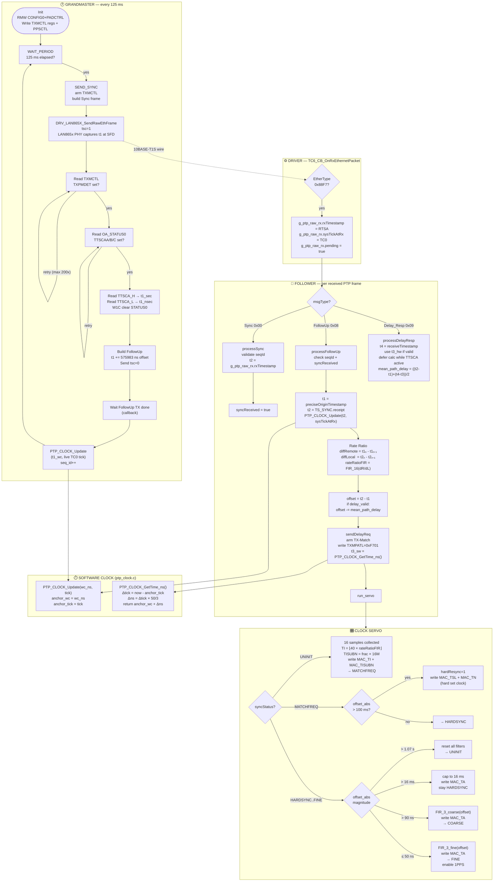

# PTP Implementation — AN1847 Harmony Port

## Table of Contents

- [1. Overview](#1-overview)
- [2. Module Structure](#2-module-structure)
- [3. Frame Addressing](#3-frame-addressing)
- [4. Pseudocode](#4-pseudocode)
  - [4.1 Grandmaster](#41-grandmaster-ptp_gm_taskc)
  - [4.2 Driver Layer](#42-driver-layer-drv_lan865x_apic)
  - [4.3 Follower — Frame Reception](#43-follower--frame-reception-ptp_fol_onframe)
  - [4.4 Follower — Clock Servo State Machine](#44-follower--clock-servo-state-machine)
  - [4.5 Follower — Register Write State Machine](#45-follower--register-write-state-machine-ptp_fol_service)
  - [4.6 Software Clock](#46-software-clock-ptp_clockc)
- [5. Flow Diagram](#5-flow-diagram)
- [6. Timestamps t1 t2 t3 t4](#6-timestamps-t1-t2-t3-t4)
- [7. Timing Sequence](#7-timing-sequence-single-cycle)
- [8. Servo State Transitions](#8-servo-state-transitions)
- [9. Key Registers](#9-key-registers-lan86501)
- [10. Logging and Trace](#10-logging-and-trace)
- [11. Measured Performance](#11-measured-performance)

---

## 1. Overview

IEEE 1588 PTPv2 Two-Step Clock Synchronization over 10BASE-T1S (LAN865x).
Target: ATSAME54P20A + LAN8650/1 MAC-PHY, Harmony 3 framework.

## 2. Module Structure

| Module | File | Role |
|---|---|---|
| Grandmaster | `src/ptp_gm_task.c` | Sends Sync + FollowUp, captures t1 from LAN865x HW |
| Follower | `src/PTP_FOL_task.c` | Receives t1/t2, runs servo, writes LAN865x clock registers |
| Software Clock | `src/ptp_clock.c` | Anchor-based interpolation using TC0 @ 60 MHz |
| RX Timestamp IPC | `src/ptp_ts_ipc.h` | `g_ptp_raw_rx` — bridge from driver callback to application |
| Deferred PTP Logging | `src/ptp_log.c` / `src/ptp_log.h` | Serializes GM/FOL console output and avoids interleaved log lines |

---

## 3. Frame Addressing

| Frame | Destination | Type |
|---|---|---|
| **Sync** | `FF:FF:FF:FF:FF:FF` | Layer-2 Broadcast |
| **FollowUp** | `FF:FF:FF:FF:FF:FF` | Layer-2 Broadcast |
| **Delay_Req** | `FF:FF:FF:FF:FF:FF` | Layer-2 Broadcast |
| **Delay_Resp** | requester's MAC | Layer-2 **Unicast** |

**Why Broadcast instead of PTP Multicast?**
The LAN865x hardware RX filter is not configured for PTP multicast addresses
(`01:80:C2:00:00:0E` or `01:1B:19:00:00:00`). Multicast frames would be silently
dropped at the GM's MAC filter. Broadcast guarantees delivery on the shared
10BASE-T1S bus segment.

A `PTP_GM_DST_MULTICAST` mode exists in `ptp_gm_task.h` but is not active by default:

```c
typedef enum {
    PTP_GM_DST_MULTICAST = 0,   // 01:80:C2:00:00:0E
    PTP_GM_DST_BROADCAST = 1    // FF:FF:FF:FF:FF:FF  ← default
} ptp_gm_dst_mode_t;
```

**Delay_Resp** is unicast: the GM extracts the source MAC from the received
Delay_Req frame and uses it directly as the destination — conforming to IEEE 1588.

---

## 4. Pseudocode

### 4.1 Grandmaster (`ptp_gm_task.c`)

```
INIT_GM:
    read MAC address from TCPIP_STACK
    if calibratedTI != 0: use calibrated TI/TISUBN in init sequence

    RMW OA_CONFIG0  |= 0xC0       // FTSE + bit6: enable TX frame-sync engine
    RMW PADCTRL: set bit8, clear bit9  // route 1PPS to pin

    write sequence (non-blocking, callback-protected):
        TXMCTL=0, TXMLOC=30, TXMPATH=0x88, TXMPATL=0xF710
        TXMMSKH=0, TXMMSKL=0
        MAC_TISUBN=calibrated, MAC_TI=calibrated  (or defaults 0/40)
        PPSCTL=0x7D   (1PPS enable)

    state = WAIT_PERIOD

SERVICE_GM:   // called every 1 ms via SYS_TIME periodic callback
    tick_ms++

    state WAIT_PERIOD:
        if (tick_ms - period_start) >= 125 ms:
            period_start = tick_ms
            state = SEND_SYNC

    state SEND_SYNC:
        build Sync frame  (EtherType=0x88F7, seqId, twoStepFlag)
        write TXMCTL = TXME | MACTXTSE   // arm TX-Match + Timestamp capture
        wait for write callback → state WAIT_SYNC_TX_DONE

    state WAIT_SYNC_TX_DONE:
        send Sync frame via DRV_LAN865X_SendRawEthFrame(tsc=1)
        // LAN865x PHY captures t1 at SFD → stores in OA_TTSCA{H,L}
        wait for TX-done callback → state READ_TXMCTL

    state READ_TXMCTL:
        read TXMCTL, check TXPMDET bit  (pattern matched?)
        if TXPMDET set: → READ_STATUS0
        else: retry up to MAX_RETRIES → WAIT_PERIOD on failure

    state READ_STATUS0:
        check gm_get_and_clear_ts_capture()   // driver-captured via EXST path
        if available: → READ_TTSCA_H
        else: SPI-read OA_STATUS0, wait for callback

    state WAIT_STATUS0:
        if TTSCAA/B/C bit set: → READ_TTSCA_H
        else: retry

    state READ_TTSCA_H → WAIT_TTSCA_H:
        read OA_TTSCAH → gm_ts_sec

    state READ_TTSCA_L → WAIT_TTSCA_L:
        read OA_TTSCAL → gm_ts_nsec

    state WRITE_CLEAR → WAIT_CLEAR:
        W1C write to OA_STATUS0  (clear TTSCAA flag)

    state SEND_FOLLOWUP:
        nsec = gm_ts_nsec + 575983        // empirical static TX-path offset
        if nsec >= 1e9: nsec -= 1e9; sec++
        build FollowUp  (preciseOriginTimestamp = sec:nsec, seqId)
        send via DRV_LAN865X_SendRawEthFrame(tsc=0)
        → state WAIT_FOLLOWUP_TX_DONE

    state WAIT_FOLLOWUP_TX_DONE:
        wait for TX-done callback
        // Update local software clock anchor (live TC0 tick)
        wc_ns = gm_ts_sec * 1e9 + gm_ts_nsec + GM_ANCHOR_OFFSET_NS
        PTP_CLOCK_Update(wc_ns, SYS_TIME_Counter64Get())
        seq_id++
        → state WAIT_PERIOD
```

---

### 4.2 Driver Layer (`drv_lan865x_api.c`)

```
TC6_CB_OnRxEthernetPacket(data, length, rxTimestamp):
    if EtherType(data[12:13]) == 0x88F7:
        g_ptp_raw_rx.data         = copy(data, length)
        g_ptp_raw_rx.length       = length
        g_ptp_raw_rx.rxTimestamp  = rxTimestamp   // LAN865x RTSA hardware ns
        if rxTimestamp != NULL:
            g_ptp_raw_rx.sysTickAtRx = SYS_TIME_Counter64Get()  // TC0 tick
        g_ptp_raw_rx.pending = true
    pass frame to TCPIP stack
```

> **Note:** `rxTimestamp` is non-NULL only for Sync frames (RTSA bit set in SPI footer).
> FollowUp frames have `rxTimestamp=NULL`; the IPC struct keeps the previous SYNC ts.

---

### 4.3 Follower — Frame Reception (`PTP_FOL_OnFrame`)

```
PTP_FOL_OnFrame(data, length, rxTimestamp):
    msgType = data[14] & 0x0F

    case MSG_SYNC (0x00):
        processSync():
            seqId = frame.sequenceID
            if |seqId - expected| > 10:
                resetSlaveNode()   // large gap → full reset
            elif seqId matches expected:
                syncReceived = true
                TS_SYNC.receipt = ns_from(g_ptp_raw_rx.rxTimestamp)  // t2

    case MSG_FOLLOW_UP (0x08):
        processFollowUp():
            if seqId mismatch or !syncReceived: discard, reset seqId

            // Extract timestamps
            t1 = preciseOriginTimestamp  (from frame, GM HW clock)
            t2 = TS_SYNC.receipt         (LAN865x RTSA, FOL HW clock)

            if t2 == 0:
                discard frame           // first sync after reset may not have RTSA yet

            // Update software clock anchor
            PTP_CLOCK_Update(t2, g_ptp_raw_rx.sysTickAtRx)

            // Rate ratio (LAN865x crystal vs GM crystal)
            diffRemote = t1_now - t1_prev
            diffLocal  = t2_now - t2_prev
            rateRatioFIR = FIR_16(diffRemote / diffLocal)

            // Offset with delay correction
            offset = t2 - t1
            if delay_valid:
                offset -= mean_path_delay

            // Initiate Delay_Req
            sendDelayReq(t1, t2)

            // Run servo
            run_servo(offset, rateRatioFIR)

    case MSG_DELAY_RESP (0x09):
        processDelayResp():
            verify requestingPortIdentity matches our clock ID
            t4 = receiveTimestamp  (GM HW RX time of our Delay_Req)
            t3 = fol_t3_hw_ns if valid else fol_t3_ns
            t1 = TS_SYNC.origin    (latest FollowUp t1)
            t2 = TS_SYNC.receipt   (latest Sync t2)

            if TTSCA still active:
                defer t1/t2/t4 until t3 HW capture reaches IDLE
            else:
                forward         = t2 - t1
                backward        = t4 - t3
                mean_path_delay = (forward + backward) / 2
                delay_valid     = true
```

---

### 4.4 Follower — Clock Servo State Machine

```
run_servo(offset, rateRatioFIR):
    offset_abs = |offset|

    ┌─ UNINIT ───────────────────────────────────────────────────────────┐
    │  Collect 16 Sync samples                                          │
    │  When runs >= 16:                                                  │
    │    calcInc    = 40.0 * rateRatioFIR                               │
    │    MAC_TI     = floor(calcInc)                                     │
    │    MAC_TISUBN = frac(calcInc) * 16777216  [byte-swapped for HW]  │
    │    save as calibratedTI / calibratedTISUBN                        │
    │    → schedule FOL_ACTION_SET_CLOCK_INC                            │
    │    syncStatus = MATCHFREQ                                          │
    └────────────────────────────────────────────────────────────────────┘
    ┌─ MATCHFREQ ────────────────────────────────────────────────────────┐
    │  if offset_abs > 100 ms:  hardResync=1 → write MAC_TSL + MAC_TN  │
    │  else:                    syncStatus = HARDSYNC                    │
    └────────────────────────────────────────────────────────────────────┘
    ┌─ HARDSYNC / COARSE / FINE ─────────────────────────────────────────┐
    │  if offset_abs > ~1.07 s:   reset all filters → UNINIT            │
    │  if offset_abs > 16 ms:     cap=16ms, write MAC_TA, stay HARDSYNC │
    │  if offset_abs > 90 ns:     FIR_3_coarse(offset) → MAC_TA, COARSE│
    │  if offset_abs > 50 ns:     FIR_3_coarse(offset) → MAC_TA, COARSE│
    │  else (≤ 50 ns):            FIR_3_fine(offset)   → MAC_TA, FINE  │
    │                             enable 1PPS output (PPSCTL=0x7D)      │
    └────────────────────────────────────────────────────────────────────┘

    MAC_TA format:  Bit31 = sign (1=positive/advance), Bit30:0 = magnitude [ns]
    Hard sync:      hardResync flag → write MAC_TSL (seconds) + MAC_TN (ns) directly
```

---

### 4.5 Follower — Register Write State Machine (`PTP_FOL_Service`)

```
PTP_FOL_Service():   // called every 1 ms

    FOL_ACTION_HARD_SYNC:
        write MAC_TSL (seconds) → wait cb → write MAC_TN (ns) → wait cb → DONE

    FOL_ACTION_ENABLE_PPS:
        skip TSL/TN → write PPSCTL=0x7D → wait cb → DONE

    FOL_ACTION_SET_CLOCK_INC:
        skip TSL/TN/PPSCTL → write MAC_TISUBN → wait cb → write MAC_TI → wait cb → DONE

    FOL_ACTION_ADJUST_OFFSET:
        skip to → write MAC_TA (phase adjust) → wait cb → DONE

    Each wait state: decrement timeout (100 ms); on 0 → IDLE (log error)
```

---

### 4.6 Software Clock (`ptp_clock.c`)

```
PTP_CLOCK_Update(wallclock_ns, sys_tick):
    anchor_wc_ns = wallclock_ns   // GM or FOL HW timestamp
    anchor_tick  = sys_tick       // TC0 tick captured at same moment
    valid = true
    // Drift correction disabled: sys_tick capture jitter (~200 µs)
    // dominates the 21 ppm crystal error over 500 ms window

PTP_CLOCK_GetTime_ns() → uint64_t:
    now_tick    = SYS_TIME_Counter64Get()    // TC0 @ 60 MHz, 64-bit
    delta_tick  = now_tick - anchor_tick
    delta_ns    = (delta_tick / 3) * 50
                + ((delta_tick % 3) * 50) / 3   // exact: 50/3 ns per tick
    return anchor_wc_ns + delta_ns
```

---

## 5. Flow Diagram



---

## 6. Timestamps t1 t2 t3 t4

### Origin on the Time Axis

```
GM-Hardware                    10BASE-T1S Cable              FOL-Hardware
(LAN865x GM)                                                 (LAN865x FOL)

     │                                                              │
     │──── SYNC sent ──────────────────────────────────────────────►│
  t1 ↑                                                          t2 ↑
(SFD end)                                                    (SFD end)
     │                                                              │
     │──── FOLLOWUP (contains t1) ────────────────────────────────►│
     │                                                              │
     │                                                          t3 ↑
     │                                                       (SW-Clock)
     │◄─── DELAY_REQ ───────────────────────────────────────────── │
  t4 ↑                                                              │
(SFD end)                                                           │
     │                                                              │
     │──── DELAY_RESP (contains t4) ──────────────────────────────►│
     │                                                              │
```

### t1 — GM Transmit Time of Sync

**When:** At the moment the last bit of the SFD (Start of Frame Delimiter) leaves the 10BASE-T1S wire.

**Where:** In the **LAN865x of the GM** — the PHY hardware automatically freezes the internal wall-clock value. No software influence.

```c
// ptp_gm_task.c, State READ_TTSCA_H / READ_TTSCA_L:
gm_ts_sec  = Read(OA_TTSCAH);  // Register 0x00000010
gm_ts_nsec = Read(OA_TTSCAL);  // Register 0x00000011
// → stored in FollowUp.preciseOriginTimestamp
```

### t2 — FOL Receive Time of Sync

**When:** At the moment the SFD of the Sync frame arrives at the FOL.

**Where:** In the **LAN865x of the FOL** — the PHY hardware embeds the wall-clock value directly into the SPI footer of each received frame (RTSA = Receive Timestamp Append). No software influence.

```c
// drv_lan865x_api.c, TC6_CB_OnRxEthernetPacket():
g_ptp_raw_rx.rxTimestamp = rxTimestamp;  // from SPI footer

// PTP_FOL_task.c, handlePtp() → processSync():
TS_SYNC.receipt.secondsLsb  = rxTimestamp >> 32;
TS_SYNC.receipt.nanoseconds = rxTimestamp & 0xFFFFFFFF;
```

### t3 — FOL Transmit Time of Delay_Req

**When:** At the moment the Delay_Req is detected on the wire by the LAN865x TX-Match mechanism.

**Where:** Primarily in the **LAN865x of the FOL** via `TTSCA{H,L}`. A software timestamp
(`fol_t3_ns`) is still set as fallback directly before TX.

```c
// PTP_FOL_task.c, FOL_TTSCA_WAIT_TXMCTL:
fol_t3_ns = PTP_CLOCK_GetTime_ns();              // SW fallback
DRV_LAN865X_SendRawEthFrame(..., tsc=1, ...);    // arm HW capture

// later in FOL_TTSCA_WAIT_L:
fol_t3_hw_ns = sec * 1e9 + nsec;
fol_t3_hw_valid = true;
```

> **Note:** On 10BASE-T1S with PLCA, the physical TX may occur several ms after
> the software call. Therefore, the delay calculation is deferred if `Delay_Resp`
> arrives before `t3_hw`.

### t4 — GM Receive Time of Delay_Req

**When:** At the moment the SFD of the Delay_Req frame arrives at the GM.

**Where:** In the **LAN865x of the GM** — also RTSA from the SPI footer, analogous to t2.

```c
// ptp_gm_task.c — receives Delay_Req, builds Delay_Resp:
// t4 = rxTimestamp from SPI footer → DelayResp.receiveTimestamp

// PTP_FOL_task.c, processDelayResp():
fol_t4_ns = htonl(ptpPkt->receiveTimestamp.secondsLsb) * 1e9
          + htonl(ptpPkt->receiveTimestamp.nanoseconds);
```

### Comparison Table

| | t1 | t2 | t3 | t4 |
|---|---|---|---|---|
| **Event** | SYNC leaves GM | SYNC arrives at FOL | Delay_Req leaves FOL | Delay_Req arrives at GM |
| **Hardware** | LAN865x GM | LAN865x FOL | LAN865x FOL (Fallback: ATSAME54 TC0) | LAN865x GM |
| **Mechanism** | TX Timestamp Capture (TTSCA) | RX Timestamp Append (RTSA) | TX Timestamp Capture (TTSCA) with SW fallback | RX Timestamp Append (RTSA) |
| **Clock** | GM Wall Clock | FOL Wall Clock | FOL TC0 @ 60 MHz | GM Wall Clock |
| **Accuracy** | < 1 ns | < 1 ns | < 1 ns (fallback: scheduler-jitter-limited) | < 1 ns |
| **Transport** | Via FollowUp frame | SPI footer directly | Local | Via Delay_Resp frame |

### Usage of Timestamps

$$\text{offset} = t_2 - t_1 - \text{mean\_path\_delay}$$

$$\text{mean\_path\_delay} = \frac{(t_2 - t_1) + (t_4 - t_3)}{2}$$

Offset accuracy (~40–100 ns) is primarily determined by **t1** and **t2** —
both captured hardware-side with < 1 ns resolution. With active TTSCA, **t3**
is also hardware-captured; the SW value remains only as a fallback on error paths.

---

## 7. Timing Sequence (Single Cycle)

```
T+ 0.0 ms   GM:  send SYNC (tsc=1)
             →   LAN865x PHY freezes t1 at SFD end
T+ 0.1 ms   LAN865x: stores t1 in OA_TTSCA{H,L}
T+ 4.0 ms   GM:  reads TTSCA, builds FollowUp, sends FollowUp
T+ 6.0 ms   GM:  FollowUp TX-done → PTP_CLOCK_Update(t1 + offset, live_tick)
T+ 7.0 ms   FOL: TC6_CB_OnRxEthernetPacket → t2=RTSA, sysTickAtRx=TC0
T+ 7.0 ms   FOL: processSync → t2 stored
T+ 7.x ms   FOL: processFollowUp → compute offset, run servo
                                  → PTP_CLOCK_Update(t2, sysTickAtRx)
T+ 7.x ms   FOL: sendDelayReq → t3_sw = PTP_CLOCK_GetTime_ns(), arm TTSCA
T+ 8.0 ms   GM:  receives Delay_Req → builds Delay_Resp with t4
T+ 8.x ms   FOL: processDelayResp → defer if t3_hw not ready yet
T+ 9..10 ms FOL: TTSCA captures t3_hw after PLCA slot wait
T+ 9..10 ms FOL: complete_delay_calc → mean_path_delay = ((t2-t1)+(t4-t3))/2
T+125.0 ms  → next cycle
```

---

## 8. Servo State Transitions

$$
\text{UNINIT} \xrightarrow{16 \times \text{Sync}} \text{MATCHFREQ} \xrightarrow{|\text{off}|<100\text{ms}} \text{HARDSYNC} \xrightarrow{|\text{off}|<90\text{ns}} \text{COARSE} \xrightarrow{|\text{off}|\leq50\text{ns}} \text{FINE}
$$

| State | Threshold | Action |
|---|---|---|
| UNINIT | runs ≥ 16 | Set MAC_TI + MAC_TISUBN (frequency) |
| MATCHFREQ | \|off\| > 100 ms | Hard set MAC_TSL + MAC_TN |
| HARDSYNC | \|off\| > 1.07 s | Reset → UNINIT |
| HARDSYNC | \|off\| > 16 ms | Write MAC_TA capped to 16 ms |
| COARSE | \|off\| > 90 ns | FIR3 filtered → MAC_TA |
| FINE | \|off\| ≤ 50 ns | FIR3 fine → MAC_TA + enable 1PPS |

---

## 9. Key Registers (LAN8650/1)

| Register | Address | Purpose |
|---|---|---|
| MAC_TI | `0x00010077` | Timer increment (nominal 40 ns/tick) |
| MAC_TISUBN | `0x0001006F` | Sub-nanosecond increment fraction |
| MAC_TSL | `0x00010074` | Wall clock seconds (set on hard sync) |
| MAC_TN | `0x00010075` | Wall clock nanoseconds (set on hard sync) |
| MAC_TA | `0x00010076` | Phase adjust: Bit31=sign, Bit30:0=magnitude [ns] |
| OA_TTSCA{H,L} | `0x00000010/11` | TX timestamp capture A: sec / ns |
| PPSCTL | `0x000A0239` | 1PPS output control |
| OA_STATUS0 | `0x00000008` | TTSCAA/B/C flags (W1C) |

---

## 10. Logging and Trace

- GM and FOL PTP logs are routed through `ptp_log.c` into a deferred ring buffer.
- `ptp_log_flush()` is called from `SYS_Tasks()` so console output is serialized and GM/FOL lines do not interleave.
- High-volume diagnostics are trace-gated and only shown when `ptp_trace on` is active.
- Follower verbose output (`ptp_mode follower v`) still emits one live status line per Sync cycle.

Trace-only examples:

- `Sync seqId mismatch. Is: ...`
- `FollowUp seqId out of sync. Is: ...`
- `Filtered rateRatio outlier`
- `[FOL] Delay_Req timeout — retrying`
- `[PTP-GM] Delay_Resp sent (...)`
- GM init/RMW progress and `Delay_Req ... dropped: no HW RX timestamp`

---

## 11. Measured Performance

| Metric | Value |
|---|---|
| Mean offset | +40 to +100 ns |
| Standard deviation | typically < 40 ns |
| Peak offset | ~250 ns during seqId disturbances, otherwise ~115 ns |
| Convergence time | ~3 to 4 s |
| Mean path delay | ~3 787 ns |
| Sync rate | 8 Hz (125 ms period) |
| Crystal error (FOL vs GM) | about +5.4 ppm before MATCHFREQ correction |

*Measured: `ptp_offset_test.py`, `ptp_delay_test.py` — hardware t3 enabled, Build Apr 15 2026*
