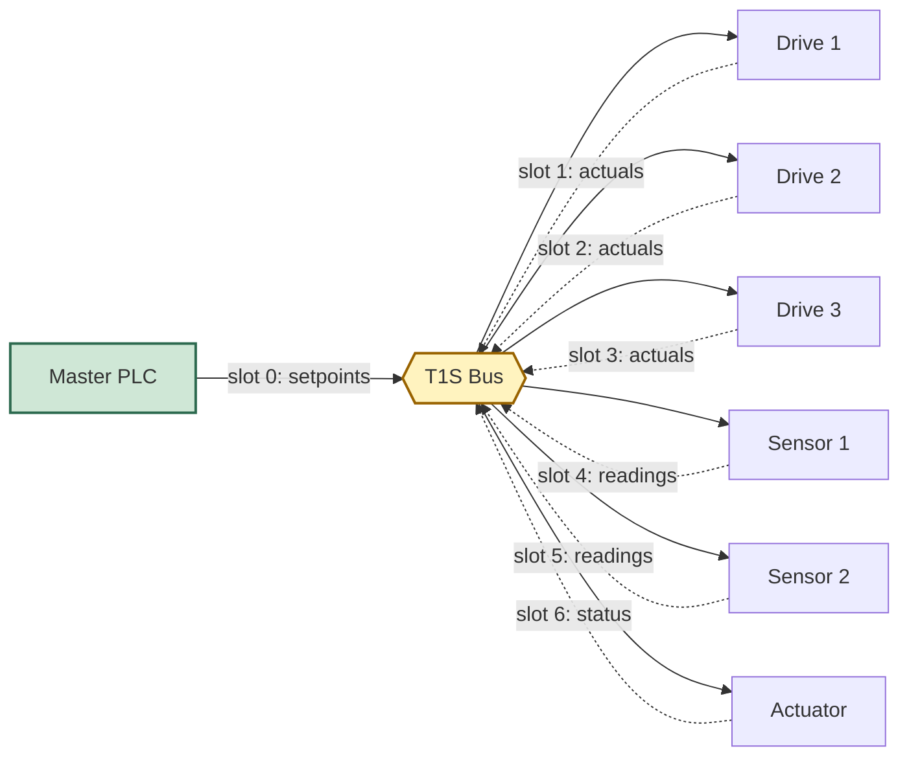
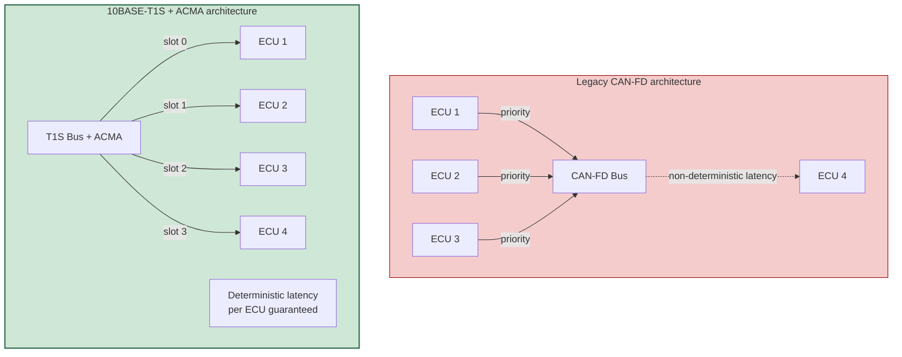
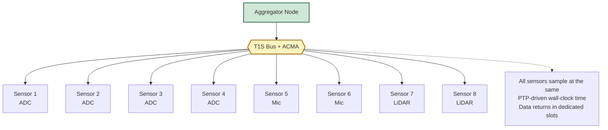
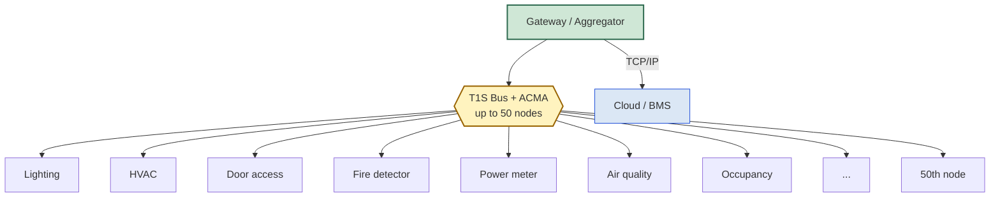

# ACMA on 10BASE-T1S — Application Landscape and Market Reach

This document explores what kinds of applications can be supported
on a 10BASE-T1S bus when **ACMA**, **PTP**, and **PLCA** are used in
combination, and how the choice of mechanism shapes the addressable
market for the LAN86xx silicon family.

It assumes the reader already knows what PTP, ACMA, and PLCA are.
The focus is purely on **what becomes possible**, what the
synchronisation envelope looks like at different precision targets,
and which application categories map to which configuration.

---

## Audience and Purpose

This is an architecture-and-application-perspective discussion,
written for engineers and decision-makers who:

- Need to choose between standard-PLCA and TDMA-style configurations
  for a specific design
- Want to understand the application reach of LAN86xx silicon
  beyond basic Ethernet connectivity
- Are evaluating where the LAN86xx family fits in the broader 10BASE-T1S
  ecosystem and which markets it competes in

The intent is to make the application landscape visible — what
becomes possible at each timing-precision class, what specific
industries demand which guarantees, and how application breadth
expands when deterministic transmit-slot mechanisms are available.

---

## Table of Contents

1. [Time Synchronisation Methods — Precision Spectrum](#1-time-synchronisation-methods--precision-spectrum)
2. [Application Requirements — Timing and Bandwidth](#2-application-requirements--timing-and-bandwidth)
3. [Application Categories Enabled by ACMA](#3-application-categories-enabled-by-acma)
   - 3.1 [Industrial Real-Time Control](#31-industrial-real-time-control)
   - 3.2 [Automotive Sensor and ECU Networks](#32-automotive-sensor-and-ecu-networks)
   - 3.3 [Distributed Sensor Arrays](#33-distributed-sensor-arrays)
   - 3.4 [Multimedia and Synchronised Effects](#34-multimedia-and-synchronised-effects)
   - 3.5 [Functional Safety and Avionics](#35-functional-safety-and-avionics)
   - 3.6 [Test, Measurement, and HIL](#36-test-measurement-and-hil)
   - 3.7 [Smart Building and IIoT Mesh](#37-smart-building-and-iiot-mesh)
4. [Application Reach by Configuration](#4-application-reach-by-configuration)
5. [Market Segment Addressability](#5-market-segment-addressability)
6. [Competing Technologies and Where ACMA Fits](#6-competing-technologies-and-where-acma-fits)
7. [Outlook](#7-outlook)

---

## 1. Time Synchronisation Methods — Precision Spectrum

Time synchronisation in networked systems spans nearly nine orders of
magnitude in achievable precision. Picking the right method depends
on the application's tolerance for jitter, drift, and latency
variability:

| Method | Achievable Precision | Worst-Case Latency Bound |
|---|---|---|
| Software NTP over plain Ethernet | ~1 ms | unbounded |
| PTP software-only (no hardware timestamping) | ~100 µs | unbounded |
| **PTP with hardware timestamping (AN1847-style)** | **~100 ns** | up to 10 ms (bus-load dependent) |
| PTP + PLCA with software heartbeat discipline | ~100 ns | several ms (PLCA skip-effects) |
| **PTP + ACMA** | **~100 ns synchronisation, < 1 ms transport** | **deterministic** |
| Sub-100-ns specialised solutions (White Rabbit, external 1PPS) | ~1 ns | n/a |

The key insight: **PTP + ACMA delivers ~100 ns clock synchronisation
plus deterministic sub-millisecond transport**, the combination
demanded by most industrial TDMA-style applications. PTP alone gives
the synchronisation but not the transport guarantee; ACMA alone gives
the transport but not the synchronised slot times.

---

## 2. Application Requirements — Timing and Bandwidth

Applications cluster into a small number of timing classes. A
practical rule of thumb is to first ask: *"What is the worst-case
delay I can tolerate between a measurement event and the resulting
control action?"*

| Application class | Required precision | Bandwidth need | PTP needed | ACMA needed |
|---|---|---|---|---|
| Pure data logging with timestamp correlation | < 100 µs | low | yes | no |
| Temperature monitoring (slow trends) | < 1 ms | very low | yes | no |
| Power-quality monitoring (PMU) | < 1 µs | medium | yes | optional |
| **Real-time motor control** | **< 100 µs reaction** | medium | yes | **yes** |
| **Multi-axis robotics** | **< 1 µs sample sync** | medium | yes | **yes** |
| **Distributed PLC backbone** | **< 1 ms reaction** | medium | yes | **yes** |
| **ADAS sensor triggering** | **< 1 µs** | low (trigger only) | yes | **yes** |
| **In-vehicle network (CAN-FD replacement)** | **< 1 ms** | low-medium | yes | **yes** |
| **Distributed audio (beamforming)** | **< 1 µs phase** | medium | yes | **yes** |
| **Synchronised lighting (LED effects)** | **< 1 ms** | low | yes | **yes** |
| **LiDAR cluster (no cross-talk)** | **< 100 µs slot exclusivity** | low | optional | **yes** |
| **Safety-critical control (ASIL)** | **< 1 ms deterministic** | low-medium | yes | **yes** |
| **HIL test bench with multi-load** | **< 10 µs** | medium | yes | **yes** |
| **Smart-building (50 nodes)** | **< 10 ms** | low | yes | **yes** |

Two patterns emerge from this table:

1. **PTP alone** suffices when the time-critical aspect is the
   measurement timestamp, with relaxed transport latency
   (logging, monitoring, post-acquisition correlation).

2. **PTP + ACMA together** is required whenever the application
   has any kind of **deterministic reaction or transport
   requirement** — which is the vast majority of industrial,
   automotive, and safety-critical use cases.

---

## 3. Application Categories Enabled by ACMA

The following sections describe the application categories where
deterministic transmit-slot scheduling on 10BASE-T1S Multidrop
unlocks designs that would otherwise be impossible or require much
more expensive technology.

### 3.1 Industrial Real-Time Control

**The opportunity:** Industrial automation has historically used
specialised real-time Ethernet protocols (EtherCAT, PROFINET-IRT,
Sercos III) on 100 Mbit/s. These are powerful but expensive — both
in silicon cost and in installation complexity. A meaningful slice
of industrial designs has only modest bandwidth needs and would
benefit from a lower-cost wiring approach.

**What ACMA enables:**

**Concrete designs unlocked:**

- Synchronised multi-axis motion control with sub-µs sample
  alignment across encoders and inverters
- Distributed PLC backbones for packaging machines, conveyor
  systems, palletisers, robotic cells
- Coordinated actuator triggering for stamping presses, spray
  nozzles, vibration excitation
- Modular machine architectures with reduced cabling cost compared
  to point-to-point Ethernet wiring

**The market reach:** Industrial automation OEMs serving mid-range
machinery — segments where 100 Mbit/s Ethernet is overkill but CAN
or LIN are too slow. Without deterministic transmit-slot
scheduling, this segment would have to choose between expensive
real-time Ethernet or non-deterministic CAN-FD.

### 3.2 Automotive Sensor and ECU Networks

**The opportunity:** Modern vehicles are evolving toward zone-based
electrical architectures, where local sensor and ECU clusters
communicate over short-haul buses. The two reigning options are
CAN-FD (limited bandwidth, non-deterministic prioritisation) and
100BASE-T1 (point-to-point, more wiring). 10BASE-T1S Multidrop sits
exactly in the gap — provided the timing guarantees CAN-FD lacks
can be matched.

**What ACMA enables:**

- Park-sensor clusters with synchronised distance measurements
- Tyre Pressure Monitoring Systems (TPMS) with deterministic
  4-wheel polling
- ADAS frame-trigger distribution for cameras, radar, LiDAR,
  ultrasonic — all capturing at the same wall-clock instant for
  sensor fusion
- ECU coordination for battery management, brake-by-wire, climate,
  ambient lighting — each ECU getting a guaranteed slot
- Distributed in-cabin audio with phase-coherent multi-speaker
  playback
- Ambient lighting synchronised with vehicle state changes

**The architectural shift:**

**The market reach:** Automotive Tier-1 suppliers and OEMs
specifying next-generation E/E architectures. AEC-Q100
qualification and ISO-26262 safety-package availability make
LAN86xx silicon a candidate for these designs — but only when the
deterministic scheduling argument can compete with CAN-FD's
prioritisation and 100BASE-T1's point-to-point determinism.

### 3.3 Distributed Sensor Arrays

**The opportunity:** A surprising number of industrial sensing
applications need many low-bandwidth measurement points
synchronously sampled and aggregated into a coherent picture. With
classical wiring this means custom backplanes or expensive
distributed-acquisition systems. A bus-based approach with
synchronous sampling collapses the BOM dramatically.

**What ACMA enables:**

- **Multi-channel ADC arrays** — 8 ADC nodes synchronised at 1 kHz,
  reconstructing a multi-channel waveform with constant phase
  alignment between channels. Use cases: smart-grid power
  monitoring, vibration diagnostics on rotating machinery,
  structural health monitoring on bridges and wind-turbine towers.
- **Acoustic arrays for beamforming** — multiple microphones in
  spatial arrangement, sample-synchronous to enable source
  localisation, gunshot detection, machine acoustic diagnostics.
- **LiDAR / Time-of-Flight clusters** — exclusive slot per sensor
  prevents inter-sensor cross-talk that would otherwise cause
  phantom distance measurements.

**The market reach:** Industrial-IoT, scientific instrumentation,
power monitoring, predictive maintenance. Total addressable
opportunity grows with industrial digitalisation initiatives.

### 3.4 Multimedia and Synchronised Effects

**The opportunity:** AVB (Audio-Video Bridging) on 100 Mbit/s
Ethernet has been the gold standard for distributed audio in
buildings and venues, but its silicon and switch costs are
significant. There is a clear market for a low-cost equivalent
serving applications with modest bandwidth needs but strict
synchronisation requirements.

**What ACMA enables:**

- **Distributed audio** — 48 kHz × 16-bit stereo (1.5 Mbit/s per
  stream) easily fits in a 1 ms ACMA cycle. Multiple speakers play
  back with sub-µs phase alignment, eliminating echo and timing
  artefacts perceptible to listeners.
- **Synchronised lighting** — LED strips, stage lighting, and
  architectural lighting effects coordinated at sub-millisecond
  resolution across an entire installation. Replaces DMX-512 with
  higher data rates and bidirectional status feedback.
- **In-cabin acoustic systems** — surround sound, active noise
  cancellation, voice-zone separation, all requiring tight phase
  coherence between distributed transducers.

**The market reach:** Building-automation systems, conference
rooms, automotive in-cabin audio, stage and venue equipment,
broadcast installations. Applications where AVB is currently used
but at a price point that locks out smaller-budget designs.

### 3.5 Functional Safety and Avionics

**The opportunity:** Safety-critical applications demand
*deterministic* behaviour, period. Watchdog mechanisms must detect
node failures within bounded time. Redundant nodes must be able to
vote on shared decisions without bus contention. None of these
guarantees can be made on a best-effort PLCA bus.

**What ACMA enables:**

- **Watchdog detection** — every node has a guaranteed slot. If
  the slot is empty, the node is non-functional. Detection latency
  is deterministic and bounded by one ACMA cycle.
- **N+1 redundant clusters** — multiple identical nodes share the
  bus, all transmitting their independently computed values in
  their own slots. Voter logic on the master applies 2-of-3
  majority decisions in real time.
- **Hot-standby switchover** — backup nodes can take over within
  one ACMA cycle, with no risk of overlapping with the failing
  primary node.

**The market reach:** Aerospace control buses, industrial safety
controllers (Emergency-Stop, light curtains), automotive
brake-by-wire and steer-by-wire systems, medical devices with
fail-safe modes. ISO-26262 and ARP4761 certification programmes
specifically demand the determinism guarantees that ACMA provides.

### 3.6 Test, Measurement, and HIL

**The opportunity:** Test and measurement setups have historically
relied on dedicated trigger buses (GPIB, LXI, CompactPCI) or
proprietary backplanes. Modern test labs increasingly want
flexible, scalable architectures based on standard networking, but
without losing trigger precision.

**What ACMA enables:**

- **Synchronous measurement nodes** — multiple instruments
  (oscilloscopes, data loggers, power analysers) connected to one
  bus, all triggered to capture at the same PTP-instant, with data
  returning in dedicated slots.
- **Hardware-in-the-Loop (HIL) test benches** — programmable
  loads, stimulus generators, and DUT interfaces all coordinated
  with µs-precise sequences. Reproducibility across long test
  campaigns becomes practical.
- **Multi-domain correlation** — voltage, current, temperature,
  acoustic, and motion measurements simultaneously captured for
  correlation analysis.

**The market reach:** R&D laboratories, automotive validation,
semiconductor characterisation, manufacturing test stations.
Per-customer revenue is moderate, but margins are high and design
cycles are long.

### 3.7 Smart Building and IIoT Mesh

**The opportunity:** Buildings and industrial facilities are
deploying ever-larger numbers of sensors and actuators. The
classical solutions — KNX, BACnet, Modbus, wireless mesh — each
have their compromises. A single bus that supports many nodes,
deterministic latency, low installation cost, and direct
interoperability with TCP/IP stacks would unlock a significant
market.

**What ACMA enables (combined with PoDL):**

- **Smart-building backbone** — lighting, HVAC, security, access
  control, fire detection on one bus with up to 50 nodes,
  deterministic latency for time-critical events (fire alarm,
  emergency lighting).
- **IIoT sensor mesh** — distributed condition monitoring, edge
  data aggregation to gateway, deterministic data return without
  contention.
- **Smart-grid edge** — distributed power-quality monitoring,
  phasor measurement units (PMU) with shared timing reference.

**The market reach:** Building-automation OEMs, industrial-IoT
platform providers, smart-grid solution vendors. Volumes are
high; the competitive question is BOM cost and ease of
integration.

---

## 4. Application Reach by Configuration

How does the addressable application landscape change depending on
which combination of mechanisms is deployed?

| Configuration | Pure logging | Sync sampling | Real-time control | Sync actuation | Safety-critical | Multi-vendor TSN |
|---|---|---|---|---|---|---|
| PLCA only | ✓ | partial | ✗ | ✗ | ✗ | ✗ |
| PLCA + PTP | ✓ | ✓ | partial | partial | ✗ | ✗ |
| PLCA + PTP + ACMA | ✓ | ✓ | **✓** | **✓** | **✓** | partial (single-vendor) |
| Full TSN (1 Gbit+) | ✓ | ✓ | ✓ | ✓ | ✓ | ✓ |

**Reading this table:**

- The first row (PLCA only) addresses only the simplest connectivity
  use cases — basic Ethernet links with whatever timing the
  application can tolerate.
- The second row (PLCA + PTP) extends reach into measurement
  applications where time-correlation matters but transport
  latency does not.
- **The third row (PLCA + PTP + ACMA) is the configuration that
  unlocks the bulk of the industrial, automotive, multimedia, and
  safety market** — applications where determinism is required.
- The fourth row (full TSN) addresses everything but at
  considerably higher silicon cost and infrastructure complexity.

---

## 5. Market Segment Addressability

A coarse estimate of how various 10BASE-T1S market segments break
down by their need for deterministic scheduling:

| Market segment | Share with determinism need | Addressable with ACMA |
|---|---|---|
| Automotive sensor + ECU networks | ~70 % | high |
| Industrial automation (machinery) | ~80 % | high |
| Building automation | ~60 % | medium-high |
| Energy management | ~50 % | medium |
| Audio / multimedia | ~80 % | high |
| Safety / avionics | ~95 % | very high |

The pattern is consistent: **across most LAN86xx-targeted market
segments, a clear majority of designs benefit from or require
deterministic scheduling**. The remaining minority — pure data-only
applications — is well-served by basic PLCA and represents the
"easier" market entry point.

---

## 6. Competing Technologies and Where ACMA Fits

Looking at the broader landscape of deterministic networking
options:

| Technology | Bandwidth | Determinism | Silicon cost | Installation cost | Standardised |
|---|---|---|---|---|---|
| CAN-FD | 1-8 Mbit/s | priority-based | low | medium | yes (ISO) |
| LIN | < 20 Kbit/s | scheduled | very low | low | yes (ISO) |
| EtherCAT | 100 Mbit/s | yes | medium | medium | yes (IEC) |
| PROFINET-IRT | 100 Mbit/s | yes | medium-high | medium | yes (IEC) |
| Sercos III | 100 Mbit/s | yes | medium-high | medium | yes (IEC) |
| TSN (802.1Qbv) | 1 Gbit/s+ | yes | high | high | yes (IEEE) |
| **10BASE-T1S + ACMA** | **10 Mbit/s** | **yes** | **low** | **low** | **partial — vendor-specific** |
| 10BASE-T1S + PLCA only | 10 Mbit/s | best-effort | low | low | yes (IEEE) |

**The position is distinctive:** 10BASE-T1S with ACMA occupies
the low-bandwidth / low-cost / deterministic quadrant — a
combination that no other technology fills. CAN-FD has lower
bandwidth and weaker determinism. Real-time Ethernet has higher
bandwidth and higher cost. TSN has much higher cost and complexity.

For applications that need deterministic transport at modest
bandwidths, ACMA-enabled 10BASE-T1S is the only widely-available
silicon option.

---

## 7. Outlook

The technical capability is established. The application landscape
is broad and aligns with markets undergoing active digitalisation:

- **Automotive** is moving from CAN-FD to mixed E/E architectures.
  10BASE-T1S with deterministic scheduling fits the zone
  controllers and sensor clusters.
- **Industrial automation** is consolidating around real-time
  Ethernet, but a clear cost-sensitive sub-segment is looking for
  cheaper alternatives without giving up determinism.
- **Building and energy systems** are scaling sensor counts
  rapidly, with an increasing premium on sub-second response
  times for safety and energy efficiency.
- **Functional safety** applications are mandating deterministic
  buses for ISO-26262 / ARP4761 / IEC 61508 compliance.

In each of these areas, designs benefit measurably from
deterministic transmit-slot scheduling. Where it is available, it
becomes a natural choice for the low-bandwidth tier; where it is
absent, designs reach for either CAN-FD (with its limitations) or
much more expensive real-time Ethernet.

The application diversity covered here — from millisecond-cycle
PLC backbones through microsecond-precision sensor fusion through
phase-coherent audio reproduction — illustrates the breadth of
markets that depend on this kind of capability for their
architectural feasibility.

---

**Summary in one sentence:**

> *Across the most active growth markets for 10BASE-T1S — automotive,
> industrial, multimedia, safety-critical, smart-building — the
> majority of designs require deterministic transmit-slot scheduling
> as a precondition for their architectural feasibility, making this
> capability a defining factor for which applications a given silicon
> family can address.*
