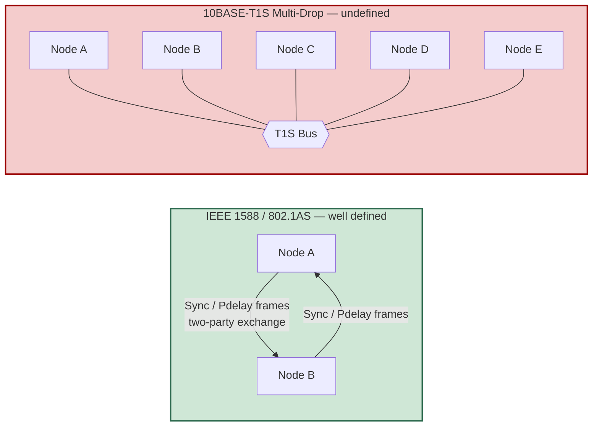
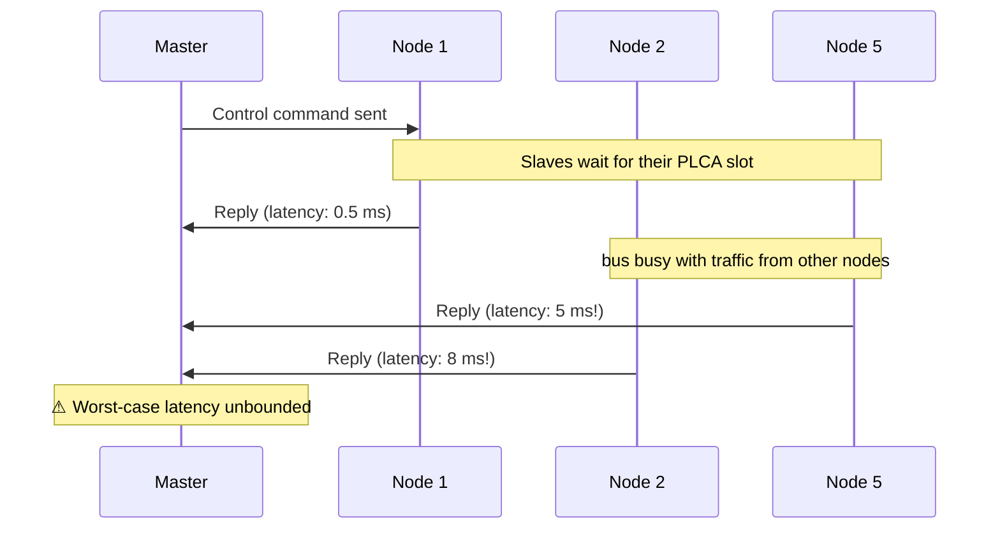
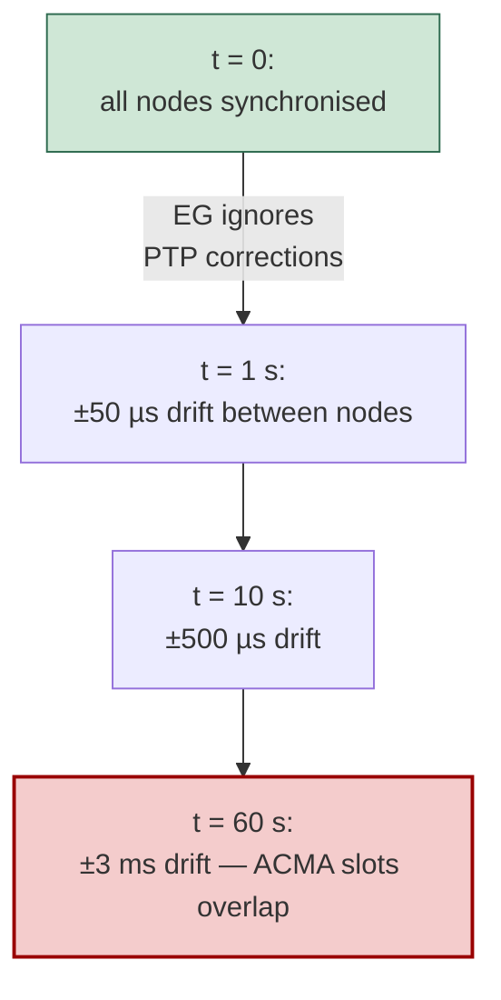
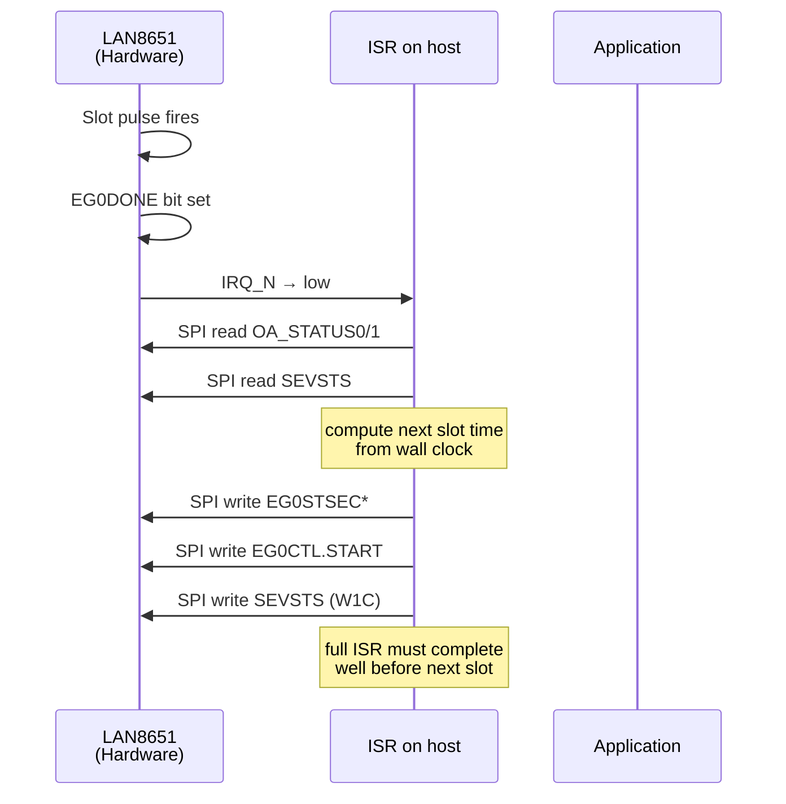
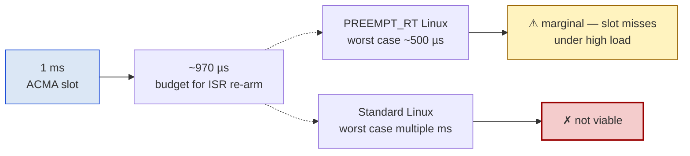
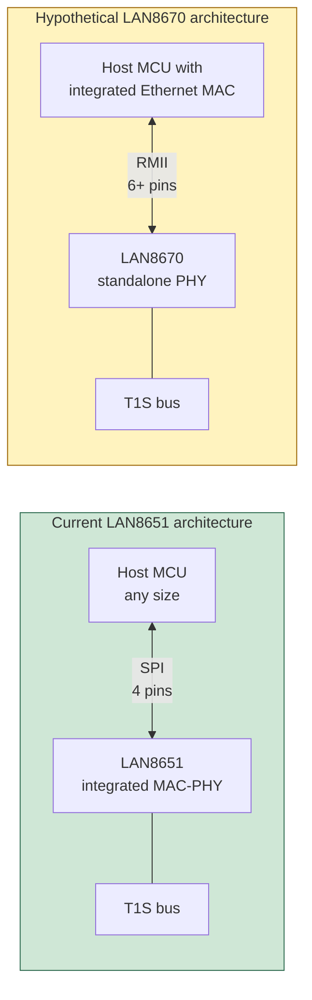
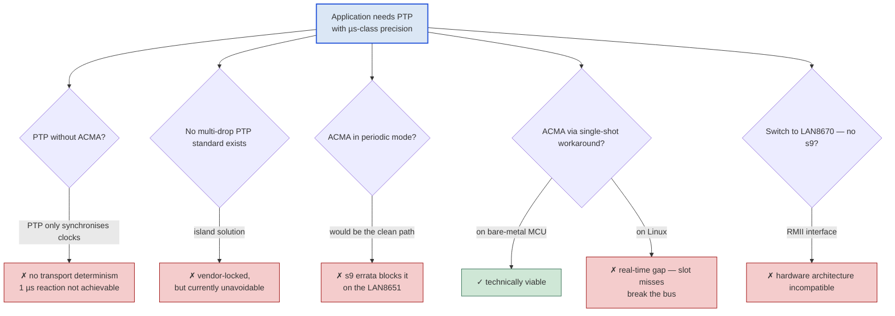

# Why PTP Without ACMA Makes No Sense on the LAN86xx Family

A focused technical analysis of why **PTP** alone is not a viable
synchronisation solution on Microchip's 10BASE-T1S silicon, why the
**LAN8651 s9 errata** turns into a software problem with critical
real-time implications, and why the absence of a multi-drop PTP
standard leaves no alternative path.

The conclusion this analysis arrives at: **ACMA is not an optional
extra — it is the keystone that makes precise time synchronisation
practical on this silicon family**.

---

## Contents

1. [The Standards Gap — No IEEE PTP Spec for Multi-Drop T1S](#1-the-standards-gap--no-ieee-ptp-spec-for-multi-drop-t1s)
2. [Why PTP Alone Cannot Deliver Microsecond-Class Determinism](#2-why-ptp-alone-cannot-deliver-microsecond-class-determinism)
3. [The LAN8651 s9 Errata — What It Is and Why It Is a Software Problem](#3-the-lan8651-s9-errata--what-it-is-and-why-it-is-a-software-problem)
4. [The Software Workaround and Its Real-Time Requirements](#4-the-software-workaround-and-its-real-time-requirements)
5. [Why the s9 Workaround Breaks PTP on Linux](#5-why-the-s9-workaround-breaks-ptp-on-linux)
6. [LAN8670 as a Theoretical Alternative — and Why It Does Not Help](#6-lan8670-as-a-theoretical-alternative--and-why-it-does-not-help)
7. [Conclusion](#7-conclusion)

---

## 1. The Standards Gap — No IEEE PTP Spec for Multi-Drop T1S

PTP (Precision Time Protocol, IEEE 1588) is well-defined for
**point-to-point** Ethernet links. The IEEE 802.1AS profile (gPTP)
extends this for time-sensitive networking on switched Ethernet.
Both standards assume that nodes communicate over **dedicated
links** — every PTP port has exactly one peer.

### The 10BASE-T1S Reality

10BASE-T1S Multi-Drop is fundamentally different. A single physical
medium is shared by many nodes — typically 8, sometimes more. There
is **no IEEE specification** that defines how PTP message exchanges,
peer-delay measurements, or BMCA selection are supposed to behave
in this topology.

### The Vendor-Specific Workaround Pattern

Microchip's own Application Note AN1847 explicitly acknowledges the
gap:

> *"Current PTP standards do not yet cover multidrop / PLCA broadcast
> Pdelay."*

The recommended workaround is to **pre-measure the peer delay and
use it as a fixed value**, or to modify the software stack to
demultiplex Pdelay responses. Either approach is **vendor-specific**
and only works when all nodes on the bus implement the **same**
workaround.

### Practical Consequence

Any PTP-on-T1S deployment today is by definition an **island
solution**:

- It works only when all nodes share the same vendor's silicon and
  the same workaround software
- A standardised, vendor-neutral PTP-over-multi-drop is a future
  promise (IEEE 802.3da is working on it) but not available today
- For an AIoT demo this means: as long as we use Microchip silicon
  end-to-end, PTP is technically possible — but as a closed
  ecosystem, not as a standards-conforming interoperable system

This is the starting point of the analysis. Every further argument
builds on top of it.

---

## 2. Why PTP Alone Cannot Deliver Microsecond-Class Determinism

PTP synchronises **wall clocks** across nodes. With hardware
timestamping (as documented in AN1847) the achievable accuracy is
in the **~100 ns range** — measured 100 ns peak-to-peak, 25 ns
sigma on Microchip's reference hardware.

That is well within the 1 µs target — for the **clock-accuracy
component** of the requirement. But "1 µs synchronisation" in a
real application typically has a second component that PTP cannot
address.

### Two Independent Components of the 1 µs Requirement

| Component | What it means | Solved by |
|---|---|---|
| **A. Wall-clock accuracy** | All nodes name the same instant | **PTP** |
| **B. Deterministic transport latency** | Data and commands arrive within bounded time | **ACMA** |

PTP solves only Component A. Component B is a question of bus
access, which is the responsibility of the bus-access mechanism
(PLCA or ACMA), not of PTP.

### What PTP Without ACMA Looks Like

On a pure PLCA bus, even with perfect PTP wall-clock sync, transport
latency is fundamentally non-deterministic:

For an application that needs to react within a defined time
window — typical of any **real-time control loop** or **distributed
trigger sequence** — this is a showstopper. PTP gives you
synchronised timestamps, but not synchronised actions.

### The Conclusion of This Section

**PTP without ACMA on multi-drop 10BASE-T1S delivers only half of
what microsecond-class synchronisation requires.** The other half —
deterministic transport — must come from somewhere else. On the
LAN86xx silicon, the only mechanism that provides it is ACMA.

Without ACMA, you can have synchronised clocks, but you cannot
build a system that reacts deterministically. That makes the
synchronisation effectively useless for the bulk of industrial,
automotive, and AIoT control applications.

---

## 3. The LAN8651 s9 Errata — What It Is and Why It Is a Software Problem

The LAN8651 — Microchip's integrated MAC-PHY for 10BASE-T1S — has a
documented errata item designated **s9** in revision DS80001075F:

> **s9 — Event Generator drifts relative to synchronised wall clock
> when used in periodic mode:**
>
> *"If the local wall clock is controlled by a clock servo
> algorithm, events generated by the event generator (EG) in
> periodic mode will drift relative to the synchronised wall clock.
> The first pulse of the EG will be synchronous to the wall clock,
> but the EG will not track updates to the wall clock, so events
> will drift relative to the synchronised clock."*

### What This Breaks

ACMA on the LAN8651 is driven by an Event Generator that produces
periodic pulses defining the slot start times. The straightforward
configuration is **periodic mode** (`EG0CTL.REP = 1`): the hardware
generates a pulse train at the configured period, all autonomous,
no software involvement after configuration.

But because the EG in periodic mode runs against the **local
crystal oscillator** (which has ±50 ppm drift) and **ignores the
wall-clock corrections** that PTP applies, the slots drift between
nodes:

After about a minute, the bus becomes chaotic — multiple nodes
transmit in overlapping slots and the deterministic guarantee of
ACMA collapses.

### The Workaround Microchip Recommends

The errata document explicitly proposes a workaround:

> *"If multiple events are required, it is possible to trigger each
> event individually. Events generated in single mode are
> synchronous to the wall clock."*

Translation: **single-shot mode** (`EG0CTL.REP = 0`) anchors each
pulse to the wall clock, which means it follows PTP corrections
correctly. But single-shot mode produces only **one pulse** —
software must re-arm the EG before every slot.

This converts what would have been a hardware-only solution into a
**software-driven loop**: every slot generates an interrupt, the
software computes the next slot time, and re-arms the EG. Every
slot. Forever.

### Why This Is a Software Problem

The hardware would have been autonomous. The errata forces software
into the inner loop of a real-time mechanism. That means:

- **Software runs at the slot rate** — typically 1000 times per
  second per node, sometimes higher
- **Software latency directly affects bus determinism** — a delayed
  re-arm means a delayed slot, which means slot collisions
- **Software stack complexity rises** — what should have been "set
  EG0 once at boot" becomes a tightly-timed ISR plus the careful
  handling of failure cases (missed deadlines, IRQ delays, SPI
  contention)
- **System-integration risk rises** — the workaround makes ACMA
  reliability dependent on the host platform's real-time
  characteristics

What was a hardware-bug becomes a **system-integration problem**
that propagates upward into every layer above it.

---

## 4. The Software Workaround and Its Real-Time Requirements

Concretely, what does the software need to do at every slot?

For each slot, the host runs:

- 2 SPI reads (status discovery, ~6 µs)
- 1 wall-clock read and arithmetic (negligible)
- 4 SPI writes (re-arm + clear, ~12 µs)
- ISR entry and exit overhead (5-10 µs)

Total ISR runtime: **roughly 25-30 µs** in the typical case.

### The Hard Real-Time Constraint

The next slot pulse will fire at a specific wall-clock time. If the
ISR has not finished re-arming the EG by then, the pulse is missed.
A missed pulse means the slot is delayed, which means it overlaps
with the next node's slot, which means **two nodes transmit
simultaneously and the bus is corrupted**.

So the software must guarantee:

> **ISR completes within `slot_period - max_slot_jitter_tolerance`,
> on every single slot, with no exceptions.**

For a 1 ms slot period with 100 µs tolerance, that is a hard
**900 µs upper bound** for the ISR.

### What Platforms Can Meet This

Real-time behaviour on different hosts:

| Host platform | Typical IRQ latency | Worst-case IRQ latency | Suitable for s9 workaround? |
|---|---|---|---|
| Bare-metal MCU (Cortex-M4 with NVIC) | < 5 µs | < 20 µs | **yes** |
| FreeRTOS / Zephyr (real-time RTOS) | 5-15 µs | 30-50 µs | **yes** |
| Linux with PREEMPT_RT patch | 20-50 µs | 100-500 µs | **borderline** |
| Standard Linux | 50-200 µs | up to multiple ms | **no** |

On a bare-metal MCU, the workaround is comfortable. On an RTOS, it
works with care. On Linux, things start breaking down.

---

## 5. Why the s9 Workaround Breaks PTP on Linux

The AIoT-class systems that are likely to host PTP on T1S — edge
gateways, embedded vision, industrial controllers — increasingly
run on **Linux**. This is where the s9 workaround becomes a
deal-breaker.

### Linux Real-Time Reality

Standard Linux makes **no hard real-time guarantees**. An ISR can
be delayed by:

- Kernel RCU read-side critical sections
- Memory reclamation (shrinker callbacks, page-cache flushing)
- Other I/O paths competing for the same SPI controller
- Power-management state transitions
- Higher-priority timer interrupts
- Deferred work (workqueues, softirqs) draining

Even with the **PREEMPT_RT** patch — which converts most kernel
locks into preemptible mutexes — worst-case latencies remain in
the **100-500 µs range**, with rare excursions to several
milliseconds under heavy load.

### The Math of Slot Misses

For a 1 ms ACMA slot cycle:

PREEMPT_RT might survive a 1 ms slot under light load, but no
sensible production system runs in light-load mode. As soon as the
gateway services other I/O, runs application logic, or handles a
storage flush, the worst-case latency creeps up — and any
worst-case latency longer than the slot period **breaks the bus**.

### What Happens When ISR Misses a Slot

The chain reaction is brutal:

1. Linux delays the ISR by, say, 1.5 ms
2. The next slot's pulse fires before the EG is re-armed for it
3. The node's transmission is now delayed by ~500 µs
4. The next node's slot starts on time (its own wall clock is
   correct), but the previous node's transmission is still on the
   bus
5. **Slot collision** — both transmissions are corrupted
6. The error is detected, but recovery requires re-establishing
   slot order — typically multiple cycles
7. During recovery, the bus is unstable; deterministic
   communication is suspended

A single missed deadline cascades into multiple slots of unstable
operation.

### The Practical Consequence

On Linux, the s9 software workaround is **not reliably
implementable for production-grade systems**. The combination of:

- A workaround that requires hard real-time behaviour
- A host OS that cannot guarantee hard real-time behaviour
- A protocol (PTP) whose value depends on deterministic timing

leads inevitably to a system that works on the test bench under
controlled load but fails sporadically in production. From a
reliability standpoint, that is worse than not implementing PTP at
all.

In other words: **the s9 workaround on Linux breaks PTP** in the
sense that it makes the synchronisation guarantee unreliable.

---

## 6. LAN8670 as a Theoretical Alternative — and Why It Does Not Help

A natural question: could we sidestep the s9 problem by using the
**LAN8670** instead of the LAN8651? The LAN8670 — the standalone
PHY variant from the same family — does **not** carry the s9
errata in its current revision (D0). Its EG periodic mode tracks
the wall clock correctly.

So in principle, LAN8670 could run ACMA in periodic mode without
any software workaround, and Linux could host PTP without the
real-time chokepoint.

### The Catch: Interface Compatibility

The LAN8670 talks to the host MCU via **MII / RMII / SC-MII**
parallel Ethernet interfaces, **not** via SPI:

For an AIoT demo or any embedded design built around an SPI
connection, switching to LAN8670 means:

- The host MCU must have its own MAC block (Ethernet IP). Many
  small or cost-optimised MCUs do not.
- Pin count grows substantially (RMII = 6+ pins plus reference
  clock distribution).
- PCB routing complexity rises (50 Ω controlled impedance on RMII
  traces, clock skew between data lanes).
- Software stack changes fundamentally — standard Ethernet driver
  instead of OA-TC6 SPI stack.

For an existing platform, this is **not a drop-in replacement**.
It is a complete architectural change at the hardware, schematic,
and software layers.

### What This Means

The LAN8670 is the *theoretically* clean answer to s9, but it is
not the *practically* available answer for systems built around
the LAN8651. The LAN8651 is the silicon you have; you have to make
it work as it is.

And making it work reliably with PTP on Linux is — as Section 5
established — extremely difficult.

---

## 7. Conclusion

Putting all the pieces together, the situation is unambiguous:

### The Layered Argument

### The Five Findings

1. **PTP without ACMA delivers only synchronised clocks**, not
   deterministic transport. Most real-time applications need both.
   On a multi-drop T1S bus, the second half of "real-time" is
   provided exclusively by ACMA.

2. **There is no IEEE standard for PTP on multi-drop 10BASE-T1S.**
   Every implementation today is a vendor-specific island
   solution. As long as the bus is built end-to-end with Microchip
   silicon, the island works; multi-vendor interoperation does not
   exist.

3. **The LAN8651 s9 errata turns hardware-clean ACMA into a
   software-driven mechanism.** What should have been a one-time
   register configuration becomes a 1000-Hz interrupt loop with
   hard real-time deadlines.

4. **On Linux, the s9 workaround is not reliably implementable.**
   Worst-case OS latencies exceed the ACMA slot period under any
   realistic load, leading to sporadic slot misses, slot
   collisions, and unstable bus behaviour. From a reliability
   standpoint this is unsuitable for production deployment.

5. **The theoretically clean alternative — LAN8670 with no s9
   errata — is not practically available.** Its RMII host
   interface requires a different MCU architecture, more pins,
   different PCB layout, and a different software stack. It is
   not a drop-in replacement for the LAN8651-based design.

### The Resulting Position

Stitch these five findings together, and the picture is clear:

> **For PTP-based microsecond-class time synchronisation on the
> LAN8651-based 10BASE-T1S platform — particularly when the host
> runs Linux — ACMA is the only mechanism that closes the
> determinism gap. PTP without ACMA buys you partial synchronisation
> at best, and the available alternatives (LAN8670 substitution,
> single-shot software workaround on Linux) each fail for separate
> structural reasons.**

ACMA is therefore not a feature one might choose to use or ignore.
It is the **structural keystone** that makes precise PTP-based time
synchronisation a usable capability on this silicon family. Without
it — or without a silicon-level fix that removes the s9 errata
from the LAN8651 — PTP on multi-drop 10BASE-T1S is reduced to
something far less than its theoretical promise.

The standards gap (no IEEE multi-drop PTP), the silicon gap (s9 on
LAN8651), and the platform gap (Linux real-time limits) all point
in the same direction: ACMA is the indispensable component of the
overall solution.

---

**Status 2026-04-28.** This analysis is grounded in the present
state of the LAN86xx silicon family, the published errata
documents, and current Linux real-time characteristics. Future
silicon revisions or a future IEEE multi-drop PTP standard may
shift the picture; today's design decisions must be made on the
basis of what is available now.
