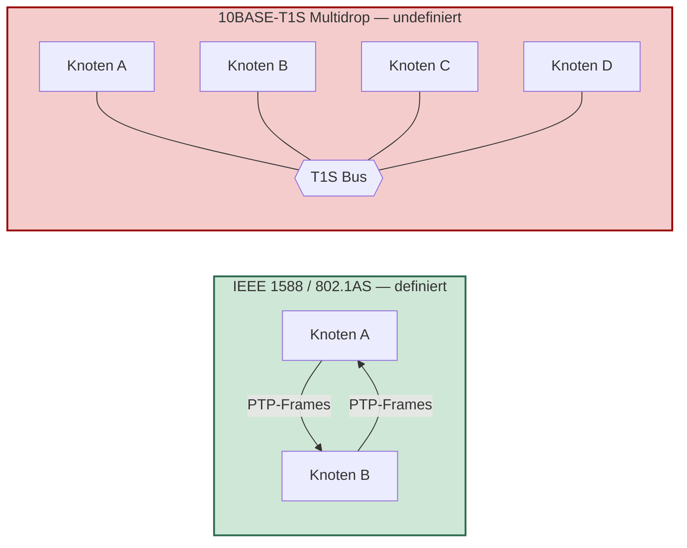
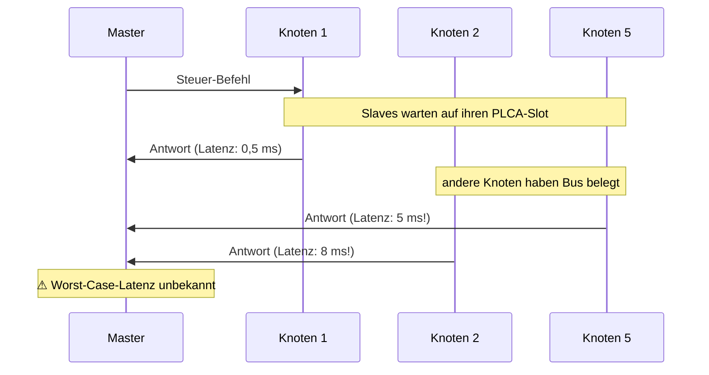
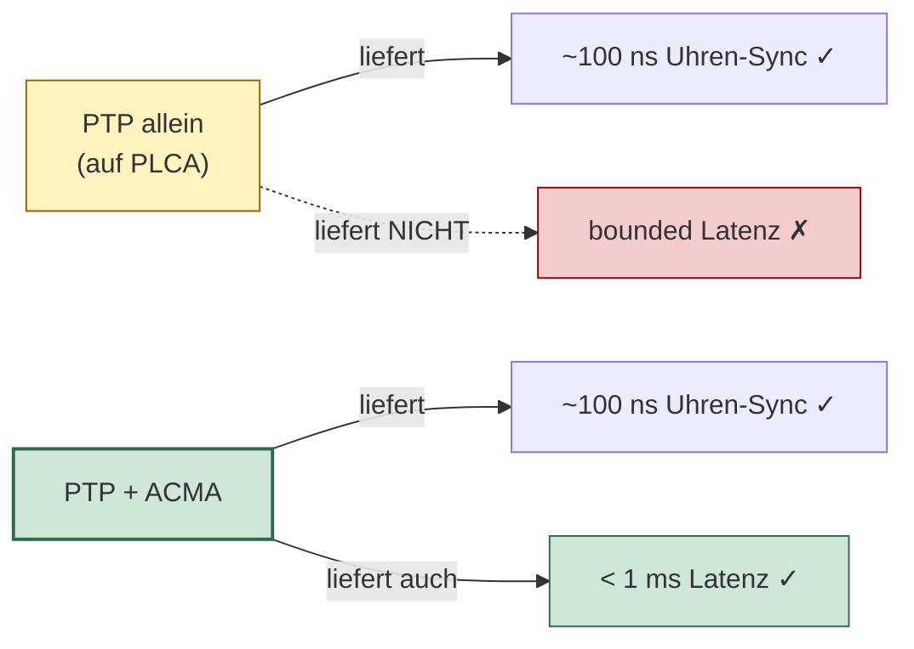
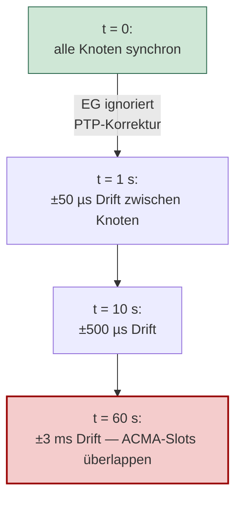
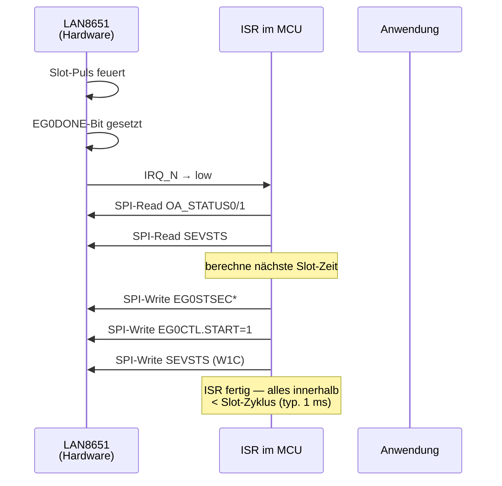
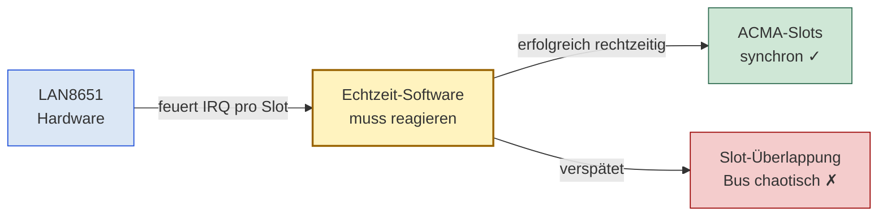
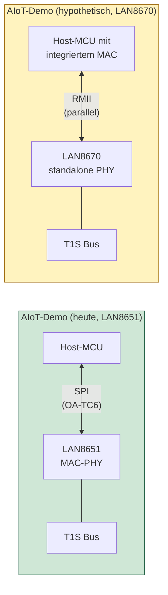
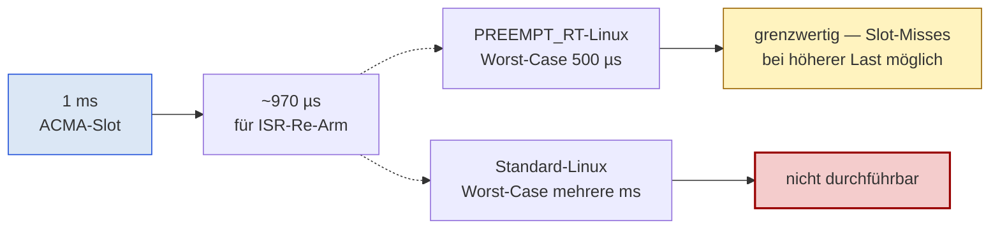
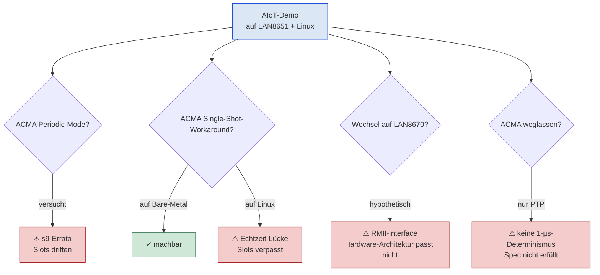

# Warum ACMA für präzise PTP-Zeitsynchronisation auf dem LAN865x notwendig ist

Eine technische Analyse, warum **PTP** auf 10BASE-T1S aktuell nur als
**Insel-Lösung** funktioniert, warum **ACMA** der entscheidende
Mechanismus für die geforderte Mikrosekunden-Präzision ist und welche
Hindernisse einer Software-Workaround-Lösung im Weg stehen.

Der zentrale Anwendungs-Kontext: ein **AIoT-Demo-System** mit
verteilter Sensorik und Steuerung, bei dem die Zeitsynchronisation
zwischen den Knoten nicht schlechter als 1 µs sein darf.

---

## Inhalt

1. [Die Insel-Lösungs-Problematik](#1-die-insel-lösungs-problematik)
2. [Warum 1 µs Genauigkeit ohne ACMA nicht erreichbar ist](#2-warum-1-µs-genauigkeit-ohne-acma-nicht-erreichbar-ist)
3. [Das s9-Errata des LAN8651 und sein Software-Workaround](#3-das-s9-errata-des-lan8651-und-sein-software-workaround)
4. [Warum der Software-Workaround kritisch ist](#4-warum-der-software-workaround-kritisch-ist)
5. [LAN8670 als Alternative — und warum sie nicht passt](#5-lan8670-als-alternative--und-warum-sie-nicht-passt)
6. [Linux-PTP-Support auf 10BASE-T1S — der schwierige Pfad](#6-linux-ptp-support-auf-10base-t1s--der-schwierige-pfad)
7. [Konsequenz für den AIoT-Demo](#7-konsequenz-für-den-aiot-demo)
8. [Fazit](#8-fazit)

---

## 1. Die Insel-Lösungs-Problematik

### Standard-Lücke

PTP (Precision Time Protocol, IEEE 1588) ist auf Punkt-zu-Punkt-
Verbindungen gut definiert und in vielen Industrie-Standards
verankert. Auf **10BASE-T1S Multidrop**-Bussen — also Bussen, an
denen mehrere Knoten parallel hängen — gibt es allerdings **keinen
abgesegneten IEEE-Standard**, der definiert, wie die PTP-Mechanik
genau ablaufen soll.

Bei einer **Punkt-zu-Punkt-Verbindung** (Standard-Ethernet) ist klar:
zwei Geräte tauschen direkt Frames aus, der Pfad-Delay wird mit dem
**Pdelay-Mechanismus** gemessen, beide Seiten kennen die
Verzögerung. Bei einem **Multidrop-Bus** funktioniert dieser
Mechanismus nicht ohne Weiteres: wer antwortet wem? Wie misst man
N gleichzeitige Pfad-Delays? Microchip's eigene Application Note
AN1847 weist explizit darauf hin, dass PTP-Standards diesen Fall
**aktuell nicht abdecken**.

### Folge: vendor-spezifische Lösungen

Jeder Chip-Hersteller, der PTP auf T1S Multidrop anbietet, baut sich
seinen eigenen Workaround. Microchip macht es mit AN1847 (statisches
Path-Delay statt dynamischer Pdelay-Messung), andere Hersteller
machen es anders — oder gar nicht. Die praktische Konsequenz:

> **PTP auf 10BASE-T1S Multidrop funktioniert heute nur dann, wenn
> alle Knoten am Bus vom selben Vendor stammen und denselben
> Workaround implementieren.**

Für einen AIoT-Demo bedeutet das:

- Solange **alle Knoten Microchip-LAN86xx**-basiert sind, läuft PTP
  → das ist eine Insel-Lösung
- Sobald **Knoten anderer Vendoren** in den Bus integriert werden
  sollen, fällt die PTP-Synchronisation aus, weil die Mechanismen
  inkompatibel sind
- Eine vendor-übergreifende PTP-Multi-Drop-Standardisierung gibt es
  perspektivisch (IEEE 802.3da arbeitet daran), aber **heute nicht
  verfügbar**

Das ist der Kern der Insel-Lösungs-Problematik: PTP funktioniert
auf einem Microchip-T1S-Bus, aber **nur in einem Microchip-Universum**.

---

## 2. Warum 1 µs Genauigkeit ohne ACMA nicht erreichbar ist

Der AIoT-Demo verlangt **< 1 µs Synchronisations-Genauigkeit**
zwischen den Knoten. Diese Anforderung lässt sich in zwei Aspekte
zerlegen:

### Aspekt A — Wall-Clock-Genauigkeit

Alle Knoten müssen dieselbe Uhrzeit nennen. Hier liefert PTP allein
auf reiner PLCA-Basis bereits **~100 ns** Genauigkeit (gemessen,
laut AN1847). Das ist deutlich unter 1 µs — **dieser Aspekt wäre
auch ohne ACMA erreichbar**.

### Aspekt B — Deterministische Reaktions-Zeit

Wenn der Master einen Steuer-Befehl sendet, muss die Reaktion der
Empfänger innerhalb einer **vorhersagbaren Zeit** erfolgen. Hier ist
der reine PLCA-Bus-Zugriff problematisch:

Auf einem PLCA-Bus hängt die Reaktions-Zeit von der Bus-Auslastung
ab — bei voll geladenem Bus kann die Antwort eines Knotens mehrere
Millisekunden brauchen, statt der angestrebten Mikrosekunden.

### Die Lücke

Für eine echte 1-µs-Anforderung — also nicht nur "Uhren synchron"
sondern auch "Reaktion in deterministischer Zeit" — reicht PTP
allein nicht. Es braucht zusätzlich einen Mechanismus, der **jedem
Knoten ein garantiertes Sende-Fenster** zuweist:

Genau diesen Mechanismus stellt **ACMA** zur Verfügung — und nichts
anderes auf dem LAN86xx tut das. **Ohne ACMA ist die 1-µs-Anforderung
für deterministische Reaktion nicht erreichbar**, egal wie sauber
PTP läuft.

---

## 3. Das s9-Errata des LAN8651 und sein Software-Workaround

Der LAN8651 (das integrierte MAC-PHY, das im AIoT-Demo zum Einsatz
kommt) hat in seinem aktuellen Silicon-Stand B1 ein **dokumentiertes
Errata mit der Bezeichnung s9**:

> **s9 — Event Generator Periodic-Mode-Drift:**
> Der Event Generator (EG), der die ACMA-Slot-Pulse erzeugt, läuft
> im Periodic-Mode (`REP=1`) am lokalen Quarz-Takt — und nicht an
> der durch PTP korrigierten Wall Clock. Folge: nach dem ersten
> Puls driften alle weiteren Pulse mit dem ungeregelten Quarz weg
> (~50 µs/s bei ±50 ppm Toleranz).

### Was das praktisch bedeutet

Wenn der LAN8651 die ACMA-Slots in Periodic-Mode generieren würde
— die naive, einfachste Konfiguration —, würden die Slots zwischen
den Knoten innerhalb weniger Sekunden auseinanderlaufen:

Die Folge: nach kurzer Zeit ist der Bus chaotisch, mehrere Knoten
senden gleichzeitig in fremde Slots. Die ACMA-Determinismus-Garantie
ist hin.

### Der Workaround

Microchip schlägt im Errata-Dokument explizit einen Workaround vor:

> "If multiple events are required, it is possible to trigger each
> event individually. Events generated in single mode are
> synchronous to the wall clock."

Das heißt: statt **Periodic-Mode** (`REP=1`) muss man **Single-Shot-
Mode** (`REP=0`) verwenden. In Single-Shot-Mode wird der EG vor
jedem Slot-Puls **explizit neu programmiert** — die Software muss
nach jedem Puls die nächste Slot-Zeit aus der aktuellen Wall Clock
berechnen und in die EG-Register schreiben.

Damit folgt der Slot-Puls jeder PTP-Korrektur der Wall Clock und
driftet nicht mehr.

---

## 4. Warum der Software-Workaround kritisch ist

Der Single-Shot-Workaround funktioniert technisch — aber er hat
**erhebliche Echtzeit-Anforderungen** an die Software, die ihn
treibt.

### Die ISR-Schleife pro Slot

Für jeden ACMA-Slot muss die Software exakt diese Sequenz fahren:

Pro Slot **ein vollständiger ISR-Durchlauf**. Bei einem typischen
1-ms-Zyklus heißt das: **1000 IRQs pro Sekunde pro Knoten**, jeder
mit etwa 5-7 SPI-Transaktionen.

### Worst-Case-Anforderung

Die ISR muss **vor dem nächsten Slot-Beginn** fertig sein, sonst
verpasst der Knoten seinen Slot und sendet später als geplant —
was zu Slot-Überlappungen mit dem nächsten Knoten führt. Konkret:

- Slot-Zyklus: 1 ms
- ISR-Latenz: typisch 5-10 µs
- ISR-Laufzeit: typisch 25-30 µs (SPI-bedingt)
- **Worst-Case-Bound:** ISR muss in deutlich unter 1 ms abgeschlossen sein

Auf einem **Bare-Metal-MCU mit dedizierter Interrupt-Behandlung**
ist das machbar. Auf einem **General-Purpose-OS** wird es schwierig:

| OS-Typ | Typische IRQ-Latenz | Typische Worst-Case-Latenz | Workaround praktikabel? |
|---|---|---|---|
| Bare-Metal-MCU | < 5 µs | < 20 µs | **ja** |
| FreeRTOS / Zephyr | 5-15 µs | 30-50 µs | knapp ja |
| Linux mit RT-Patch (PREEMPT_RT) | 20-50 µs | 100-500 µs | grenzwertig |
| Standard-Linux | 50-200 µs | bis mehrere ms | **nein** |

Auf Standard-Linux kann eine Hintergrund-Aufgabe (Kernel-Garbage-
Collection, NIC-Verarbeitung, Disk-I/O, RCU-Read-Side, etc.) die
ACMA-ISR um zig Millisekunden verzögern — **weit länger als ein
ACMA-Slot dauert**. Der Knoten verpasst seine Slots, und der gesamte
Bus läuft in Slot-Konflikte.

### Was das Kritische daran ist

Der s9-Software-Workaround ist also **nicht** ein "kleiner
Software-Trick" — er ist eine **echte Echtzeit-Anforderung** an
das Host-System. Bei jedem Slot ein deterministischer ISR-Run.
Wenn die Plattform diese Anforderung nicht zuverlässig erfüllt,
bricht das gesamte ACMA-Konzept zusammen.

---

## 5. LAN8670 als Alternative — und warum sie nicht passt

Der LAN8670 (das standalone PHY-Pendant aus derselben Familie) hat
in seinem aktuellen Silicon-Stand D0 das **s9-Errata-Pendant nicht
mehr** — der Drift im Periodic-Mode ist dort entweder per Si-Rev
gefixt oder von Anfang an nicht aufgetreten. Auf dem LAN8670 wäre
also **ACMA ohne den Software-Workaround** möglich. Periodic-Mode
würde funktionieren, die ISR-Schleife wäre nicht nötig.

### Aber das Interface-Problem

Der LAN8670 ist ein **standalone PHY**, kein integriertes MAC-PHY.
Er kommuniziert mit dem Host-MCU über **MII / RMII / SC-MII** —
also klassische parallel-Ethernet-Interfaces.

Auf einem AIoT-Demo-System, das auf SPI-basiertem Anschluss aufgebaut
ist, wäre der LAN8670 **nicht ohne weiteres einsetzbar**:

- Host-MCU bräuchte einen eigenen **MAC-Block** (Ethernet-IP), der
  den Frame-Pfad bedient — viele kleine MCUs haben das nicht
- Pin-Anzahl deutlich höher (RMII = 6+ Pins, RMII-Clock-Verteilung
  etc., gegen SPI = 4 Pins)
- PCB-Routing-Anforderungen anspruchsvoller (50 Ω controlled
  impedance auf RMII-Strecken, Clock-Skew zwischen Daten-Lanes)
- Software-Stack komplett anders (Standard-Ethernet-Treiber statt
  OA-TC6 SPI-Stack)

Für einen **bestehenden AIoT-Demo, der auf LAN8651 aufgebaut ist**,
ist der Wechsel auf LAN8670 also keine Drop-in-Alternative — er
bedeutet eine grundlegende Hardware- und Software-Architektur-
Änderung.

---

## 6. Linux-PTP-Support auf 10BASE-T1S — der schwierige Pfad

Wenn der AIoT-Demo perspektivisch auf einem **Linux-basierten
Host-System** laufen soll (z. B. Raspberry Pi oder Industrial-
Edge-PC), wird die Lage noch enger.

### Die Linux-Echtzeit-Lücke

Standard-Linux bietet **keine harten Echtzeit-Garantien**. Eine
ISR-Routine kann durch eine Vielzahl von Faktoren verzögert
werden:

- Kernel-RCU-Operationen
- Memory-Reclaim und Garbage-Collection
- Konkurrierende I/O-Operationen (Disk, USB, anderer Netzwerk-
  Verkehr)
- Power-Management-Übergänge
- Timer-Interrupts höherer Priorität

Selbst mit dem **PREEMPT_RT-Patch**, der Linux echtzeit-fähig
machen soll, sind Worst-Case-IRQ-Latenzen typisch im Bereich
**100-500 µs**, gelegentlich auch mal mehrere Millisekunden.

### Konsequenz für den s9-Workaround

Bei einem 1-ms-ACMA-Slot-Zyklus, in dem der Workaround die ISR in
deutlich unter 1 ms ausführen muss, ist Linux am Limit:

Auf Standard-Linux ist die deterministische Slot-Erzeugung beim
LAN8651 **praktisch nicht durchführbar** — die OS-Latenz ist
größer als ein Slot-Zyklus.

### Folge

Linux-PTP-Support auf 10BASE-T1S in Verbindung mit ACMA wäre nur
auf dem **LAN8670** ohne s9-Workaround möglich (siehe §5: aber
RMII-Interface-Problem). Auf dem **LAN8651** mit s9-Workaround
wäre es **sehr schwierig bis unmöglich** — selbst ein
PREEMPT_RT-Linux würde unter realistischer Anwendungs-Last
sporadisch Slots verpassen, was die ACMA-Garantie kompromittiert.

---

## 7. Konsequenz für den AIoT-Demo

Der AIoT-Demo befindet sich an einer Schnittstelle:

- Hardware-Plattform: **LAN8651 mit SPI-Anschluss** (nicht ohne
  weiteres austauschbar)
- Synchronisations-Anforderung: **< 1 µs zwischen Knoten** (das
  ist die Spec)
- Zukunfts-Pfad: **Linux-Software-Support** (für AIoT-typische
  Edge-Anwendungen unverzichtbar)

Aus den vorherigen Kapiteln ergibt sich folgende Lage:

| Anforderung | LAN8651 (heute) | LAN8670 (hypothetisch) | Linux-Support |
|---|---|---|---|
| PTP ohne ACMA | ✓ aber kein Determinismus | ✓ aber kein Determinismus | ✓ aber unzureichend |
| PTP + ACMA via Periodic-Mode | ✗ wegen s9 | ✓ kein Errata | ✓ wenn ohne Workaround |
| PTP + ACMA via Single-Shot-Workaround | ✓ technisch, aber RT-kritisch | nicht nötig | ✗ Linux nicht zeitsicher genug |
| RMII statt SPI | n/a | aber HW-Architektur nicht passend | – |

### Was das praktisch heißt

Die einzig saubere Konfiguration für den AIoT-Demo wäre:

> **LAN8651 + ACMA in Periodic-Mode + Linux-Software-Support**
>
> Aber genau **das** verhindert das s9-Errata.

Der Workaround per Single-Shot-Mode ist auf Bare-Metal-MCUs
machbar, aber auf Linux problematisch. Der Wechsel auf LAN8670
würde das s9-Problem umgehen, aber den Demo-Hardware-Aufbau
fundamental ändern.

Jeder einzelne Pfad führt entweder in eine **Errata-Limitation**
(s9), eine **Echtzeit-Lücke** (Linux), eine **Hardware-Inkompatibilität**
(RMII) oder eine **Nicht-Erfüllung der 1-µs-Spec** (PTP allein).

---

## 8. Fazit

Die technische Analyse führt unausweichlich zu folgender Aussage:

> **ACMA ist eine notwendige Voraussetzung dafür, dass PTP auf
> 10BASE-T1S für präzise Zeitsynchronisation im Mikrosekunden-
> Bereich überhaupt nutzbar ist — solange die Insel-Lösungs-
> Limitierung des fehlenden Multidrop-PTP-Standards besteht.**

Konkret bedeutet das für den AIoT-Demo:

1. **PTP allein** liefert nur Uhren-Synchronisation, nicht
   deterministische Reaktions-Zeit. Die 1-µs-Anforderung ist damit
   nicht erfüllbar.

2. **ACMA in Periodic-Mode** — die einfache, robuste Variante —
   ist auf dem LAN8651 wegen des s9-Errata aktuell nicht nutzbar.

3. **ACMA via Single-Shot-Workaround** ist auf Bare-Metal-MCUs
   machbar, auf Linux aber wegen der OS-Echtzeit-Lücke
   problematisch — ein zentrales Risiko für AIoT-Plattformen mit
   Linux-Stack.

4. **Wechsel auf LAN8670** würde das s9-Problem lösen, ist aber
   wegen des RMII-Interfaces auf der bestehenden Demo-Hardware
   nicht ohne Aufwand realisierbar.

5. Eine Welt **ohne ACMA** auf dem LAN86xx würde bedeuten, dass
   die 1-µs-Synchronisation auf Multidrop-T1S für AIoT-Anwendungen
   praktisch nicht mehr erreichbar wäre — keiner der oben
   genannten Pfade würde dann noch funktionieren.

Damit ist ACMA nicht ein "schönes Zusatz-Feature", sondern der
**zentrale technische Hebel**, der präzise Zeitsynchronisation auf
10BASE-T1S für AIoT-Anwendungen überhaupt erreichbar macht. Der
saubere Pfad nach vorne — sowohl für die laufende Demo-Plattform
als auch für künftige Linux-fähige Edge-Erweiterungen — verlangt
**ACMA in Periodic-Mode ohne Software-Workaround**, was wiederum
einen **Silicon-Fix für s9** auf dem LAN8651 voraussetzt oder den
Rückgriff auf Hardware-Varianten, die das Errata bereits hinter
sich gelassen haben.

---

**Stand 2026-04-28.** Diese Analyse ist auf den konkreten
AIoT-Demo-Anwendungsfall zugeschnitten und bezieht sich auf den
Silicon-Stand der LAN86xx-Familie wie aktuell verfügbar. Bei
Si-Rev-Änderungen oder Bus-Topologie-Anpassungen sind die
Schlussfolgerungen entsprechend zu prüfen.
