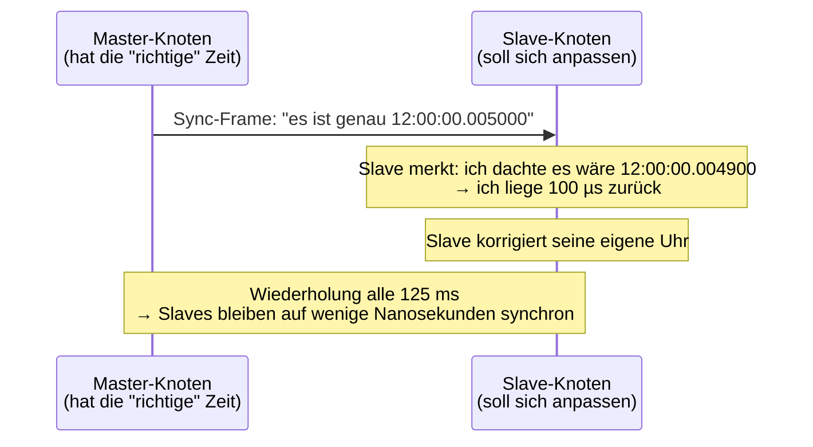
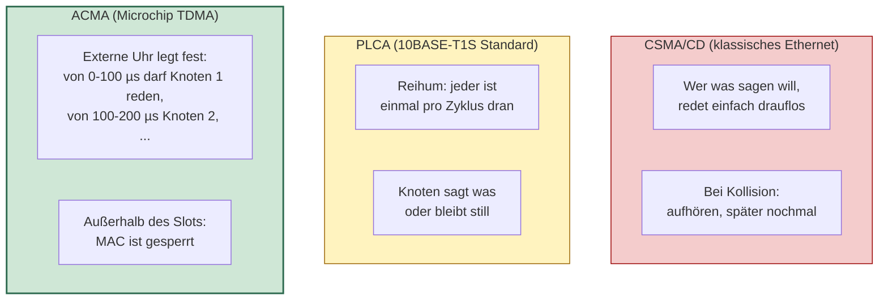
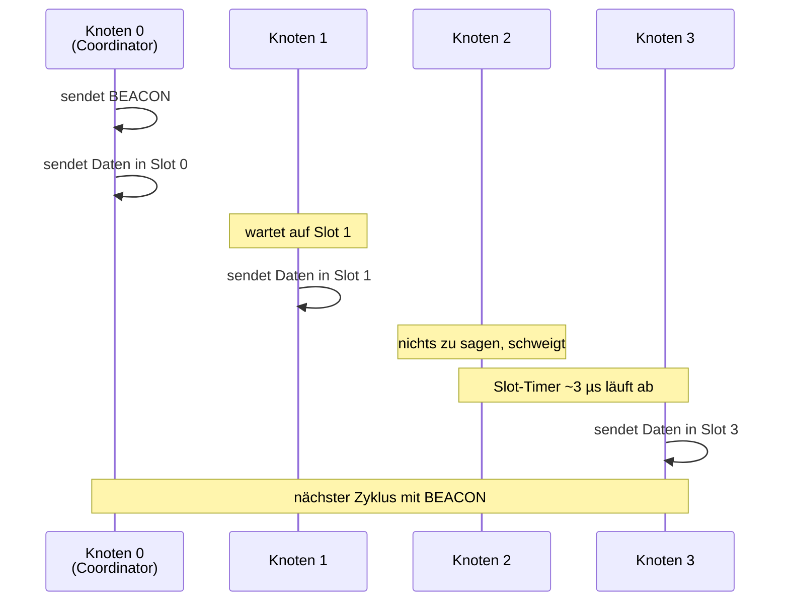
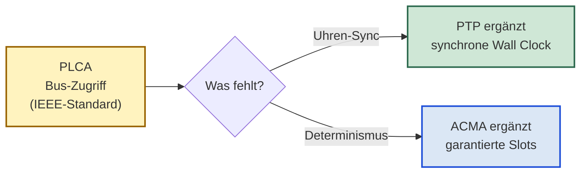
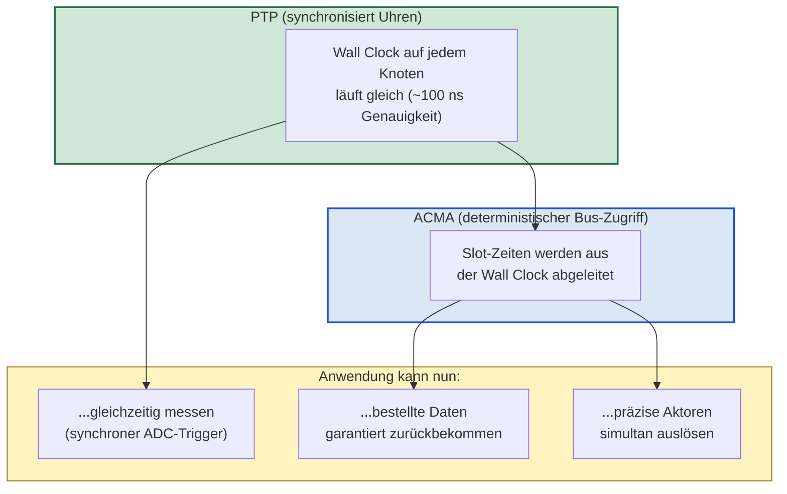
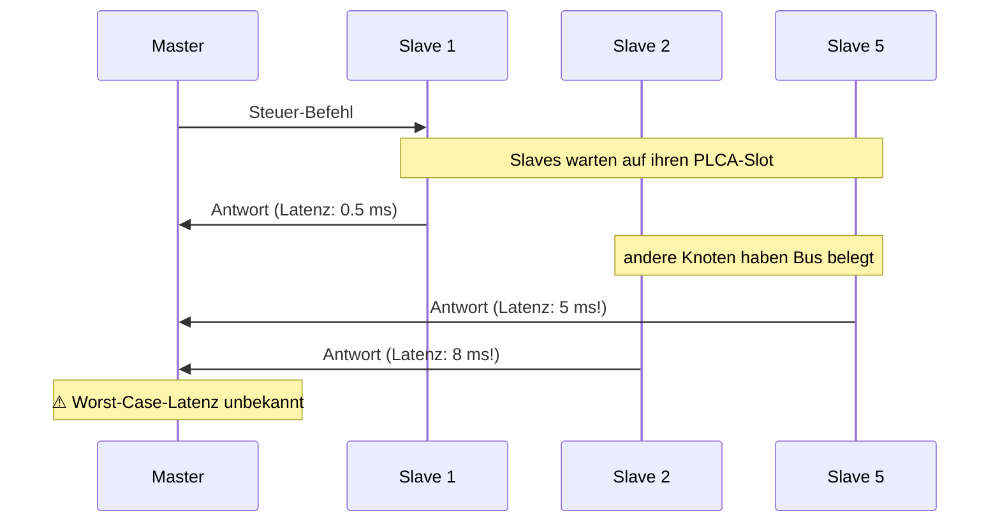
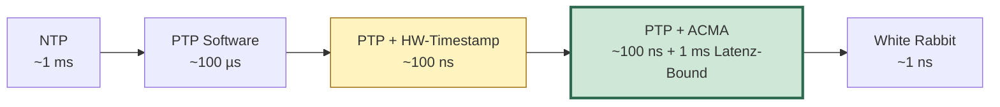
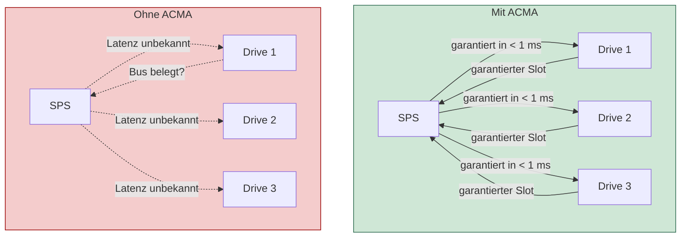
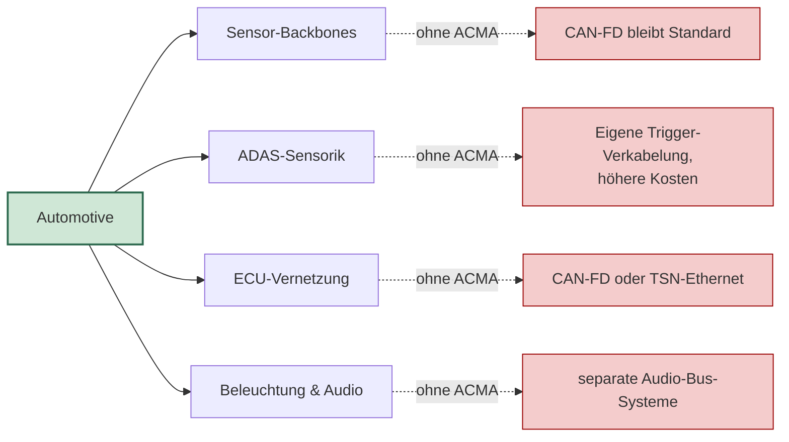

# 10BASE-T1S Zeitsynchronisation — PTP, ACMA und ihre Anwendungen

Eine kompakte Einführung in die zwei zentralen Mechanismen für
zeitsynchrone Mess- und Steuerungs-Anwendungen auf 10BASE-T1S
Multidrop-Netzen: **PTP** für synchrone Uhren und **ACMA** für
deterministischen Bus-Zugriff. Plus eine ehrliche Betrachtung, welche
Anwendungen welche Genauigkeit brauchen und welche Geschäfts-Felder
ohne ACMA verloren gingen.

---

## Inhalt

1. [Was ist PTP?](#1-was-ist-ptp)
2. [Was ist ACMA?](#2-was-ist-acma)
3. [Wie ACMA und PTP zusammen Zeitsynchronisation garantieren](#3-wie-acma-und-ptp-zusammen-zeitsynchronisation-garantieren)
   - 3.0 [Vorab: Was ist PLCA?](#30-vorab-was-ist-plca)
   - 3.1 [Die Lücken bei einzelner Verwendung](#31-die-lücken-bei-einzelner-verwendung)
   - 3.2 [Die Kombination](#32-die-kombination)
4. [Was mit PTP allein nicht erreichbar ist](#4-was-mit-ptp-allein-nicht-erreichbar-ist)
5. [AN1847 als Basis der heutigen PTP-Implementierung](#5-an1847-als-basis-der-heutigen-ptp-implementierung)
6. [Zeitsynchronisations-Methoden im Vergleich](#6-zeitsynchronisations-methoden-im-vergleich)
7. [Welche Anwendung braucht welche Bandbreite und Genauigkeit?](#7-welche-anwendung-braucht-welche-bandbreite-und-genauigkeit)
8. [Was ohne ACMA nicht mehr möglich wäre](#8-was-ohne-acma-nicht-mehr-möglich-wäre)
9. [Geschäfts-Folgen ohne ACMA](#9-geschäfts-folgen-ohne-acma)

---

## 1. Was ist PTP?

PTP heißt **Precision Time Protocol** und ist im Standard IEEE 1588
festgelegt. Die Aufgabe von PTP ist einfach: **alle Knoten in einem
Netzwerk sollen dieselbe Uhrzeit kennen**.

### Wie PTP funktioniert (vereinfacht)

### Das Ergebnis

Wenn PTP einmal eingeschwungen ist, sind alle Knoten auf etwa
**100 ns synchron** (gemessen auf realer Microchip-Hardware).
Das bedeutet:

- Knoten 1 und Knoten 5 nennen denselben Zeitpunkt
- Wenn der Master sagt "messe um genau 12:00:01.000000", dann
  messen alle Knoten zur exakt gleichen Wall-Clock-Zeit
- Verteilte Mess-Werte können zeitlich korreliert werden

### Was PTP **nicht** macht

PTP **synchronisiert nur die Uhren**. Es macht **nichts** zum
Bus-Zugriff: wer wann senden darf, ob Daten kollidieren, wie lange
ein Frame zum Empfänger braucht — das ist nicht Aufgabe von PTP.

---

## 2. Was ist ACMA?

ACMA heißt **Application Controlled Media Access**. Es ist ein
Mechanismus, der den Bus-Zugriff streng zeitlich plant —
quasi ein Kalender, der jedem Knoten ein eigenes Zeitfenster
zuweist, in dem er senden darf.

### Bus-Zugriffs-Mechanismen im Vergleich

### Wie ACMA technisch funktioniert

ACMA ist im Grunde ein einfaches **Tor vor der Sende-Logik** des
Chips:

- Tor offen → Chip darf senden
- Tor zu → Chip ist gesperrt

Das Tor wird von einem Steuersignal kontrolliert, das von einer
internen oder externen Quelle kommt. Wenn die Quelle ein
**Pulsgenerator** ist, der von der Wall Clock getrieben wird, kann
der Chip präzise zu vordefinierten Zeitpunkten senden.

### Das Ergebnis

Mit ACMA bekommt jeder Knoten ein **garantiertes Sende-Fenster**:

```mermaid
gantt
    title 8-Knoten-Bus mit 1 ms Zyklus / 100 µs Slots / 25 µs Guard
    dateFormat X
    axisFormat %L

    section Knoten
    Knoten 0 sendet  :a1, 0, 100
    Guard            :crit, 100, 25
    Knoten 1 sendet  :a2, 125, 100
    Guard            :crit, 225, 25
    Knoten 2 sendet  :a3, 250, 100
    Guard            :crit, 350, 25
    Knoten 3 sendet  :a4, 375, 100
    Guard            :crit, 475, 25
    Knoten 4 sendet  :a5, 500, 100
    Guard            :crit, 600, 25
    Knoten 5 sendet  :a6, 625, 100
    Guard            :crit, 725, 25
    Knoten 6 sendet  :a7, 750, 100
    Guard            :crit, 850, 25
    Knoten 7 sendet  :a8, 875, 100
```

Jeder Knoten bekommt 100 µs in einer Millisekunde. Niemand kommt zu
spät, niemand kollidiert, niemand muss warten.

---

## 3. Wie ACMA und PTP zusammen Zeitsynchronisation garantieren

### 3.0 Vorab: Was ist PLCA?

Bevor wir verstehen, wie ACMA und PTP zusammenwirken, hilft eine
kurze Erklärung des **Standard-Bus-Zugriffs-Mechanismus**, auf dem
beide aufbauen oder den sie ergänzen — **PLCA**.

PLCA heißt **Physical Layer Collision Avoidance** und ist im Standard
IEEE 802.3 Clause 148 festgelegt. Es ist der eigentliche Bus-
Zugriffs-Standard für 10BASE-T1S Multidrop-Netze.

**Wie PLCA funktioniert:**

- Ein Knoten (typischerweise Knoten 0) ist der **Coordinator** und
  sendet periodisch ein **BEACON**-Signal auf den Bus
- Nach dem BEACON ist Knoten 0 mit seinem Sende-Slot dran, dann
  Knoten 1, dann Knoten 2, und so weiter — der Reihe nach
- Im eigenen Slot darf der Knoten **ein Frame senden** — oder still
  bleiben
- Bleibt er still, läuft ein kurzer Slot-Timer (~3 µs) ab, und der
  nächste Knoten ist dran

**Lesart:**

- **Was PLCA garantiert:** Kollisionen sind ausgeschlossen, weil nur
  ein Knoten zur gleichen Zeit sendet. Jeder Knoten kommt fair zum
  Sprechen, niemand muss konkurrieren.
- **Was PLCA *nicht* garantiert:** konstante Zykluszeit (Slots bei
  Inaktivität werden übersprungen), keine harte Latenz-Bound (unter
  Volllast dauert der Zyklus deutlich länger), keine Uhrzeit-
  Synchronisation zwischen Knoten.

PLCA ist also **fair und kollisionsfrei**, aber nicht
**deterministisch im strengen Sinne** und kennt keine Uhren. Genau
diese beiden Lücken werden von **PTP** (synchrone Uhren) und
**ACMA** (deterministische Slots) geschlossen.

### 3.1 Die Lücken bei einzelner Verwendung

Allein hat jeder der beiden Mechanismen eine Lücke:

- **PTP allein** (auf PLCA-Basis): Uhren synchron, aber Daten kommen
  unvorhersagbar spät an
- **ACMA allein** (ohne PTP): Bus-Slots sind deterministisch, aber
  die Uhren zwischen Knoten driften auseinander → die Slots laufen
  aus dem Tritt

### 3.2 Die Kombination

Erst **die Kombination** liefert echte Zeitsynchronisation:

### Wie Erklärungs-Bild

PTP sagt: *"Jeder hat dieselbe Uhrzeit."*

ACMA sagt: *"Wer um 12:00:00.000125 dran ist, darf senden."*

Beide zusammen sagen: *"Knoten 5 darf um genau 12:00:00.000125 auf
allen 8 Knoten gleichzeitig anerkannt 100 µs lang senden — und
keine Sekunde später."*

Damit hat man **einen TDMA-Bus mit zeitsynchroner Slot-Vergabe**.
Genau das, was Industrie- und Automotive-Anwendungen für
deterministische Steuerungen brauchen.

---

## 4. Was mit PTP allein nicht erreichbar ist

Wenn nur PTP ohne ACMA aktiv ist, hat man synchrone Uhren auf
allen Knoten. Aber:

### 4.1 Garantierte Antwort-Zeit nicht möglich

Ein Master schickt einen Steuer-Befehl an alle Slaves. Mit PLCA als
Bus-Zugriffs-Mechanismus muss jeder Slave **warten, bis er an der
Reihe ist**, um seine Antwort zu schicken. Dauert das eine
Millisekunde oder zehn? Niemand weiß es im Voraus, weil die
Wartezeit von der Bus-Last abhängt.

Bei einer **Echtzeit-Regelung** ist das ein Showstopper. Die
Steuerungs-Schleife kann nicht stabil laufen, wenn die Antwort-Zeit
schwankt.

### 4.2 Synchrones gleichzeitiges Senden mehrerer Knoten unmöglich

Wenn alle Knoten ihre Mess-Werte zur exakt gleichen Sekunde
abliefern sollen, geht das auf einem PLCA-Bus nicht — nur ein
Knoten kann gleichzeitig senden, alle anderen müssen warten. Die
Datenpakete kommen nacheinander, nicht parallel.

### 4.3 Worst-Case-Bandbreite pro Knoten unbekannt

Auf einem PLCA-Bus teilen sich alle Knoten **dynamisch** die
Bandbreite — wer mehr sendet, bekommt mehr. Aber für sichere
Steuerungen braucht man eine garantierte Mindest-Bandbreite pro
Knoten, unabhängig davon, was die anderen tun.

### Die Konsequenz

PTP allein liefert **synchrone Zeitstempel**, aber nicht
**deterministische Datenübertragung**. Für Anwendungen, die nur
Zeitstempel brauchen (z. B. Datenlogging mit nachträglicher
Korrelation), reicht PTP. Für Anwendungen mit harten
Echtzeit-Anforderungen reicht es nicht.

---

## 5. AN1847 als Basis der heutigen PTP-Implementierung

Microchip hat in **Application Note AN1847** eine konkrete
Implementierung von PTP für 10BASE-T1S beschrieben und als
Referenzcode bereitgestellt. Diese Implementierung ist die heutige
Basis für PTP-Synchronisation auf der LAN86xx-Familie.

### Was AN1847 liefert

- **Sync + Follow_up Frames** — der Master sendet alle 125 ms eine
  Sync-Botschaft mit seiner aktuellen Wall-Clock-Zeit; alle Slaves
  korrigieren ihre Uhr danach
- **Hardware-Timestamping am SFD** — der Timestamp wird direkt am
  PHY (auf dem Kabel) erfasst, unabhängig von Software-Latenz
- **Statisches Path-Delay** — die Signal-Laufzeit zwischen Master
  und Slave wird einmal gemessen und als Konstante hinterlegt
- **Einfacher Servo-Algorithmus** — 4 Zustände (UNINIT, MATCHFREQ,
  HARDSYNC, COARSE, FINE), läuft auf jedem Mikrocontroller

### Gemessene Genauigkeit

Microchip hat AN1847 auf eigener Hardware vermessen:
**100 ns peak-to-peak**, **25 ns Standardabweichung**, **8 ns
Mittelwert** zwischen Master und Slave auf 50 cm Kabel.

Das ist **deutlich unter 1 µs** und reicht für die meisten
zeitsynchronen Anwendungen.

### Was AN1847 nicht macht

AN1847 löst nur die Uhren-Synchronisation. Es macht **nichts** zum
deterministischen Bus-Zugriff — der Bus läuft auf normalem PLCA und
hat alle PLCA-Eigenschaften (faire Slot-Vergabe, aber keine harten
Latenz-Garantien).

Wer Latenz-Garantien braucht, muss zusätzlich ACMA nutzen.

---

## 6. Zeitsynchronisations-Methoden im Vergleich

Verschiedene Kombinationen liefern verschiedene Genauigkeits-
Klassen:

| Methode | Erreichbare Genauigkeit | Worst-Case-Latenz |
|---|---|---|
| **Reine NTP-Software-Sync** über klassisches Ethernet | ~1 ms | unbestimmt |
| **PTP-Software** ohne Hardware-Timestamping | ~100 µs | unbestimmt |
| **PTP mit Hardware-Timestamping** (AN1847-Style) | **~100 ns** | bis 10 ms (Bus-Last-abhängig) |
| **PTP + PLCA** mit Heartbeat-Disziplin | ~100 ns | mehrere ms (PLCA-Skip-Effekte) |
| **PTP + ACMA** | **~100 ns** | **< 1 ms (deterministisch)** |
| **Sub-100-ns-Lösungen** (z. B. White Rabbit, externer 1PPS) | ~1 ns | – |

### Wichtige Erkenntnis

**PTP + ACMA liegt klar unter 1 µs Synchronitäts-Genauigkeit, plus
deterministische Sub-Millisekunden-Latenz.** Das ist die
Kombination, die die meisten industriellen TDMA-Anwendungen
verlangen.

---

## 7. Welche Anwendung braucht welche Bandbreite und Genauigkeit?

Eine Übersicht typischer Anwendungs-Klassen mit ihren Anforderungen:

| Anwendung | Genauigkeits-Bedarf | Bandbreite | PTP genug? | ACMA nötig? |
|---|---|---|---|---|
| **Datenlogging** mit Zeit-Korrelation | < 100 µs | gering | ja | nein |
| **Temperatur-Monitoring** | < 1 ms | sehr gering | ja | nein |
| **Power-Quality-Monitoring** (PMU) | < 1 µs | mittel | ja | nein |
| **Motor-Steuerung** mit Echtzeit-Feedback | < 100 µs | mittel | nein | **ja** |
| **Multi-Achs-Robotik** | < 1 µs Sample-Sync | mittel | nein | **ja** |
| **Verteilte SPS** in Produktionsanlagen | < 1 ms Reaktion | mittel | nein | **ja** |
| **ADAS-Sensor-Trigger** im Fahrzeug | < 1 µs | gering (nur Trigger) | nein | **ja** |
| **In-Vehicle-Network** (CAN-FD-Replacement) | < 1 ms | gering-mittel | nein | **ja** |
| **Distributed Audio** (Beamforming) | < 1 µs Phase | mittel | nein | **ja** |
| **Synchronized Lighting** (LED-Effekte) | < 1 ms | gering | nein | **ja** |
| **LiDAR-Cluster** ohne Cross-Talk | < 100 µs | gering | nein | **ja** |
| **Sicherheits-kritische Steuerungen** (ASIL) | < 1 ms deterministisch | gering-mittel | nein | **ja** |
| **HIL-Test-Bench** mit Multi-Last | < 10 µs | mittel | nein | **ja** |
| **Smart-Building** (50 Knoten) | < 10 ms | gering | nein | **ja** |
| **Smart-Grid-Edge-Monitoring** | < 1 µs | mittel | ja | optional |

### Die wichtige Beobachtung

In dieser Liste sind **wenige Anwendungen** mit "PTP genug" — und
**viele** mit "ACMA nötig". Sobald **deterministische Reaktion**
oder **deterministische Datenübertragung** verlangt wird, ist ACMA
notwendig.

---

## 8. Was ohne ACMA nicht mehr möglich wäre

Wenn ACMA als Mechanismus nicht zur Verfügung stünde, wären die
folgenden Anwendungs-Klassen mit der LAN86xx-Familie **nicht
realisierbar** (oder nur mit erheblichen externen Workarounds):

### 8.1 Verteilte Echtzeit-Steuerung

Motor-Drives, SPS-Backbone, Roboter-Achsen — alles auf
Standard-PLCA *grundsätzlich machbar*, aber **nicht mit der nötigen
Reaktions-Garantie**. Diese Anwendungen wandern dann zu
EtherCAT/PROFINET-IRT auf 100 Mbit/s ab.

### 8.2 Automotive ADAS-Sensor-Synchronisation

Kameras, Radar, LiDAR und Ultraschall müssen frame-synchron
ausgelöst werden, damit ihre Daten zeitlich vergleichbar sind. Ohne
ACMA gibt es keinen deterministischen Trigger-Verteilungs-Mechanismus
— die Sensor-Fusion wird ungenau, was bei Sicherheitsfunktionen
(Notbrems-Assistenz) ein Showstopper ist.

### 8.3 Funktional-sichere Bus-Systeme

ISO-26262- oder ARP4761-konforme Steuerungen brauchen
Watchdog-Mechanismen mit deterministischen Reaktionszeiten. Ohne
ACMA ist die Detektion eines Knoten-Ausfalls auf einem Bus mit
N Teilnehmern nicht binnen einer definierten Zeitspanne garantiert —
die Funktionssicherheits-Zertifizierung wird damit deutlich
schwieriger.

### 8.4 Distributed Audio / Beamforming

Mehrere Mikrofone oder Lautsprecher mit phasen-konstanter
Synchronität geht ohne ACMA nicht — die Audio-Daten würden mit
schwankender Latenz ankommen, was hörbare Artefakte produziert.

### 8.5 LiDAR-Cluster ohne Cross-Talk

Mehrere ToF-Distanz-Sensoren auf demselben Bus brauchen
**exklusive Sende-Slots**, damit ihre Lichtpulse sich nicht in den
Empfängern der anderen Sensoren stören. Ohne ACMA gibt es nur
PLCA-Best-Effort, was bei zeitkritischen Light-Pulsen zu falschen
Distanz-Messungen führt.

### 8.6 Verteilte Aktorik mit synchronem Trigger

Stempel-Pressen, Sprüh-Anlagen, Schwingungs-Anregung —
Anwendungen, bei denen **mehrere Aktoren simultan** aktiv werden
müssen. Ohne ACMA müsste man auf separate Trigger-Verkabelung
ausweichen, was Verkabelungs- und Wartungs-Aufwand vervielfacht.

### 8.7 TDMA-Bus für Industrie-4.0-Sensorik

Smart-Building, Smart-Grid-Edge, IIoT-Sensor-Mesh — alle
Anwendungen mit **vielen Knoten + Determinismus + niedriger
Bandbreite** verlangen TDMA. Ohne ACMA gibt es auf 10BASE-T1S kein
TDMA — diese Anwendungen verlieren sich an höher-bandbreitigere
(und teurere) TSN-Ethernet-Lösungen.

---

## 9. Geschäfts-Folgen ohne ACMA

Die oben genannten Anwendungs-Klassen sind nicht akademisch — sie
adressieren **konkrete und wachsende Märkte** mit milliardenschwerem
Volumen. Wenn ACMA nicht zur Verfügung stünde, würde der LAN86xx
in folgenden Geschäfts-Feldern den Anschluss verlieren:

### 9.1 Automotive — der größte Verlust

Microchip's primärer Markt-Push für 10BASE-T1S adressiert genau die
Automotive-Branche (AEC-Q100, ISO-26262 Safety-Package). Ohne ACMA
wäre der LAN86xx als CAN-FD-Replacement zwar funktional einsatzbar,
aber ohne den entscheidenden Determinismus-Vorteil. Ergebnis: die
Branche bleibt bei CAN-FD oder springt direkt auf TSN-Ethernet.

### 9.2 Industrieautomatisierung

Verteilte SPS-Systeme, Motor-Drives, Förderbänder, Verpackungs-
Maschinen, Roboter-Achsen — typischer Einsatz von EtherCAT,
PROFINET-IRT oder Sercos III auf 100 Mbit/s. Die Idee: 10BASE-T1S
mit ACMA ist die Low-Cost-Variante. Ohne ACMA fehlt der
Determinismus-Vorteil — Kunden bleiben bei den 100-Mbit/s-Lösungen,
auch wenn die Bandbreite überdimensioniert ist.

### 9.3 Funktional-sichere Anwendungen

Sicherheits-Steuerungen in Industrie und Avionik. Microchip hat ein
ISO-26262-Safety-Package speziell für die LAN86xx-Familie aufgebaut.
Ohne ACMA fehlt dem Safety-Konzept die Determinismus-Komponente,
die für Reaktions-Garantien notwendig ist — die hochpreisige
Funktional-Sicherheits-Anwendung springt zu Konkurrenz-Hardware.

### 9.4 Audio / Multimedia / Smart-Building

AVB-Light-Anwendungen, synchrone Beleuchtung, Konferenz-Audio,
Gebäude-Automatisierung. Hier ist die Konkurrenz oft AVB/TSN auf
100 Mbit/s mit höheren Hardware-Kosten. Ohne ACMA fällt der
Low-Cost-Vorteil von 10BASE-T1S weg, weil Standard-PLCA nicht die
nötige zeitliche Determiniertheit liefert.

### 9.5 Test- und Mess-Equipment

HIL-Test-Bänke, synchrone Mess-Knoten in R&D und Produktion. Diese
Märkte sind klein, aber margenstark. Ohne ACMA fehlt der
deterministische Trigger-Verteilungs-Mechanismus — die Kunden
bleiben bei Trigger-Bus-Verkabelungen oder GPIB/LXI.

### 9.6 Quantitative Einschätzung

Marktforschungs-Daten zu 10BASE-T1S projizieren für 2027-2030 eine
**zweistellige Milliarden-USD-Adressierungs-Größe**. Die zentralen
Anwendungs-Felder:

| Markt-Segment | Anteil mit Determinismus-Bedarf | ACMA-Relevanz |
|---|---|---|
| Automotive (Sensor + ECU) | ~70 % | hoch |
| Industrieautomatisierung | ~80 % | hoch |
| Building-Automation | ~60 % | mittel-hoch |
| Energie-Management | ~50 % | mittel |
| Audio / Multimedia | ~80 % | hoch |
| Sicherheits-/Avionik | ~95 % | sehr hoch |

→ Ohne ACMA verliert der LAN86xx in **70-80 % seiner adressierten
Anwendungen** den entscheidenden Differenzierungs-Vorteil.

### 9.7 Strategische Folge

ACMA ist nicht nur ein "nettes Extra-Feature" — es ist das
**zentrale Differenzierungs-Merkmal** des LAN86xx in den meisten
seiner adressierten Märkte. Ohne ACMA wäre die LAN86xx-Familie eine
Standard-PLCA-Implementation mit Hardware-Timestamping —
funktional brauchbar, aber ohne Alleinstellungs-Merkmal gegenüber
den Wettbewerbern, die alle ebenfalls Standard-PLCA anbieten.

Die kommerzielle Realität: Wer bei Microchip 10BASE-T1S kauft und
TDMA-Determinismus braucht, hat **keine alternative Hardware** auf
dem Markt. Diese Quasi-Monopol-Stellung in der TDMA-Nische ist der
Hauptgrund, warum LAN86xx in Industrie- und Automotive-Designs
Marktanteile gewinnt.

---

## Zusammenfassung in einem Satz

> **PTP synchronisiert die Uhren auf 100 Nanosekunden genau. ACMA
> liefert den deterministischen Bus-Zugriff. Erst die Kombination
> ergibt eine zeitsynchrone TDMA-Plattform unter einer Mikrosekunde
> Genauigkeit — und genau diese Kombination ist das, was 10BASE-T1S
> für hochwertige Industrie- und Automotive-Anwendungen attraktiv
> macht.**
