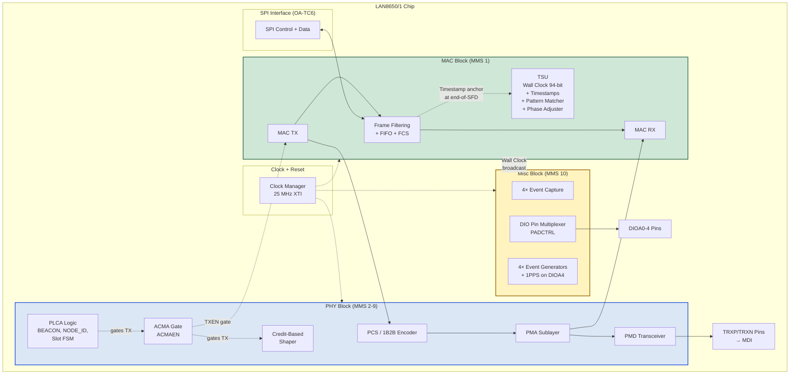
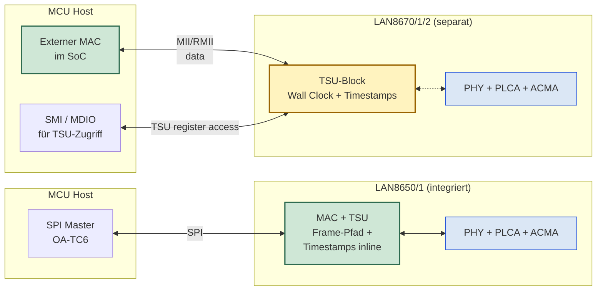

# LAN8650/1 (MAC-PHY) vs LAN8670/1/2 (Standalone PHY) — Block-Architektur

Vergleichende Analyse der internen Block-Architektur der zwei
Microchip 10BASE-T1S Silicon-Familien. Schwerpunkt: **was lebt im
MAC-Block des LAN8650/1** und **wo dieselben Funktionen im
LAN8670/1/2 hingewandert sind**, da der LAN8670/1/2 keinen MAC hat.

**Erstellt:** 2026-04-27
**Bezugs-Dokumente:**

- [lan86xx_family.md](lan86xx_family.md) — Familien-Übersicht mit
  Feature-Matrix
- [readme_pdf.md](readme_pdf.md) — vollständige PDF-Referenzen mit
  Section- und Page-Hinweisen
- DS60001734F §4.5 / §6 / §11.2 (LAN8650/1)
- DS60001573K §4.12 / §5.4 (LAN8670/1/2)

---

## Inhaltsverzeichnis

1. [Worum es geht](#1-worum-es-geht)
2. [Was im MAC-Block des LAN8650/1 lebt](#2-was-im-mac-block-des-lan86501-lebt)
   - 2.1 [Klassische Ethernet-MAC-Funktionen](#21-klassische-ethernet-mac-funktionen)
   - 2.2 [Time Synchronization Unit (TSU) — explizit als Teil des MAC](#22-time-synchronization-unit-tsu--explizit-als-teil-des-mac)
3. [Was außerhalb des MAC im LAN8650/1 lebt](#3-was-außerhalb-des-mac-im-lan86501-lebt)
4. [Block-Diagramm LAN8650/1](#4-block-diagramm-lan86501)
5. [Was im LAN8670/1/2 anders ist](#5-was-im-lan867012-anders-ist)
   - 5.1 [Was vom MAC-Block fehlt](#51-was-vom-mac-block-fehlt)
   - 5.2 [Was trotzdem im Chip ist](#52-was-trotzdem-im-chip-ist)
   - 5.3 [Architektur-Vergleich](#53-architektur-vergleich)
6. [Praktische Konsequenzen](#6-praktische-konsequenzen)
7. [Warum LAN8670/1/2 mehr RMII-Errata hat](#7-warum-lan867012-mehr-rmii-errata-hat)
8. [Asymmetrie beim Event-Generator-Erratum (s9 nur im LAN8650/1)](#8-asymmetrie-beim-event-generator-erratum-s9-nur-im-lan86501)
   - 8.1 [Faktenlage](#81-faktenlage)
   - 8.2 [Drei Erklärungen](#82-drei-erklärungen)
   - 8.3 [Praktische Konsequenz](#83-praktische-konsequenz)
9. [Kurzfassung](#9-kurzfassung)

---

## 1. Worum es geht

Microchip's 10BASE-T1S Linie hat zwei Klassen von Silicon:

- **LAN8650/1** — *integrierter MAC-PHY* (32-VQFN, OA-TC6 SPI host
  interface)
- **LAN8670/1/2** — *standalone PHY* (24/32/36-VQFN, MII / RMII /
  SC-MII host interface, kein eingebauter MAC)

Beide enthalten denselben 10BASE-T1S PHY-Kern (Clause 147 + Clause
148 PLCA). Aber weil der LAN8670/1/2 keinen MAC hat, müssen sich
**MAC-Funktionen plus alles, was historisch im MAC verankert war**
auf einer der beiden Seiten finden lassen — im externen MCU-MAC oder
in einem Ersatz-Block im PHY-Chip.

Diese Datei beantwortet die Frage präzise:
**Was ist im MAC drin, und wo wandert es bei der MAC-losen Variante hin?**

---

## 2. Was im MAC-Block des LAN8650/1 lebt

### 2.1 Klassische Ethernet-MAC-Funktionen

Aus DS60001734 §6 (Ethernet MAC, p.65-73) und MMS-1-Register-Bank §11.2
(p.157-200):

| Funktion | Wo verankert | Anmerkung |
|---|---|---|
| **MAC-Frame-Assembly / -Disassembly** | §6 | Preamble-Generation, SFD-Insertion, FCS-Berechnung/Prüfung |
| **MAC-Adress-Filter** | §6 | Unicast-Match auf eigene MAC, Multicast-Hash-Filter, Promiscuous-Mode |
| **IEEE-Std-802.3-Clause-4-Konformität** | §6 | Inter-Packet-Gap-Erzwingung (96 Bit-Zeiten = 9.6 µs), MII-State-Machine |
| **TX/RX-FIFOs** | §6 | 8 KB internes RAM für Frame-Pufferung |
| **Collision-Detection-Logik** | §6 + §7.2.5 | Kollisions-Counter, Backoff-Algorithmus, CSMA/CD-Fallback wenn PLCA aus |
| **Error-Counter und -Reporting** | §11.2 (MMS 1) | RX-Error-Count, FCS-Error-Count, etc. |

### 2.2 Time Synchronization Unit (TSU) — explizit als Teil des MAC

Aus DS60001734 §4.5.1 (p.32) wörtlich (paraphrasiert):

> "The wall clock is implemented as part of the MAC, so it can be
> configured and adjusted via accesses in MMS1."

Das heißt: **alle TSU-Komponenten sind im MAC-Block der LAN8650/1.**
Konkret:

| TSU-Komponente | Im MAC? | Zugriff |
|---|---|---|
| **Wall Clock (94-bit)** — MAC_TSH/L/N | ✅ MAC | MMS 1, OA-TC6 control transaction |
| **Timer Increment** — MAC_TI / MAC_TISUBN | ✅ MAC | MMS 1 |
| **Timer Adjust** — MAC_TA | ✅ MAC | MMS 1 |
| **Phase Adjuster** — PACTRL / PACYC | ✅ MAC | MMS 1 |
| **TX Timestamps A/B/C** — TTSCAH/L, TTSCBH/L, TTSCCH/L | ✅ MAC | MMS 1 |
| **RX Timestamps** (in Frame-Footer) | ✅ MAC | über RTSA-Bit im OA-TC6 Footer |
| **Packet Pattern Matcher TX/RX** (TXMCTL/RXMCTL etc.) | ✅ MAC | MMS 1 |

---

## 3. Was außerhalb des MAC im LAN8650/1 lebt

| Block | Wo | Anmerkung |
|---|---|---|
| **PHY** (PCS/PMA/PMD, 10BASE-T1S Clause 147) | MMS 2-9 | klassischer PHY-Block |
| **PLCA-Logik** (BEACON, Slot-FSM, NODE_ID) | MMS 4 (Vendor-Specific PHY-Register) | im PHY-Block, nicht im MAC |
| **ACMA-Logik** (ACMACTL, Gate vor TXEN) | MMS 4 (PHY) | im PHY-Block, gated den MAC-Sender extern |
| **Credit-Based Shaper** (CBSCTRL etc.) | MMS 4 (PHY) | im PHY-Block, gated den MAC ähnlich wie ACMA |
| **SQI (Signal Quality Indicator)** | MMS 4 (PHY) | im PHY-Block |
| **Cable Fault Diagnostics** | MMS 4 (PHY) | im PHY-Block |
| **Event Capture** (DIO-Pin → Wall-Clock-Sample) | MMS 10 (Misc) | eigener Block, *nutzt* Wall Clock vom MAC |
| **Event Generators 0-3** (Wall-Clock-Vergleich → DIO-Puls) | MMS 10 (Misc) | eigener Block, *nutzt* Wall Clock vom MAC |
| **1PPS-Generator** (PPSCTL → DIOA4) | MMS 10 (Misc) | eigener Block, *nutzt* Wall Clock vom MAC |
| **DIO Pin Multiplexer** (PADCTRL) | MMS 10 (Misc) | Routing-Layer für Event-Capture / -Gen / 1PPS |
| **Clock Manager** (Quartz-Eingang, interne Takte) | MMS 0 (OA Standard) | versorgt MAC+PHY mit dem 25-MHz-Referenztakt |
| **Sleep Mode + Wake-Logik** (SLPCTL0) | MMS 0 / MMS 4 | übergreifend |
| **OA-TC6 SPI Controller** | MMS 0 + Hardware | Host-Interface, koppelt SPI an MAC und Register |
| **Safety Features** (FMEDA, ECC, BIST) | MMS 0/1/4 | übergreifend |

---

## 4. Block-Diagramm LAN8650/1

**Lesart:** Der MAC-Block (grün) enthält klassische MAC-Funktionen
**plus** die komplette TSU. Der PHY-Block (blau) enthält PLCA, ACMA,
CBS — alle drei Mechanismen, die das Senden gated. Der Misc-Block
(gelb) enthält Event Capture/Generators und 1PPS, die alle die Wall
Clock vom MAC referenzieren.

---

## 5. Was im LAN8670/1/2 anders ist

### 5.1 Was vom MAC-Block fehlt

LAN8670/1/2 ist ein **standalone PHY** ohne MAC. Konsequenz: alles
aus der grünen MAC-Box im obigen Diagramm **fehlt im Chip**. Der
Host-MCU muss seinen **eigenen MAC** mitbringen (typisch im SoC
integriert, an MII / RMII / SC-MII des LAN8670/1/2 angebunden).

Konkret fehlen vom Chip:

- Frame Filtering, FCS-Berechnung, FIFO
- IPG-Erzwingung
- Collision-Detection (logisch — physisch passiert sie weiter im PHY)
- TX/RX-FIFOs

Diese Funktionen müssen im **externen MAC im SoC** vorhanden sein.
Bei modernen MCUs (z. B. SAM-E54, STM32F4) ist das gegeben — es ist
der Standard-Ethernet-Block, der ohnehin im SoC sitzt.

### 5.2 Was trotzdem im Chip ist

Microchip hat die TSU + Pattern Matcher + Event Capture/Gen **in den
standalone PHY hinüber portiert**, weil diese Hardware-Funktionen für
PTP auf 10BASE-T1S essentiell sind und nicht vom externen MAC
geleistet werden können. Aus DS60001573:

| Block | Wo im LAN8650/1 | Wo im LAN8670/1/2 |
|---|---|---|
| Wall Clock (94-bit) | MMS 1 (MAC) | DS60001573 §4.12 + §5.4 (Misc Registers) |
| Packet Timestamping (Pattern Matcher) | MMS 1 (MAC) | DS60001573 §4.12 + §5.4 |
| Phase Adjuster | MMS 1 (MAC) | DS60001573 §4.12 + §5.4 |
| Event Capture / Event Generators / 1PPS | MMS 10 (Misc) | DS60001573 §5.4 |
| PLCA / ACMA / CBS | MMS 4 (PHY) | DS60001573 §4.8 / §4.9 / §4.10 + §5.4 |

Die TSU lebt also **nicht mehr im MAC** (weil keiner da ist), sondern
in einem dedizierten Block, der von der PHY-Seite die SFD-Detection
bekommt und auf die Host-Seite über die SMI Management Interface
ansprechbar ist.

### 5.3 Architektur-Vergleich

**Lesart:** Beim LAN8650/1 sitzt die TSU **inline im Frame-Pfad**,
weil der MAC selbst beim Senden / Empfangen den Timestamp setzt.
Beim LAN8670/1/2 sitzt sie **als Seitenarm**, der via SMI ansprechbar
ist und am SFD im PHY-Pfad ein Latch ausführt — der eigentliche
Frame fließt parallel über MII/RMII zum externen MAC im SoC.

---

## 6. Praktische Konsequenzen

| Aspekt | LAN8650/1 | LAN8670/1/2 |
|---|---|---|
| MAC im Chip | ✅ ja | ❌ nein, MCU bringt seinen MAC mit |
| TSU-Zugriff vom Host | OA-TC6 SPI Control Transactions | SMI / MDIO bei MMD 0x1F |
| Frame-Pfad | direkt SPI ↔ MAC ↔ PHY | MII / RMII ↔ externer MAC ↔ Host |
| Timestamp-Footer am Frame | RTSA-Bit im OA-TC6-Footer (in-band) | nicht direkt — Host muss separate SMI-Reads für TX/RX-Timestamps machen |
| Frame-Filtering | im MAC-Block (per MAC-Adresse) | im externen MAC des SoC |
| Inter-Packet-Gap-Erzwingung | im MAC-Block | im externen MAC des SoC |
| Pin-Anzahl insgesamt | 32 (32-VQFN) | 24 (LAN8671), 32 (LAN8670), 36 (LAN8672) |
| MCU-Komplexität | benötigt nur SPI | benötigt MII/RMII + SMI + GPIO für Timestamping-IRQ |
| Driver-Komplexität | OA-TC6 SPI Stack (z.B. `oa_tc6.c`) | Standard MII-Treiber + PHY-Treiber + TSU-Side-Channel |
| BOM-Kosten | 1 Chip | 1 Chip (PHY) + ggf. größere MCU mit Ethernet-MAC |

---

## 7. Warum LAN8670/1/2 mehr RMII-Errata hat

Das oben Gesagte erklärt direkt, warum die Errata-Listen unterschiedlich
sind. Aus [lan86xx_family.md §5](lan86xx_family.md#5-errata-übersicht):

| Familie | Errata-Items | RMII-bezogene Items |
|---|---|---|
| LAN8650/1 (ER80001075) | 9 (s1-s9) | **0** |
| LAN8670/1/2 (ER80000962) | 12 (s1-s12) | **5** (s1, s3, s6, s7, s8) |

Der Grund: Beim LAN8650/1 gibt es **keine RMII-Schnittstelle** — der
externe MAC fehlt schlicht. Beim LAN8670/1/2 dagegen ist RMII die
Schnittstelle zum externen MAC, und dort liegen mehrere Silicon-Bugs:

- **s1** RMII Identification (B1) — wie der Host die RMII-Mode
  erkennt
- **s3** RMII CSMA/CD operation in mixed PLCA segments (B1, C1, C2)
  — RMII konnte nicht mit PLCA-disabled in einem PLCA-Bus arbeiten
- **s6** Transmission of collision fragments mit PLCA + RMII (alle
  Revs inkl. D0!) — der externe MAC kann während Carrier-Asserted
  senden, der PHY erkennt die Kollision nicht und leitet das Fragment
  weiter
- **s7** Carrier Sense in RMII nach Kollision (B1, C1)
- **s8** Beacon-Verlust und CSMA/CD-Reversion in RMII (B1)

→ Diese Items existieren strukturell nur, weil der LAN8670/1/2 eine
externe MAC-Schnittstelle braucht. Der LAN8650/1 ist ihnen
"immun", weil dort kein externer MAC existiert.

---

## 8. Asymmetrie beim Event-Generator-Erratum (s9 nur im LAN8650/1)

Eine Beobachtung aus dem Cross-Family-Errata-Vergleich, die für jede
PTP-naheliegende Anwendung relevant ist: das **EG-periodic-mode-Drift-
Erratum (s9)** ist nur für LAN8650/1 dokumentiert, **obwohl der Event
Generator als Hardware-Block in beiden Familien existiert**.

### 8.1 Faktenlage

| Fakt | Beleg |
|---|---|
| Event Generator existiert in **beiden** Chip-Familien | LAN8650/1: DS60001734 §4.5.4 (p.38-39, "Synchronized Event Generator") + Errata s9. LAN8670/1/2: DS60001573 §4.12 "Time Synchronization" (p.44-47) und §5.4 Misc Registers — Event Generators sind dort vorhanden |
| EG hat in **beiden** Familien einen periodic-mode | Single-Shot vs Repeating Pulse als Standard-Konfiguration in beiden |
| s9-Erratum (EG periodic-mode driftet vs synchronisierte Wall Clock) | nur in **ER80001075** (LAN8650/1), explizit auf p.5 |
| Kein analoges Erratum in **ER80000962** (LAN8670/1/2) | Bestätigt aus dem Read der gesamten Errata-Datei (12 Items s1-s12, keines beschreibt EG-vs-Wallclock-Drift) |

→ Der EG ist also in beiden Chips vorhanden, aber das Drift-Problem
ist nur für eine Familie als Erratum publiziert.

### 8.2 Drei Erklärungen

#### Erklärung A — Si-Rev hat es behoben (am wahrscheinlichsten)

LAN8670/1/2 ist bei aktueller Si-Rev **D0** angekommen — vier Si-Revs
weiter als LAN8650/1, das noch auf **B1** ist (siehe
[lan86xx_family.md §2](lan86xx_family.md#2-silicon-revisionen-stand-2025)).

Die ER80000962 ist explizit darin, welche Items in welcher Si-Rev
behoben wurden:

- s1, s2, s4, s8, s9 → "Resolved C1"
- s7 → "Resolved C2"
- s3, s10 → "Resolved D0"

Wenn das EG-Drift-Verhalten irgendwann zwischen B1 und D0 in einem
Si-Spin behoben wurde, würde Microchip es **nicht mehr im aktuellen
Errata-Dokument listen**. Microchip's Errata-Dokumente listen nur
Items, die in mindestens einer aktuell verkauften Si-Rev noch aktiv
sind. Items, die in allen aktuell verkauften Revs gefixt sind, fallen
aus dem Dokument heraus.

Beim LAN8650/1 ist die aktuelle Rev B1 — wenn das EG-Drift-Verhalten
dort noch unbehoben ist, **muss** es als Erratum drinstehen.

**Diese Erklärung passt zur Datenlage** und ist die wahrscheinlichste
Lesart. Der LAN8670/1/2 ist silicon-mäßig weiter und hat den Bug
intern bereits beseitigt — entweder durch eine geänderte
Wall-Clock-Verteilung an EG, oder durch eine Re-Synchronisation auf
jeden korrigierten Wall-Clock-Update.

#### Erklärung B — Designs sind unterschiedlich

Auch wenn der EG funktional identisch ist (Wall-Clock-Vergleich →
Pulse), könnte die **physische Implementation** unterschiedlich sein:

- LAN8650/1: EG sitzt im Misc-Block (MMS 10), bekommt eine
  **Snapshot-Kopie** der Wall Clock zum Zeitpunkt von
  `EG0CTL.START=1`. Der periodic-mode rechnet dann *intern auf dem
  lokalen Quarz* weiter, ohne weitere Wall-Clock-Synchronisation —
  daher der Drift bei PTP-Korrekturen der Wall Clock.
- LAN8670/1/2: EG könnte direkt mit der **Live-Wall-Clock** verglichen
  werden, sodass jede `MAC_TA`-Korrektur sofort auch die EG-Periode
  beeinflusst.

Zwischen den beiden Chip-Familien sind PHY-Kern und einige Funktionen
geteilt, aber die **Misc-Block-Implementierung kann durchaus separat
entwickelt** worden sein — schon deshalb, weil im LAN8670/1/2 die
Wall Clock ein eigenständiger Block ist (kein MAC-Interner) und die
Schnittstelle zur Wall Clock dort architektonisch anders aussieht.

Plausibel, aber **ohne expliziten Datasheet-Beleg nicht verifizierbar**.

#### Erklärung C — Es ist ein Doku-Versäumnis (am unwahrscheinlichsten)

Microchip hätte das Erratum auch im LAN8670/1/2 listen müssen, hat
es aber nicht — entweder versehentlich oder weil es nie als Erratum,
sondern als Datasheet-Clarification behandelt wurde.

Diese Erklärung ist die unwahrscheinlichste, weil:

- Microchip-Errata sind in der Regel sorgfältig gepflegt
- s9 ist ein **subtiles, aber messbares** Problem — wäre es im
  LAN8670/1/2 vorhanden, wäre es einer Microchip-FAE oder einem Kunden
  aufgefallen
- ER80000962 hat 12 Items inklusive sehr detailgetriebener
  RMII-Spezifika (z. B. s6 mit konkreten Bit-Maskierungen) — die
  Auflistung ist nicht knapp gehalten

#### Indirekter Hinweis für Erklärung A

Der LAN8670/1/2 hat in seinem Errata-Dokument **mehrere Items, die in
C1 oder D0 als "Resolved" markiert sind** (s1, s2, s4, s7, s8, s9 bis
C1; s3, s10 bis D0). Microchip behebt also Silicon-Bugs aktiv zwischen
Si-Revs, statt nur Workarounds zu dokumentieren — und entfernt
gefixte Items irgendwann aus dem Errata-Dokument. Wenn das EG-Drift-
Verhalten jemals dort existiert hätte, wäre es vermutlich genauso
behandelt worden.

### 8.3 Praktische Konsequenz

Für die aktuelle Anwendung (LAN8651 + ACMA + EG-getriebene Slots):

**Auf LAN8651 ist s9 Realität → Single-Shot-EG mit ISR-Re-Arm ist
Pflicht.**  Genau so wie in
[readme_acma.md §7.6](../ptp/readme_acma.md#76-irq-last-und-spi-bandbreiten-budget)
beschrieben.

Für eine hypothetische zukünftige LAN8670/1/2-Variante:

**Auf LAN8670/1/2 D0 ist s9 sehr wahrscheinlich nicht vorhanden** —
entweder weil silicon-fixed (Erklärung A) oder weil andere
Implementierung (Erklärung B). Aber **bevor man darauf vertraut und
periodic-mode-EG nutzt, sollte man selbst messen**:

1. Wall Clock per externem PTP-Sync stark korrigieren (z. B. ±100 µs
   Sprung erzwingen via `MAC_TA` oder Phase Adjuster)
2. EG in periodic-mode (`EG0CTL.REP=1`) laufen lassen mit z. B. 1 ms
   Periode
3. EG-Pulse mit Logic-Analyzer gegen 1PPS-Output oder externe
   Referenz vergleichen
4. Wenn EG-Pulse zur 1PPS-Zeit synchron bleiben → s9-Pendant
   existiert nicht, periodic-mode ist nutzbar
5. Wenn EG-Pulse driften → Workaround analog LAN8651 nötig
   (Single-Shot mit ISR-Re-Arm)

**Alternativ:** im Microchip-Support-Portal direkt nachfragen — die
FAEs können das verbindlich beantworten und haben Zugriff auf die
internen Bug-Datenbanken, die nicht in publizierten Errata
auftauchen.

> **Empfehlung für die Doku-Pflege:** sobald jemand auf realer
> LAN8670/1/2-D0-Hardware diesen Test gemacht hat, das Ergebnis hier
> einarbeiten und Erklärung A oder B verbindlich machen. Bis dahin
> bleiben alle drei Hypothesen offen.

---

## 9. Kurzfassung

Der MAC-Block im **LAN8650/1** enthält:

1. **Klassische Ethernet-MAC-Funktionen** — Frame-Filter, FIFO, FCS,
   IPG-Erzwingung, Kollisions-Counter
2. **Die komplette TSU** — Wall Clock, Timestamp-Capture (TX und
   RX), Pattern Matcher, Phase Adjuster — explizit dokumentiert in
   DS60001734 §4.5.1 als "implemented as part of the MAC"

Beim **LAN8670/1/2** fehlen Punkt 1 komplett (das macht der
MCU-SoC), und die TSU aus Punkt 2 ist als **separater Block neben
dem PHY** implementiert — funktional dasselbe Verhalten, aber
andere Architektur und über SMI statt SPI ansprechbar.

**Konsequenz für die Toolchain-Wahl:**

- Wer einen **MCU ohne eingebauten MAC** hat (z. B. ein einfacher
  M0+, der keine Ethernet-Peripherie mitbringt) → **LAN8650/1**
  passt besser, weil der MAC im Chip ist
- Wer einen **MCU mit eingebautem MAC** hat (SAM E54, STM32F4 mit
  ETH-IP, etc.) und die SPI-Bandbreite einsparen will → **LAN8670/1/2**
  passt besser, weil MII/RMII deutlich höhere effektive Bandbreite
  liefert als OA-TC6 SPI (auch wenn die PHY-Datenrate nominell
  identisch ist, ist OA-TC6-Overhead nicht zu vernachlässigen)
- Für **PTP-/PTP-ähnliche Anwendungen** ist beides verwendbar — die
  TSU-Funktionalität ist in beiden Familien vollständig vorhanden,
  nur an anderer Architektur-Position

Dieses Architektur-Bild erklärt indirekt mehrere Asymmetrien zwischen
den Errata-Dokumenten der beiden Familien (siehe §7) und ist
relevant für jede Entscheidung "welcher Chip für welches Design".

---

**Stand 2026-04-27.**  Bei größeren Datasheet-Revisionen oder
neuen Si-Revs diese Beschreibung aktualisieren.
