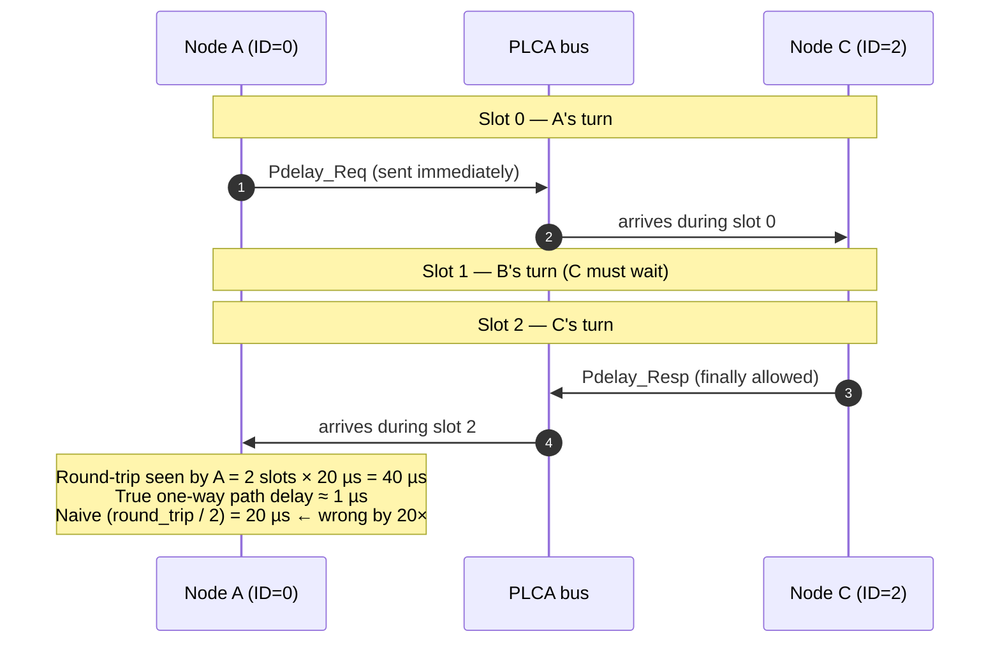
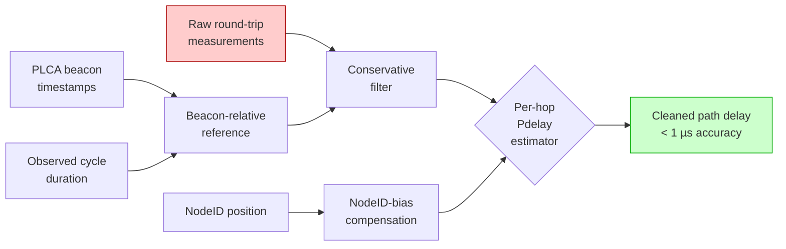

# PLCA Slot Asymmetry and PTP Compensation on 10BASE-T1S

## Overview

This document explains why standard PTP (IEEE 1588) does not work directly on 10BASE-T1S multidrop buses with PLCA, and which additional mechanisms IEEE 802.1AS-2020 Annex H defines.

---

## 1. The Relevant Standard

**IEEE 802.1AS-2020, Annex H**

- **IEEE 802.1AS** = gPTP (generalized PTP) — profile of IEEE 1588 for time-critical bridged networks
- **Annex H** was added in 2020 to address T1S with PLCA
- Defines adaptations to the Pdelay mechanism and Sync logic for multidrop bus topologies

**Related standards:**

| Standard | Content |
|----------|--------|
| IEEE 802.3cg-2019 | 10BASE-T1S PHY layer + PLCA |
| IEEE 1588-2008/2019 | Original PTPv2 standard |
| IEEE 802.1AS-2020 | gPTP with Annex H for T1S |
| OPEN Alliance TC10/TC14 | Automotive-specific extensions |

---

## 2. The Underlying Problem

### Standard PTP Assumptions

Standard PTP assumes **point-to-point connections** with the following properties:

- Full-duplex (separate TX/RX lanes)
- Symmetric latency in both directions
- Constant, deterministic transmission time
- Switch/bridge controls medium access

### What T1S Does Differently

| Property | Standard Ethernet | 10BASE-T1S |
|-------------|------------------|------------|
| Topology | Point-to-point | Multidrop bus |
| Duplex | Full-duplex | Half-duplex |
| Medium access | Switch / CSMA/CD | PLCA token passing |
| Nodes per segment | 2 | up to 8 |

PLCA = **Physical Layer Collision Avoidance**: token-passing mechanism in the PHY that regulates slot-based access.

#### Topology comparison

```
Standard Ethernet (point-to-point full-duplex):

     ┌─────────┐         TX          ┌─────────┐
     │ Node A  │ ──────────────────► │ Node B  │
     │         │ ◄────────────────── │         │
     └─────────┘         RX          └─────────┘
       dedicated link, both can transmit simultaneously


10BASE-T1S (multidrop half-duplex, PLCA-arbitrated):

   ┌────────┐  ┌────────┐  ┌────────┐  ┌────────┐
   │ Node A │  │ Node B │  │ Node C │  │ Node D │
   │ ID = 0 │  │ ID = 1 │  │ ID = 2 │  │ ID = 3 │
   └───┬────┘  └───┬────┘  └───┬────┘  └───┬────┘
       │          │           │           │
       ●──────────●───────────●───────────●─────►  shared twisted pair
                                  one transmitter at a time
                                  (PLCA token passing)
```

---

## 3. Where the Timestamp Is Taken

### Standard PTP Definition

The timestamp is taken at the **Start of Frame Delimiter (SFD)** — at the medium, not in software.

### On Classic Ethernet

```
Sender:    Application → MAC → PHY → SFD auf Draht → Timestamp t1
Empfänger: SFD auf Draht → Timestamp t2 → PHY → MAC → Application
```

Clearly defined point, no ambiguity.

### On T1S with PLCA

```
Sender:    MAC fertig → warten auf PLCA-Slot → SFD auf Draht
                       ↑
                       Hier kann beliebige Wartezeit liegen
```

**Critical question:** When is the TX timestamp taken?

- **Option A:** When the MAC has finished the frame (before the PLCA wait)
- **Option B:** When the SFD actually appears on the wire

**Standard's answer (Annex H):** Option B — timestamp at the actual SFD moment on the medium.

### Why This Matters So Much

```
MAC sagt "fertig" bei t = 100 ms
PLCA-Wartezeit: 5 ms (Slot kommt erst bei 105 ms)
SFD auf Draht:  t = 105 ms

Falsch (Option A): Timestamp = 100 ms
Richtig (Option B): Timestamp = 105 ms

Fehler bei Option A: 5 ms — komplett zerstört PTP-Genauigkeit
```

PTP targets sub-microsecond accuracy. A 5 ms error is 5000x too large.

### Solution in the LAN8651

The LAN8651 implements this **correctly in hardware**:

- The TSU (Timestamp Unit) sits directly at the PHY medium interface
- Captures the timestamp exactly at the SFD on the wire
- The PLCA wait is automatically included in the timestamp

The `MAC_TSH/TSL` registers deliver these correct timestamps.

---

## 4. The Additional Asymmetry With More Than 2 Nodes

Even with correct SFD timestamping, **3+ nodes** introduce additional problems.

### With 2 Nodes: Symmetric

```
Knoten A (PLCA ID 0)  ←→  Knoten B (PLCA ID 1)
```

In the PLCA cycle, both alternate. Wait times are on average symmetrically distributed. The standard Pdelay assumption `delay = round_trip / 2` works.

### With 3+ Nodes: Asymmetric

```
Knoten A (ID 0)  ←→  Knoten B (ID 1)  ←→  Knoten C (ID 2)
```

PLCA cycle:
- Slot 0: A is allowed to send
- Slot 1: B is allowed to send
- Slot 2: C is allowed to send
- Repeat

#### PLCA cycle timeline

```
Time →  (slot duration = 20 µs typical)

   Cycle N                       Cycle N+1
   ┌─────┬─────┬─────┬─────┐     ┌─────┬─────┬─────┬─────┐
   │  A  │  B  │  C  │  D  │     │  A  │  B  │  C  │  D  │
   │ID=0 │ID=1 │ID=2 │ID=3 │ ... │ID=0 │ID=1 │ID=2 │ID=3 │
   └─────┴─────┴─────┴─────┘     └─────┴─────┴─────┴─────┘
   0    20    40    60    80    100   120   140   160   180 µs
   ◄───── one cycle (80 µs) ─────►

Each node may transmit only inside its own slot.  Outside its slot
it must defer — even for time-critical PTP frames.
```

#### Example: A measures Pdelay to C

**Step 1:** A sends `Pdelay_Req` to C
- A waits on average half a cycle for slot 0
- A sends, C receives

**Step 2:** C replies with `Pdelay_Resp`
- C must wait from slot 2 to slot 0 — almost a full cycle
- C sends

**Result:**

```
A → C:  ~0,5 Slots Wartezeit + Übertragungszeit
C → A:  ~2 Slots Wartezeit + Übertragungszeit
```

Standard gPTP computes `path_delay = round_trip / 2`. This assumption is wrong because the directions have different wait times.

#### Visualised: the asymmetric round-trip



### The Asymmetry Scales

**With 8 nodes (T1S maximum):**

```
PLCA-Zyklus-Dauer:                30-50 µs (typisch)
Maximale Slot-Wartezeit:           ~7 × Slot-Zeit
Asymmetrie zwischen ID 0 und 7:   bis zu 50 µs
```

PTP target: < 1 µs accuracy. 50 µs of asymmetry would be 50x too large.

#### Naive Pdelay error vs. NodeID distance

For an 8-node bus, slot duration = 20 µs, asking each remote node for
its Pdelay:

```
Distance   Asymmetry   Naive-Pdelay   Visualization (1 char ≈ 5 µs)
to target  in slots    bias              0     20    40    60    80 µs
─────────  ─────────   ────────────    ────────────────────────────────
   1          1          +10 µs        ██
   2          2          +20 µs        ████
   3          3          +30 µs        ██████
   4          4          +40 µs        ████████
   5          5          +50 µs        ██████████
   6          6          +60 µs        ████████████
   7          7          +70 µs        ██████████████  ← worst case

PTP target (red line):                 │ < 1 µs
                                       └► all rows already exceed it.
```

**Without Annex H compensation, PTP on multidrop T1S is unusable.**

---

## 5. Naive Compensation Is Not Enough

### The Simple Formula

If every node knows its own NodeID and the max NodeID, the expected slot wait time could in theory be computed:

```
slot_wartezeit(target, current) = 
    ((target - current + max_id + 1) MOD (max_id + 1)) × slot_dauer
```

**Example with 8 nodes, slot_dauer = 20 µs:**

A (ID=0) sends to C (ID=2):
- Wait time for A: ~0 (slot is right there)

C replies to A:
- Wait time for C: (0 - 2 + 8) mod 8 = 6 slots = 120 µs

Compensation:
```
echter_path_delay = (round_trip - bekannte_PLCA_wartezeiten) / 2
```

### Why the Simple Formula Is Insufficient

The static calculation is only an **upper bound**, not the true value.

#### Problem 1: Slot Skipping

PLCA skips empty slots:

```
Konfiguriert: A-B-C-D-E-F-G-H = 8 Slots × 20µs = 160µs Zyklus

Wenn B+D+F nichts senden:
Effektiv: A-C-E-G-H = 5 Slots × 20µs = 100µs Zyklus
```

From G's perspective, the effective slot position has shifted.

#### Problem 2: Burst Mode

PLCA allows multiple frames per slot (`max_burst_count`). Variable utilization changes the cycle duration.

#### Problem 3: Variable Bus Utilization

Sometimes all nodes are active, sometimes only two. The theoretical calculation then does not match exactly.

#### Problem 4: Beacon Timing

The PLCA beacon from the coordinator and the cycle start can differ. On beacon loss, the phase can shift.

---

## 6. What Annex H Actually Defines

Annex H is **more realistic** than the simple formula and uses several mechanisms in combination:

#### How the five mechanisms feed into a corrected Pdelay



The five sub-mechanisms are:

### 6.1 PLCA Beacon Timestamp

- The beacon time is used as an additional reference
- Pdelay is referenced to the beacon, not to the absolute SFD
- Reduces the dependency on slot skipping

### 6.2 Cycle Time Tracking

- Mechanisms to estimate the **current** cycle duration
- Takes active nodes and burst counts into account in real time

### 6.3 Conservative Filtering

- Pdelay values with high variance are discarded
- Statistical filtering across multiple measurements
- Converges on the stable component of the latency

### 6.4 Per-Hop Approach

- Pdelay is measured between direct neighbors
- Instead of end-to-end, which is unclearly defined on multidrop
- PLCA effects are easier to control per hop

### 6.5 NodeID-Dependent Bias Compensation

- Takes the PLCA NodeID position into account
- Estimates expected slot wait time based on observation

---

## 7. What the Hardware PHY Must Provide

For a true Annex H implementation, runtime information from the PHY is required.

### LAN8651 Registers (Example)

| Register Type | Information |
|--------------|-------------|
| PLCA status | Current slot, NodeID, burst count |
| Beacon detection | Timestamp of the last beacon detection |
| PLCA statistics | Counted slots, empty slots, burst events |
| TSU register | SFD timestamps (TX/RX) |

### What the Current Project Uses

In the 2-node setup, the standard TSU registers are used:
- `MAC_TSH` / `MAC_TSL` for SFD timestamps
- TTSCAA bit for TX capture confirmation

The PLCA status registers are not read because, with 2 nodes, no Annex H compensation is needed.

---

## 8. Practical Implementation Strategies

### Variant 1: Static Worst-Case Assumption

Use the simple formula:
```
echter_delay = round_trip / 2 - statische_PLCA_kompensation
```

**Applicable when:**
- Topology and traffic patterns are stable
- Requirement is "good enough" (10-50 µs accuracy)
- Implementation effort must remain minimal

**Not applicable when:**
- Sub-µs accuracy is required
- Bus utilization fluctuates strongly
- Nodes come and go

### Variant 2: Statistical Averaging

Average over many Pdelay measurements. Slot skipping averages out when traffic is stationary.

**Advantages:** Easy to implement, works without PLCA status registers

**Disadvantages:** Long convergence time (seconds to minutes), poor reaction to topology changes

### Variant 3: Full Annex H Implementation

Read PLCA status per frame, use beacon timestamps, implement cycle tracking.

**Advantages:** True sub-µs accuracy on multidrop is possible

**Disadvantages:** High implementation effort, dependent on hardware support

---

## 9. Application to the Current Project

### Current State: 2 Nodes

In the current `net_10base_t1s` project, only 2 nodes are involved. This means:

- Asymmetry is on average zero
- Standard `delay = round_trip / 2` works
- No Annex H compensation needed
- Implementation follows IEEE 1588-2008 (PTPv2)

Achieved accuracy: < 50 ns mean offset, < 200 ns worst case (measured with `ptp_offset_capture.py`).

### When Extending to 3+ Nodes

For a multidrop configuration with 3+ nodes, the following additions would be required:

#### Minimum Implementation

1. **Read PLCA status** from LAN8651 registers
   - Own NodeID
   - Max NodeID
   - Slot time (`to_timer`)

2. **Extension of the `processFollowUp()` function**
   ```c
   pdelay_komp = berechne_plca_wartezeit(meine_id, gm_id, max_id, slot_dauer);
   echter_delay = (round_trip - pdelay_komp) / 2;
   ```

3. **Best Master Clock Algorithm (BMCA)**
   With more than 2 nodes, it must be decided who is grandmaster.

#### Full Annex H Implementation

4. **Beacon tracking**
   Evaluate beacon timestamps from PLCA status

5. **Cycle duration tracking**
   Continuously measure the current cycle duration

6. **Burst count consideration**
   Factor variable slot occupancy into compensation

7. **Conservative filtering**
   Discard Pdelay measurements with high variance

---

## 10. Summary

### The Two Main Problems With T1S+PTP

**Problem 1: Timestamp position**
- Solution: Hardware timestamp at SFD (correctly implemented in the LAN8651)
- Already solved, no software adaptation needed

**Problem 2: PLCA slot asymmetry**
- Only occurs with 3+ nodes
- Cannot be solved by hardware alone
- Requires Annex H algorithms in software

### What Is Sufficient for 2 Nodes

- Standard PTPv2 (IEEE 1588-2008)
- Hardware timestamping at the SFD
- No slot asymmetry compensation

### What Is Additionally Required for 3+ Nodes

- IEEE 802.1AS-2020 Annex H mechanisms
- Runtime observation of PLCA dynamics
- Minimum: NodeID-based compensation
- Optimal: Beacon tracking + cycle tracking + filtering

### Static Information Is Not Enough

NodeID and max NodeID provide only a worst-case estimate. True compensation requires runtime observation of:

- Actual slot occupancy
- Empty-slot skipping
- Burst count variations
- Beacon phase shift

---

## 11. Accuracy Comparison

| Configuration | Achievable Accuracy |
|---------------|------------------------|
| 2 nodes, standard PTPv2 + HW timestamping | < 1 µs |
| 8 nodes, no compensation | 50-150 µs |
| 8 nodes, static ID compensation | 5-20 µs |
| 8 nodes, full Annex H implementation | < 1 µs |

#### Visualised on a log scale

```
Achievable accuracy on a 10BASE-T1S bus
(log scale: each step is ×10)

       <0.1µs   1µs    10µs    100µs   1ms
        │       │       │       │       │
2 nodes,│  █████│       │       │       │   < 1 µs    ✅ PTP target met
PTPv2+HW│       │       │       │       │
        │       │       │       │       │
8 nodes,│       │       │       │       │
no comp.│       │       │  █████│██████ │   50-150 µs ❌ unusable
        │       │       │       │       │
8 nodes,│       │       │       │       │
static  │       │       │██████ │       │   5-20 µs   ⚠ marginal
        │       │       │       │       │
8 nodes,│       │       │       │       │
Annex H │       │  █████│       │       │   < 1 µs    ✅ PTP target met
        │       │       │       │       │
        ◄───────┴───────┴───────┴───────►
                            error magnitude (log scale)
```

The takeaway: with up to 2 nodes, basic gPTP plus hardware
timestamping reaches sub-µs accuracy.  Once 3+ nodes share the bus,
either a static NodeID-compensation (still ~10 µs error) or a full
Annex H implementation (sub-µs again) is required.

---

## 12. Roadmap to a Full Annex H Implementation in This Project

This section maps the abstract Annex H requirements to concrete
software work for the current `cross-driverless` codebase
(Harmony + LAN8651, 2-node setup).  It answers the question
*"what would have to be added to scale this demonstrator to a
fully Annex-H-compliant T1S+PTP node?"*

### 12.1 What is already in place

| Module | Role today |
|---|---|
| `ptp_drv_ext.{c,h}` | EIC EXTINT-14 ISR, Reg-init state machine, TX/RX hooks |
| `ptp_clock.{c,h}` | PTP wallclock + anchor tick |
| `ptp_gm_task.{c,h}` | Sends Sync + FollowUp, captures TX timestamp via TTSCAA |
| `ptp_fol_task.{c,h}` | Receives Sync + FollowUp, RX timestamp via `g_ptp_raw_rx`, IIR filter |
| `ptp_rx.{c,h}` | RX demux between GM and FOL paths |
| `filters.{c,h}` | Adaptive IIR for drift tracking |

→ **What is missing**: no `Pdelay_Req` / `Pdelay_Resp` protocol,
no PLCA-status awareness, no variance filter, no NodeID-bias
model, no beacon reference.

### 12.2 The six new building blocks Annex H requires

| # | Building block | What it does |
|---|---|---|
| 1 | **Pdelay protocol** | full `Pdelay_Req` / `Pdelay_Resp` / `Pdelay_Resp_FollowUp` triplets, capturing all four timestamps t1–t4 |
| 2 | **PLCA status reader** | live read of LAN8651 fields `PLCA_STATUS`, burst count, empty slots, own NodeID, max NodeID |
| 3 | **Cycle observer** | estimates the live PLCA cycle duration via beacon-to-beacon intervals or slot-boundary inference |
| 4 | **Variance filter** | discards Pdelay samples with high spread; median or Kalman over 16–64 samples |
| 5 | **NodeID-bias compensator** | from `(source_id, target_id, slot_duration)` subtracts the theoretical PLCA wait time on both directions |
| 6 | **Per-hop topology** | Pdelay only between direct neighbours on the bus, not end-to-end |

### 12.3 Implementation phases

#### Phase 1 — Hardware plumbing (~3 days)

**New in `ptp_drv_ext.{c,h}`:**

```c
typedef struct {
    uint8_t  curSlot;
    uint8_t  ownNodeId;
    uint8_t  maxNodeId;
    uint16_t burstCount;
    uint32_t emptySlotCount;
    bool     plcaActive;
} PLCA_Status_t;

bool     DRV_LAN865X_GetPlcaStatus(uint8_t idx, PLCA_Status_t *out);
uint64_t DRV_LAN865X_GetLastBeaconTick(uint8_t idx);  // 0 if never
uint32_t DRV_LAN865X_GetSlotDurationNs(uint8_t idx);  // typ. 20000
```

LAN8651 registers to read:

- `0x00040A04` — PLCA_STATUS
- `0x00040A05` — PLCA_NCOL (collision counter)
- `0x00040A07` — PLCA_DROP_FRAME_CNT
- possibly a second EIC pin latch for beacon detection in parallel with the existing nIRQ

> **Critical unknown**: beacon detection.  If the LAN8651 does not
> assert nIRQ on beacon, the cycle observer must SPI-poll
> `PLCA_STATUS` — higher load, lower resolution.  **Verify in the
> datasheet before committing to an implementation.**

#### Phase 2 — Pdelay protocol (~3 days)

**New file: `ptp_pdelay_task.{c,h}`**

```c
typedef struct {
    uint64_t t1_ns;     // Pdelay_Req TX (local)
    uint64_t t2_ns;     // Pdelay_Req RX (remote, in Resp_FollowUp)
    uint64_t t3_ns;     // Pdelay_Resp TX (remote, in Resp_FollowUp)
    uint64_t t4_ns;     // Pdelay_Resp RX (local)
    uint8_t  remoteNodeId;
} PdelayMeasurement_t;

void PTP_PDELAY_Init(uint8_t periodMs);
void PTP_PDELAY_Tasks(void);
bool PTP_PDELAY_GetLatest(uint8_t remoteId, PdelayMeasurement_t *out);
```

State machine: every ~1 s a Pdelay triplet to each neighbour.
Uses `DRV_LAN865X_SendRawEthFrame()` with the `tsc` flag for
TX-timestamp capture, identical to the Sync path.

#### Phase 3 — Cycle observer (~2 days)

**New file: `plca_observer.{c,h}`**

Either:
- timestamps the beacon per cycle (if HW support is available), or
- infers slot boundaries from Pdelay round-trip timing.

Output:

```c
typedef struct {
    uint32_t cycleDurationNs;       // measured, filtered
    uint32_t cycleDurationVarNs;    // 1-σ
    uint64_t lastBeaconTickNs;
    uint8_t  activeNodeMask;        // bit i = node i recently seen
} PLCA_Observation_t;

void PLCA_OBS_Tasks(void);
void PLCA_OBS_GetLatest(PLCA_Observation_t *out);
```

#### Phase 4 — NodeID-bias compensator (~1 day)

**New file: `annex_h_compensator.{c,h}`**

```c
int64_t ANNEX_H_BiasNs(uint8_t fromId, uint8_t toId,
                       uint8_t maxId, uint32_t slotNs);
// Returns expected one-way slot wait in ns

int64_t ANNEX_H_CleanPdelay(const PdelayMeasurement_t *raw,
                            const PLCA_Observation_t *obs);
// Cleaned per-hop path delay
```

#### Phase 5 — Variance filter (~1 day)

**Extend `filters.{c,h}`:**

```c
typedef struct {
    int64_t buf[64];
    uint8_t idx;
    uint8_t count;
} PdelayVarFilter_t;

bool    FILTER_PdelayUpdate(PdelayVarFilter_t *f, int64_t newSample);
int64_t FILTER_PdelayMedian(const PdelayVarFilter_t *f);
int64_t FILTER_PdelayMad(const PdelayVarFilter_t *f);  // robust spread
```

Sample acceptance rule: only if `|sample - median| < 3 × MAD`.

#### Phase 6 — Stack integration (~2 days)

| File | Change |
|---|---|
| `ptp_fol_task.c` | uses `ANNEX_H_CleanPdelay()` instead of naive `roundTrip / 2` |
| `ptp_gm_task.c` | sends beacon-aware Sync intervals; address-aware Pdelay_Resp |
| `ptp_clock.c` | anchor optionally on last beacon tick instead of nIRQ tick |
| `ptp_rx.c` | dispatches Pdelay frames to `ptp_pdelay_task.c` |
| `ptp_drv_ext.c` | polls PLCA status periodically in the Reg-init state machine |

#### Phase 7 — Configuration + diagnostics (~1 day)

- **Build config** in `configuration.h`: `MAX_PLCA_NODES`,
  `EXPECTED_SLOT_NS`, `PDELAY_PERIOD_MS`
- **CLI extensions** in `ptp_cli.c`: `ptp pdelay show`,
  `ptp plca status`, `ptp annex_h debug`
- **Trace output** via `ptp_offset_trace.c` for per-neighbour Pdelay

### 12.4 Effort summary

| Phase | Effort |
|---|---|
| 1 — HW plumbing | 3 days |
| 2 — Pdelay protocol | 3 days |
| 3 — Cycle observer | 2 days |
| 4 — Bias compensator | 1 day |
| 5 — Variance filter | 1 day |
| 6 — Stack integration | 2 days |
| 7 — Config + CLI | 1 day |
| **Implementation subtotal** | **13 days (~3 weeks)** |
| Testing on 2 nodes | 2 days |
| Testing on 3 nodes (additional hardware needed) | 3–5 days |
| **Total to green light** | **~4 weeks full-time** |

### 12.5 Hardware prerequisite (critical)

For 3+ nodes you need **3+ LAN8651 boards** in parallel on a
single bus.  Today the project has master + slave (2 boards).
Without a 3-node setup, Annex H cannot be verified.

### 12.6 What to verify before starting implementation

1. **LAN8651 datasheet**: does the chip have a `BEACON_DETECTED`
   interrupt, or must one poll?
2. **Minimum slot duration**: does the Pdelay period (1 s) fit the
   typical PLCA cycle length (30–80 µs)?
3. **`MicrochipTech/LAN865x-TimeSync` repository**: their bare-metal
   state machine (UNINIT / MATCHFREQ / HARDSYNC / COARSE / FINE) is
   exactly this Annex H pattern.  Read it before designing your
   own — you will save 2 days.

### 12.7 Strategic recommendation

This is a **substantial engineering investment** (~4 weeks
full-time + 3 boards).  For today's 2-node demonstrator it is
**not required** — basic gPTP is sufficient (see §9 above).
The Annex H extension only pays off when:

- the demo must scale to 4+ nodes (e.g. an automotive gateway demo)
- a conference/fair showcase is planned: *"first complete T1S+PTP
  implementation with Annex H"* — that is a unique selling point
  (see README_cross.md §9.8 — no public open-source implementation
  exists today)
- as a Microchip showcase for the LAN8651 PLCA functionality

A separate `PROMPT_annex_h_implementation.md` (analogous to
`PROMPT_mcc_ptp_component.md`) can capture this roadmap as a
self-contained brief for whoever picks the work up.

### 12.8 Autonomous execution via a 4-board test rig

The implementation phases above describe **what** has to be built;
they do not describe **who** builds it.  The classic answer is "an
embedded engineer over ~4 weeks".  The modern answer — given that
the work is mostly mechanical translation of a known algorithm into
firmware — is *"an AI agent over ~4 weeks of wall-clock time, with
~5 days of human hardware-prep up front"*.

The enabling infrastructure is documented in
[`PROMPT_annex_h_test_rig.md`](../../PROMPT_annex_h_test_rig.md)
at the repo root.  Briefly:

#### Setup

```
                                shared 10BASE-T1S bus
   ●─────────●─────────●─────────●
   │         │         │         │
  B0        B1        B2        B3        ← 4× SAM-E54 + LAN8651
   │         │         │         │
   ▼         ▼         ▼         ▼
  PPS+GPIO   PPS+GPIO  PPS+GPIO  PPS+GPIO  (each: 2 channels)
   │ │       │ │       │ │       │ │
   ▼ ▼       ▼ ▼       ▼ ▼       ▼ ▼
   ┌──────────────────────────────┐
   │   Saleae Logic — 8 channels  │   ground-truth measurement
   │  100 MHz, 10 ns resolution   │
   └──────────────────────────────┘
                  │
                  ▼
           Python orchestrator
       (build / flash / capture /
        analyse / pass-fail-gate)
                  │
                  ▼
              AI agent
```

Each board's LAN8651 PPS pin (the chip's hardware TSU output) goes
to one Saleae channel as ground truth.  Each MCU also drives an
independent GPIO toggle from its software-disciplined PTP clock,
on a second Saleae channel — that exposes whether the *software*
clock follows the *hardware* clock.

#### Inner loop

The AI agent receives a per-phase goal (e.g. *"implement Phase 4
— bias compensator until scenario s03 passes"*).  Then:

```
┌─────────────────────────────────────────────────────────┐
│  AI agent inner loop (≤ 20 iterations per phase goal):  │
│                                                         │
│    edit code  ──►  cmake build  ──►  mdb flash × 4      │
│        ▲                                    │           │
│        │                                    ▼           │
│        │         Saleae 60-s capture  ◄── PTP runs      │
│        │              │                                 │
│        │              ▼                                 │
│        │         analyse_pps.py                         │
│        │         metrics{max_offset_ns, drift_ppm,      │
│        │                 asymmetry_signature, ...}      │
│        │              │                                 │
│        │              ▼                                 │
│        │       gates passed?                            │
│        │              │                                 │
│        └──── no ──────┤                                 │
│                       │                                 │
│                      yes                                │
│                       ▼                                 │
│                     DONE                                │
└─────────────────────────────────────────────────────────┘
```

#### Why the test-rig changes the calculus of §12.7

| Aspect | Without rig (manual) | With rig (AI-driven) |
|---|---|---|
| Human engineering hours | ~160 (4 weeks full-time) | ~5 days hardware setup, then minimal supervision |
| Iteration latency | hours per cycle (manual flash, scope re-attach, eyeball offsets) | ~5 minutes per cycle |
| Pass/fail certainty | qualitative ("looks good on the scope") | quantitative (`max_offset_ns < 1000`) |
| Reproducibility | depends on bench setup | fully scripted in `boards.yaml` + scenarios |
| Risk of regressing earlier phases | high — no automated regression net | low — every iteration runs all earlier scenarios |

→ **The recommendation in §12.7 is no longer either "skip Annex H"
or "spend 4 weeks of engineer time".**  The third option is now:
*"build the rig over a week, then let the agent do the implementation
work"*.  Net cost roughly halves and the result is a documented,
self-verifying implementation rather than a one-off lab hack.

#### Quality gates the rig enforces

| Phase | Scenario | Pass gate |
|---|---|---|
| 1 — HW plumbing | s01 (2-node baseline) + `ptp plca status` returns valid | functional + `max_offset < 1 µs` |
| 2 — Pdelay protocol | s01 + `ptp pdelay show` returns t1..t4 on all neighbours | round-trip < 100 µs, no NACKs |
| 3 — Cycle observer | s01 + cycle-jitter < 5 µs over 1 min | `cycleVarNs < 5000` |
| 4 — Bias compensator | s03 (3-node static-ID compensation) | `max_offset < 20 µs` |
| 5 — Variance filter | s05 (4-node burst load) | `max_offset < 2 µs under load` |
| 6 — Stack integration | s04 + s05 + s06 | `max_offset < 1 µs over 5 min` |
| 7 — Config + CLI | all `ptp ...` CLI commands pass scripted invocation | functional |

The agent's stop criterion for the whole roadmap is: **all of
s01–s06 pass simultaneously on a fresh build**.

#### What still needs a human

- Soldering the PPS leads and GPIO-toggle pins (one-time, ~half a day)
- Buying the Saleae and 4 boards
- Reviewing the agent's PR before it goes to upstream Microchip / Zephyr
- Sign-off after a successful Annex H passing all six scenarios

Everything else — code, build, flash, measure, analyse, iterate — is
in the agent's loop.

---

## References

- IEEE 802.1AS-2020 (gPTP with Annex H)
- IEEE 802.3cg-2019 (10BASE-T1S + PLCA)
- IEEE 1588-2008/2019 (PTPv2)
- Microchip AN1847 (PTP over 10BASE-T1S)
- LAN8651 Datasheet (TSU + PLCA status registers)

---

**Created:** 2026-04-26
