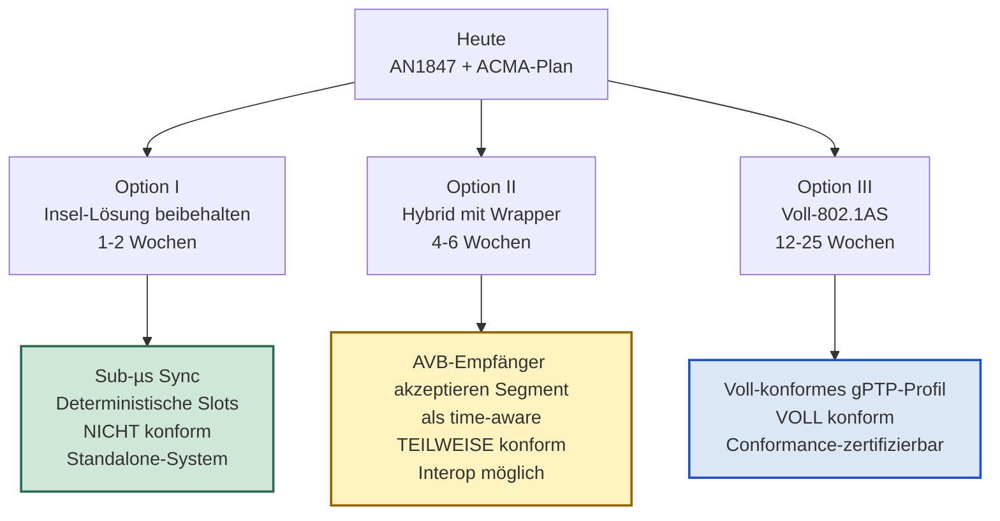
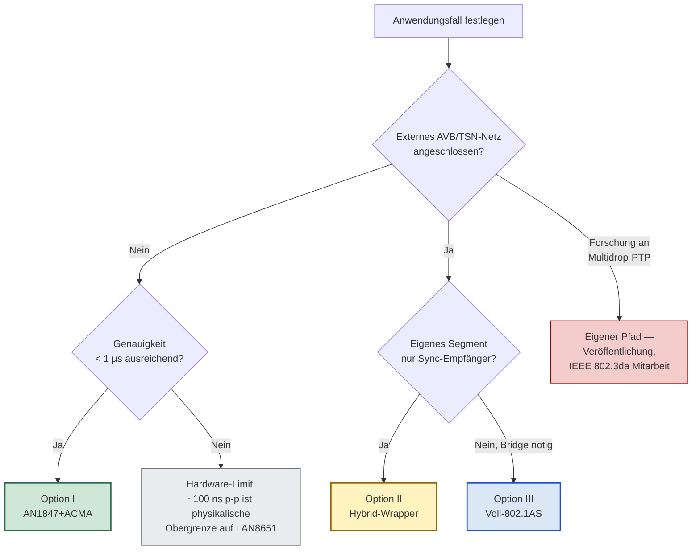
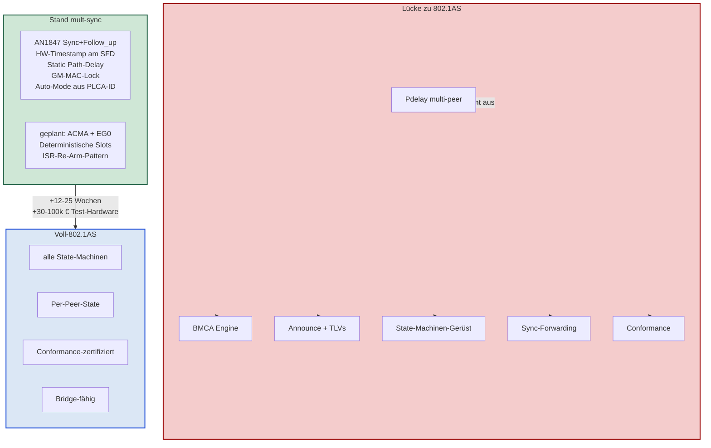

# Roadmap — Vom AN1847+ACMA zum vollen 802.1AS

**Erstellt:** 2026-04-27
**Branch:** `mult-sync` (Strategie-Dokument, kein Code)
**Bezugs-Dokumente:**

- [readme_results.md](readme_results.md) — Machbarkeits-Analyse mit
  Reality-Check (insbesondere §6, §10, §12)
- [readme_upgrade.md](readme_upgrade.md) — AN1847-Style Refactor
  (aktueller Stand)
- [readme_acma.md](readme_acma.md) — Deterministischer
  TDMA-Bus-Zugriff via ACMA
- [LAN8650-1-Time-Synch-AN-60001847.pdf](../pdf/LAN8650-1-Time-Synch-AN-60001847.pdf)
  §2 (Sync + Pdelay Equations) und §2.3 (Multidrop Modifications)
- IEEE Std 802.1AS-2020 — Generalized Precision Time Protocol

---

## Inhaltsverzeichnis

1. [Worum es geht](#1-worum-es-geht)
2. [Was wir bereits haben](#2-was-wir-bereits-haben)
3. [Die Lücke zum vollen 802.1AS](#3-die-lücke-zum-vollen-8021as)
   - 3.1 [A — Pdelay-Mechanismus mit Multidrop-Behandlung](#31-a--pdelay-mechanismus-mit-multidrop-behandlung)
   - 3.2 [B — BMCA (Best Master Clock Algorithm)](#32-b--bmca-best-master-clock-algorithm)
   - 3.3 [C — gPTP-Profil-Konformität](#33-c--gptp-profil-konformität)
   - 3.4 [D — TLVs in den Frames](#34-d--tlvs-in-den-frames)
   - 3.5 [E — Sync-Forwarding und Residence-Time](#35-e--sync-forwarding-und-residence-time)
   - 3.6 [F — State-Machine-Maschinerie](#36-f--state-machine-maschinerie)
   - 3.7 [G — Conformance-Tests](#37-g--conformance-tests)
4. [Aufwands-Schätzung](#4-aufwands-schätzung)
5. [Drei Optionen](#5-drei-optionen)
   - 5.1 [Option I — AN1847+ACMA als bewusste Insel-Lösung](#51-option-i--an1847acma-als-bewusste-insel-lösung)
   - 5.2 [Option II — Hybrid: AN1847-Sync + minimaler 802.1AS-Wrapper](#52-option-ii--hybrid-an1847-sync--minimaler-8021as-wrapper)
   - 5.3 [Option III — Voll-802.1AS-Stack](#53-option-iii--voll-8021as-stack)
6. [Entscheidungsbaum nach Anwendungsfall](#6-entscheidungsbaum-nach-anwendungsfall)
7. [Falls Option III: Implementierungs-Reihenfolge](#7-falls-option-iii-implementierungs-reihenfolge)
8. [Was vom heutigen Code überlebt](#8-was-vom-heutigen-code-überlebt)
9. [Die ungelöste Standard-Lücke](#9-die-ungelöste-standard-lücke)
10. [Empfehlung](#10-empfehlung)

---

## 1. Worum es geht

Die Frage, die diese Roadmap beantwortet:

> Was bräuchte es, damit die Implementierung **voll 802.1AS-2020
> konform** ist, statt nur einer pragmatischen AN1847-Variante mit
> ACMA-Erweiterung?

Antwort: **deutlich mehr Code, andere Architektur, hoher
Forschungs-Anteil für Multidrop-spezifische Adaptionen — und am Ende
trotzdem keine Garantie für Interop mit AVB-Switches**, weil der
Standard den Multidrop-Fall nicht klar definiert. Diese Roadmap
spannt den Bogen zwischen "bewusst pragmatische Insel-Lösung" und
"voll standardisiert" auf, listet die fehlenden Bausteine konkret
auf, schätzt den Aufwand und gibt eine Empfehlung pro
Anwendungs-Szenario.

---

## 2. Was wir bereits haben

Stand `mult-sync`-Branch nach Refactor und Architektur-Plan:

| Baustein | Status | Wo |
|---|---|---|
| Sync + Follow_up TX/RX (PTPv2) | ✅ implementiert | [ptp_gm_task.c](../../apps/tcpip_iperf_lan865x/firmware/src/ptp_gm_task.c), [ptp_fol_task.c](../../apps/tcpip_iperf_lan865x/firmware/src/ptp_fol_task.c) |
| HW-Timestamping am SFD-on-wire | ✅ Hardware | LAN8651 Pattern-Matcher |
| Servo (4-State, MAC_TA + MAC_TI) | ✅ implementiert | [ptp_clock.c](../../apps/tcpip_iperf_lan865x/firmware/src/ptp_clock.c) |
| Statisches Path-Delay pro Knoten | ✅ via CLI | `ptp_path_delay <ns>` |
| GM-MAC-Lock (BMCA-Substitut) | ✅ implementiert | [ptp_fol_task.c::handlePtp](../../apps/tcpip_iperf_lan865x/firmware/src/ptp_fol_task.c) |
| Auto-Mode aus PLCA-Node-ID | ✅ Boot-time | `PTP_FOL_AutoSelectMode()` |
| Source-MAC-Validierung | ✅ implementiert | `fol_gm_mac_locked` |
| Pdelay-Roundtrip (legacy) | 🟡 dormant via `#if !PTP_AN1847_STYLE` | Code erhalten, deaktiviert |
| Deterministische Slots (ACMA) | 🟡 geplant | [readme_acma.md](readme_acma.md) |

→ **Funktional saubere, deterministische Lösung für ein
abgeschlossenes T1S-Segment** mit festem Master. Genügt für die
meisten realen Deployments, **ist aber nicht 802.1AS** im Sinne des
Standards.

---

## 3. Die Lücke zum vollen 802.1AS

Sieben Baustein-Gruppen, die in 802.1AS-2020 verpflichtend sind und
in unserer Implementierung fehlen oder nur rudimentär vorhanden sind.

### 3.1 A — Pdelay-Mechanismus mit Multidrop-Behandlung

802.1AS verlangt **gemessenes** Path-Delay über Pdelay-Roundtrip,
nicht statisch konfiguriert wie bei uns. Auf Multidrop bedeutet das:

- Per-Peer-Pdelay-Statemaschine in jedem Knoten
- GM mit Per-Peer-Response-Queue (statt einem
  `gm_delay_resp_tx_busy`-Slot wie heute)
- `requestingPortIdentity`-Demultiplexing
- `pdelayResponseReceiptTimeout` pro Peer
- `meanLinkDelay` pro Peer
- `neighborRateRatio` Berechnung pro Peer aus aufeinanderfolgenden
  Pdelay-Messungen
- `cumulativeRateRatio` für Sync-Forwarding-Korrekturen

**Aufwand:** 2-3 Wochen, plus inhärente Genauigkeitseinbußen wegen
PLCA-Slot-Wartezeit-Asymmetrie (siehe
[readme_results.md §6.2](readme_results.md#62-pdelay-auf-shared-medium)).
Der heutige `#if !PTP_AN1847_STYLE`-Codepfad in
[ptp_gm_task.c](../../apps/tcpip_iperf_lan865x/firmware/src/ptp_gm_task.c)
und
[ptp_fol_task.c](../../apps/tcpip_iperf_lan865x/firmware/src/ptp_fol_task.c)
ist für 2 Knoten ausgelegt — auf N Peers zu erweitern bedeutet
strukturellen Umbau.

### 3.2 B — BMCA (Best Master Clock Algorithm)

Die größte Lücke. 802.1AS verlangt **dynamische Master-Wahl** aus
Announce-Botschaften:

- Periodische Announce-Frames von jedem time-aware-fähigen Knoten
- Vergleichs-Algorithmus:
  Priority1 → ClockClass → ClockAccuracy → ScaledLogVariance →
  Priority2 → ClockIdentity
- Übergangs-State-Machines: PreMaster → Master, Listening → Slave,
  Faulty → Disabled, etc.
- `announceReceiptTimeout` pro Master-Kandidat
- **Multidrop-spezifisch:** alle hören alle Announces — wer
  übernimmt, wenn der aktuelle Master schweigt? Das ist ein
  Konsens-Problem, im Standard nicht gelöst — siehe
  [readme_results.md §6.3](readme_results.md#63-bmca-auf-multidrop-ist-konzeptionell-broken)

**Aufwand:** 3-4 Wochen Design + Implementation, plus die
Multidrop-Adaptions-Frage, die der Standard offen lässt
(Forschungs-Anteil).

### 3.3 C — gPTP-Profil-Konformität

802.1AS ist ein **Profil von IEEE 1588 mit zusätzlichen Constraints**:

- `logSyncInterval = -3` (= 125 ms) — schon erfüllt
- `logAnnounceInterval = 0` (1 s) — neu zu implementieren
- `logMinPdelayReqInterval = 0` (1 s) — neu
- `gPtpCapableTimeout` Mechanismus
- **Ein-Schritt vs Zwei-Schritt Sync** Behandlung (wir machen
  Zwei-Schritt; korrekt erlaubt, aber muss explizit gemarkert werden)
- **`asCapable`-Flag pro Port** — markiert "diesen Nachbarn kann ich
  für gPTP nutzen"
- **`peerDelayThreshold`** — Pdelay über diesem Wert →
  `asCapable=false`

**Aufwand:** 1 Woche, sobald Pdelay/Announce stehen.

### 3.4 D — TLVs in den Frames

802.1AS-Frames sind nicht "nackte" PTP-Frames. Sie tragen typisierte
TLVs:

- **Path Trace TLV** — Liste aller Hops, durch die Sync gelaufen ist
- **Follow_Up Information TLV** — `cumulativeScaledRateOffset`,
  `gmTimeBaseIndicator`, `lastGmPhaseChange`,
  `scaledLastGmFreqChange`
- **Organization Extension TLVs** (Vendor-spezifisch)
- **Message Interval Request TLV** — dynamische Intervall-Aushandlung

Das Header-Parsing in
[ptp_fol_task.c::processFollowUp](../../apps/tcpip_iperf_lan865x/firmware/src/ptp_fol_task.c)
schreibt diese Felder bereits in den Header
(`tlv_followUp_t`-Struktur), **interpretiert sie aber nicht**.
Vollständige Verarbeitung kostet ~100-200 Zeilen Parser + State.

**Aufwand:** 1-2 Wochen.

### 3.5 E — Sync-Forwarding und Residence-Time

Wenn ein Knoten **Bridge** ist (Sync von einem Port empfangen, auf
einem anderen Port weiterleiten):

- Residence-Time messen (RX-Timestamp bis TX-Timestamp am eigenen
  Knoten)
- `correctionField += residenceTime × neighborRateRatio`
- Synchrones Re-Sending im richtigen Format
- Path Trace TLV erweitern (eigene ClockIdentity anhängen)

**Pure Endpoints** (deine 8 Knoten am T1S-Bus) brauchen das **nicht**,
solange sie nicht zwischen Segmenten überbrücken. Sobald aber einer
als Bridge zu einem AVB-Switch oder anderem Segment fungieren soll,
kommt der ganze Bridge-Anteil dazu.

**Aufwand:** 2-3 Wochen — nur wenn Bridge-Funktionalität gefordert.

### 3.6 F — State-Machine-Maschinerie

Der Standard definiert **24+ State-Maschinen**, die parallel laufen
müssen. Eine unvollständige Auswahl:

- `PortSyncSyncReceive` (pro Port)
- `PortSyncSyncSend` (pro Port)
- `MDSyncReceiveSM` / `MDSyncSendSM`
- `MDPdelayReq` (pro Peer)
- `MDPdelayResp`
- `LinkDelaySyncIntervalSetting`
- `MasterPortSyncSetting`
- `SiteSyncSync`
- `ClockSlaveSync`
- `ClockMasterSyncSend`
- `PortAnnounceReceive`
- `PortAnnounceInformation`
- `PortAnnounceTransmit`
- `PortStateSelection` (= BMCA-Engine)
- `PortStateSettingExt`
- `PortRoleSelection`
- ...

Jede ist 5-15 Zustände. Die meisten haben Per-Port-Instanzen.
Inter-State-Machine-Kommunikation über `Variables`. **Das ist kein
Mini-Refactor, das ist eine kleine Protokoll-Suite.**

**Aufwand:** 4-6 Wochen Gerüst, danach inkrementell pro
Sub-Maschine.

### 3.7 G — Conformance-Tests

802.1AS-Konformität wird mit kommerziellen Test-Suites verifiziert:

- **Anritsu MD8475A** mit gPTP-Test-Software
- **Spirent TestCenter** für TSN-Profile
- **Calnex Paragon** für PTP-Genauigkeit
- **AVnu Alliance Pro AV TSN Certification** Setup

Diese kosten **30k-100k €**. Ohne sie ist "802.1AS-konform" eine
Behauptung, kein Beweis. Speziell für Multidrop existiert **keine**
publizierte Conformance-Suite.

**Aufwand:** 2-4 Wochen Setup + Geld.

---

## 4. Aufwands-Schätzung

| Baustein | Aufwand | Komplexität |
|---|---|---|
| Pdelay (multi-peer) | 2-3 Wochen | mittel |
| Announce-Frames | 1 Woche | gering |
| BMCA Engine | 3-4 Wochen | hoch (Multidrop-Adaption Forschung) |
| gPTP-Profil-Spezifika | 1 Woche | gering |
| TLVs vollständig | 1-2 Wochen | gering |
| State-Maschinen-Gerüst | 4-6 Wochen | hoch |
| Sync-Forwarding (falls Bridge) | 2-3 Wochen | mittel |
| Conformance-Test-Setup | 2-4 Wochen + Geld | abhängig |
| Multidrop-Workarounds (AN1847 §2) | open-ended | Forschung |
| **Summe (Endpoint, ohne Bridge)** | **~12-16 Wochen** | hoch |
| **Summe (mit Bridge + Conformance)** | **~20-25 Wochen** | hoch |

---

## 5. Drei Optionen

**Lesart:** Drei diskrete Pfade, je nach gewünschter
Standard-Konformität und verfügbarem Aufwand. Es gibt keine
schmuggellosen Zwischenstufen; jeder Pfad ist sein eigenes Commitment.

### 5.1 Option I — AN1847+ACMA als bewusste Insel-Lösung

**Was du kriegst:**

- Sub-µs Synchronisation auf 3-8 Knoten
- Deterministische TDMA-Slots
- Sauber dokumentierte Architektur
- Funktioniert in einem geschlossenen System

**Was du *nicht* kriegst:**

- 802.1AS-Konformität
- Interop mit AVB-Switches
- BMCA / dynamische Master-Wahl

**Aufwand:** Was wir gerade machen. ~1-2 Wochen für
ACMA-Implementation; AN1847-Sync ist bereits da.

**Geeignet für:** abgeschlossene Sensor-Cluster, industrielle
Punkt-zu-Punkt-Steuerung, jede Anwendung ohne externe AVB/TSN-Welt.

### 5.2 Option II — Hybrid: AN1847-Sync + minimaler 802.1AS-Wrapper

Den AN1847-Sync intern beibehalten, aber **außen** so verpacken, dass
ein angeschlossener AVB-Switch zufrieden ist:

- Announce-Frames mit fixen Werten (ClockClass, etc.) im richtigen
  Format
- BMCA passiv — wir senden nur Announce, vergleichen aber selbst nicht
- Pdelay nur dem GM (Node 0) gegenüber, andere Knoten ignorieren
- TLVs leer aber syntaktisch korrekt
- `asCapable`-Flag setzen für angeschlossenes Bridge

**Was du kriegst:**

- Bridge-fähig zu einer AVB-Welt für **Sync-Empfang**
- Intern unverändert (Sync + Follow_up + statisches Path-Delay)
- Nicht voll-konform aber **interop-fähig**

**Aufwand:** ~4-6 Wochen.

**Geeignet für:** T1S-Segment als Sensor-Branch eines größeren
AVB/TSN-Netzes, wo die Sensoren von einem Master außerhalb
synchronisiert werden sollen, aber selber keine AVB-Streams routen.

**Risiko:** AVB-Switches prüfen oft mehr als die syntaktische
Format-Korrektheit (z. B. Pdelay-Verhalten, BMCA-Reaktivität). Ohne
echten Conformance-Test ist nicht sicher, ob der Wrapper "durchgeht".

### 5.3 Option III — Voll-802.1AS-Stack

Eigene Implementation oder Port von **linuxptp** auf MCU. Sehr
aufwändig, aber dann hast du echte Konformität.

**Was du kriegst:**

- Voll-konformes gPTP-Profil
- BMCA, Pdelay, Announce, TLVs, alles
- Conformance-zertifizierbar (mit kommerzieller Test-Suite)
- Bridge-fähig (mit Sync-Forwarding-Erweiterung)

**Aufwand:**

- ~12-16 Wochen Endpoint
- ~20-25 Wochen mit Bridge + Conformance
- Plus Testlab-Setup-Kosten

**Alternative:** Lizenzierung einer kommerziellen
802.1AS-Library. Anbieter wie Renesas, Belden/Hirschmann, TimeBeat,
TTTech oder Real-Time Systems bieten gPTP-Stacks für MCUs.
Lizenzkosten ~10k-50k € + Royalties + Integrations-Aufwand. Nicht
offen, aber kürzer.

**Geeignet für:** Produkte, die **als Time-Aware-System zertifiziert**
werden müssen, oder die in regulierten TSN-Umgebungen (Industrie 4.0,
ISO 26262 funktionale Sicherheit, AVB-zertifiziertes
Multimedia-Equipment) eingesetzt werden.

---

## 6. Entscheidungsbaum nach Anwendungsfall

**Lesart:** Die Konformitäts-Frage steht und fällt mit der externen
Anbindung. Im Standalone-Fall ist Option I objektiv ausreichend. Erst
mit AVB/TSN-Interop wird die Konformitäts-Diskussion handlungsleitend.

---

## 7. Falls Option III: Implementierungs-Reihenfolge

Wenn das Ziel voll-802.1AS-Stack ist, hat sich folgende Reihenfolge
bewährt (basierend auf linuxptp/gPTP-Stack-Strukturen):

```mermaid
flowchart LR
    P1[Phase 1<br/>Pdelay multi-peer<br/>2-3 Wo]
    P2[Phase 2<br/>Announce + Parsing<br/>1-2 Wo]
    P3[Phase 3<br/>BMCA Engine<br/>3-4 Wo]
    P4[Phase 4<br/>State-Machinen-Gerüst<br/>4-6 Wo]
    P5[Phase 5<br/>TLV Vollständigkeit<br/>1-2 Wo]
    P6[Phase 6<br/>gPTP-Profil-Compliance<br/>1 Wo]
    P7[Phase 7<br/>Sync-Forwarding<br/>2-3 Wo, optional]
    P8[Phase 8<br/>Conformance-Test<br/>2-4 Wo]

    P1 --> P2 --> P3 --> P4 --> P5 --> P6 --> P7 --> P8

    style P3 fill:#f4cccc,stroke:#990000
    style P4 fill:#f4cccc,stroke:#990000
    style P8 fill:#fff3bf,stroke:#996300
```

**Lesart:** Phase 3 (BMCA) und Phase 4 (State-Machinen) sind die
hochkomplexen Brocken (rot markiert). Phase 8 (Conformance) ist
Geld-relevant (gelb). Vorgängige Phasen 1-2, 5-6 sind eher mechanisch.

### Phase-Details

**Phase 1 — Pdelay multi-peer:**
Pdelay-Code aus
[ptp_fol_task.c](../../apps/tcpip_iperf_lan865x/firmware/src/ptp_fol_task.c)
und
[ptp_gm_task.c](../../apps/tcpip_iperf_lan865x/firmware/src/ptp_gm_task.c)
reaktivieren (`#if !PTP_AN1847_STYLE`-Guards entfernen), auf N Peers
erweitern, Per-Peer-State einführen. Gut testbar mit 2-Knoten-Setup
zuerst, dann 3-Knoten.

**Phase 2 — Announce:**
TX und RX von Announce-Frames. Format aus IEEE 1588 §13.5. Noch ohne
Verarbeitung (Listening-only).

**Phase 3 — BMCA:**
Kernstück. Datenstrukturen für `foreignMaster`-Liste,
Vergleichs-Algorithmus (`dataset_cmp` in linuxptp-Sprech),
Übergangs-Logik. Multidrop-Adaption als eigenes Modul.

**Phase 4 — State-Machinen-Gerüst:**
24+ Statemaschinen aus 802.1AS §10. Skeleton-Generierung
mit linuxptp als Vorlage. Inter-State-Machine-Variables ordentlich
typisiert.

**Phase 5 — TLVs:**
Vollständiges Parsen + Interpretieren von Path Trace, Follow_Up
Information, Organization Extension TLVs. Schreibt
`tlv_followUp_t`-Struktur erweitern, Parser implementieren.

**Phase 6 — gPTP-Profil:**
Default-Werte, Intervall-Limits, `asCapable`-Logik.

**Phase 7 — Sync-Forwarding (optional):**
Nur falls dieser Knoten als Bridge zwischen Segmenten arbeitet.

**Phase 8 — Conformance:**
Hardware besorgen / Service-Provider engagieren. Defizite finden,
fixen, re-testen.

---

## 8. Was vom heutigen Code überlebt

Selbst wenn der Pfad zu Option III gewählt wird, bleibt der Großteil
unseres aktuellen Codes erhalten:

| Komponente | Beim Sprung zu 802.1AS |
|---|---|
| LAN8651-Driver-Layer ([ptp_drv_ext.c](../../apps/tcpip_iperf_lan865x/firmware/src/ptp_drv_ext.c)) | **bleibt unverändert** |
| Servo + Drift-Filter ([ptp_clock.c](../../apps/tcpip_iperf_lan865x/firmware/src/ptp_clock.c)) | **bleibt unverändert** |
| Frame-TX/RX-Pfad (raw Eth) | bleibt, evtl. erweitert |
| HW-Timestamp-Pipeline | **bleibt unverändert** |
| Sync + Follow_up Frame-Parsing | bleibt, evtl. erweitert um TLVs |
| AN1847-Style-Flag (`PTP_AN1847_STYLE`) | wird `0` für Konformität |
| Pdelay-Code (aktuell dormant) | **wird reaktiviert + erweitert** |
| GM-MAC-Lock | wird durch BMCA ersetzt |
| Auto-Mode aus PLCA-Node-ID | wird durch BMCA ersetzt |
| Static-Path-Delay-CLI | bleibt für Debug, BMCA-Pdelay übernimmt |
| ACMA-Layer (geplant) | **bleibt unverändert** — orthogonal zu PTP |
| CLI / Logging / Tracing | **bleibt unverändert** |

**Du baust nichts weg. Du fügst hinzu** — wenn und wann der
Anwendungsfall es verlangt. Die `mult-sync`-Architektur mit dem
Compile-Flag-Schalter ist genau dafür designed.

---

## 9. Die ungelöste Standard-Lücke

Selbst voll-konformes 802.1AS auf einem T1S-Segment garantiert
**nicht**, dass eine AVB-Bridge das Segment akzeptiert. Der Standard
hat eine Lücke, die Microchip in AN1847 §2 explizit benennt:

> "While 802.1AS clearly defines the Sync and PDelay methods for
> full-duplex Ethernet links, **there is not yet a clear definition
> for a shared medium, like 10BASE-T1S when used with PLCA in
> multidrop mode.** All of the message types above are currently
> defined as multicast. Software workarounds to existing PTP
> processing are required until the standards are adapted for
> multidrop segments. These workarounds are beyond the scope of this
> document."

Konkrete Konsequenz:

- AVB-Bridges **erwarten Pdelay als Punkt-zu-Punkt-Mechanismus**.
  Auf Multidrop sehen sie N Pdelay-Antworten und müssen demultiplexen,
  was ihr Stack typisch nicht tut.
- AVB-Bridges **erwarten BMCA-Reaktivität pro Port**. Multidrop
  bedeutet "ein Port mit N Nachbarn", was die Bridge-Implementierung
  normalerweise nicht modelliert.
- AVB-Bridges **berechnen `cumulativeRateRatio` über Hops** unter der
  Annahme, dass jeder Hop ein dedizierter Link ist. Multidrop bricht
  diese Annahme.

**Selbst Option III liefert daher keine Garantie für AVB-Interop.**
Das eigentliche Problem liegt **außerhalb deines Codes** — in der
Bridge-Implementierung der Gegenseite und in der Standard-Lücke
selbst. Die IEEE 802.3da Task Group arbeitet an einer
Multidrop-PTP-Erweiterung; bis sie publiziert ist, bleibt jeder
heutige Versuch — egal ob Microchip's AN1847 oder eine Voll-802.1AS-
Implementation — eine **vendor-spezifische Adaption mit unsicherem
Interop-Status**.

---

## 10. Empfehlung

Für die meisten realen Anwendungen mit T1S-Multidrop:

> **Option I (AN1847+ACMA) ist der richtige Pfad.**
>
> Vollständiges 802.1AS gibt dir keinen praktischen Mehrwert, kostet
> aber 10-20× mehr Code, und die Multidrop-Lücke im Standard
> verhindert ohnehin echte Interop-Garantien.

**Wann ein Sprung zu Option II oder III sich lohnt:**

- Du hast einen konkreten AVB/TSN-Switch, der dein T1S-Segment
  empfangen soll, und der Anbieter hat Multidrop-PTP-Support
  bestätigt → Option II
- Du baust ein zertifiziertes Industrie-Produkt mit
  ISO-26262-Anforderung an gPTP-Konformität → Option III + Lizenz
  einer kommerziellen Lib
- Du forschst an Multidrop-PTP-Adaption und willst zur
  IEEE 802.3da-Spezifikation beitragen → eigener Pfad mit
  Veröffentlichung der Erkenntnisse

**Was du bewusst aufgibst, wenn du bei Option I bleibst:**

- Konformitäts-Zertifizierung (gibt's für Multidrop ohnehin nicht)
- AVB-Switch-Interop (steht und fällt mit der Switch-Implementierung)
- Vendor-übergreifende Multi-Master-Robustheit (in deinem
  geschlossenen System nicht gefordert)

**Was du gewinnst, wenn du bei Option I bleibst:**

- ~10-20× weniger Code zu warten
- Keine offenen Standard-Lücken zu adressieren
- Klare Architektur, dokumentiert, getestet
- Voller Fokus auf den Anwendungsfall, nicht auf
  Standard-Infrastruktur

---

## 11. Zusammenfassung als ein Bild

**Lesart:** Wir sitzen im grünen Bereich (links). Der rote Bereich
(Mitte) listet die Lücke. Der blaue Bereich (rechts) ist das Ziel,
wenn Voll-Konformität gefordert wird. Der Sprung kostet 12-25 Wochen
plus Test-Hardware-Budget — und gibt **trotzdem keine Multidrop-
Interop-Garantie**, solange die IEEE 802.3da-Task-Group nicht
geliefert hat.

---

**Status 2026-04-27: Strategie-Dokument, dient der Entscheidungsfindung
vor weiterer Code-Investition.**
