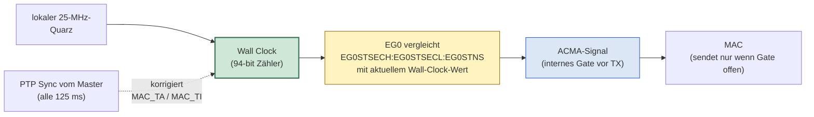
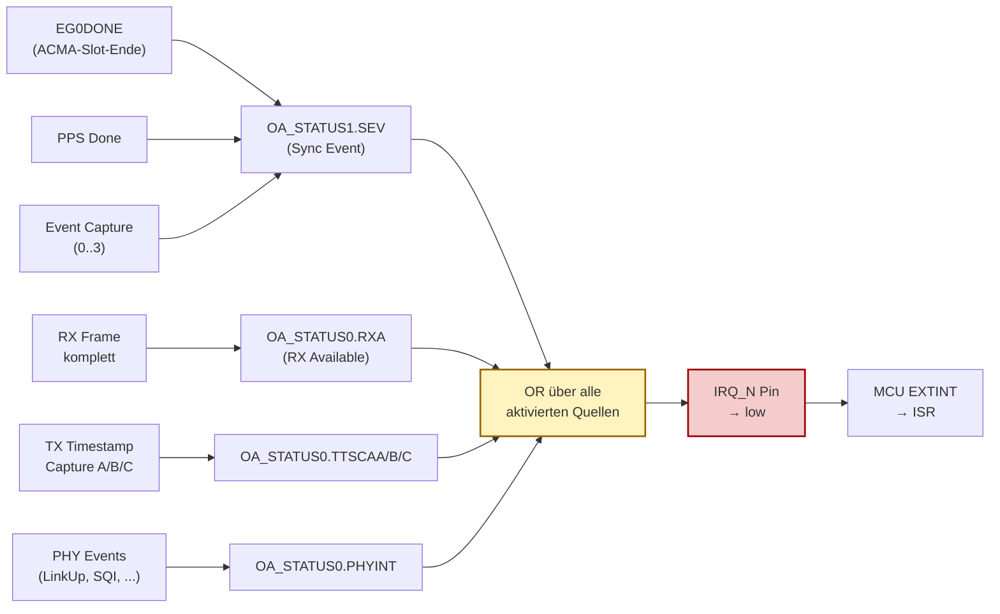
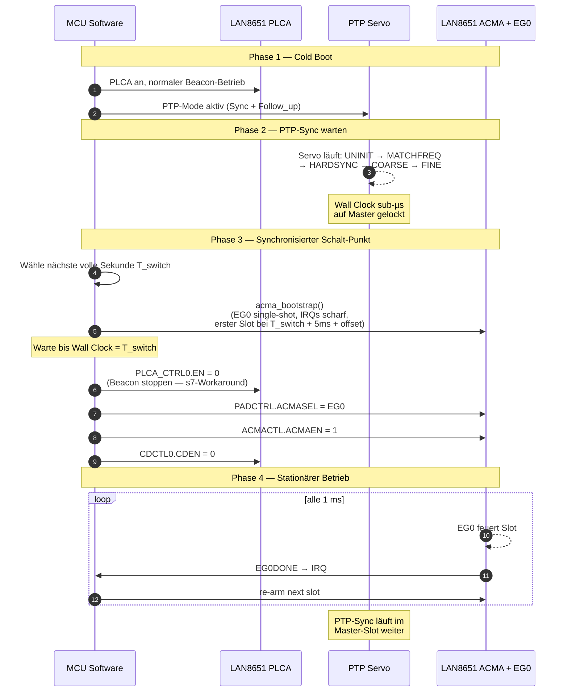

# ACMA — Deterministischer TDMA-Bus-Zugriff auf 10BASE-T1S

**Erstellt:** 2026-04-27
**Branch:** `mult-sync` (Architektur-Skizze, noch nicht implementiert)
**Bezugs-Dokumente:**

- [LAN8650-1-Data-Sheet-60001734.pdf](../../documentation/pdf/LAN8650-1-Data-Sheet-60001734.pdf)
  §4.5 Synchronization Support, §7.3 Application Controlled Media Access (ACMA)
- [LAN8650-1-Errata-80001075.pdf](../../documentation/pdf/LAN8650-1-Errata-80001075.pdf)
  §s7 PLCA-Coordinator Sleep, §s9 Event Generator Periodic-Mode-Drift
- [readme_results.md](readme_results.md) — Machbarkeits-Analyse für 1 µs PTP-Sync auf 3-8 Knoten
- [readme_upgrade.md](readme_upgrade.md) — AN1847-Style Refactor (Vorläufer zu ACMA-Plan)

---

## Inhaltsverzeichnis

1. [Worum es geht](#1-worum-es-geht)
2. [ACMA in einfachen Worten](#2-acma-in-einfachen-worten)
3. [Die drei Media-Access-Modi des LAN8651 im Vergleich](#3-die-drei-media-access-modi-des-lan8651-im-vergleich)
4. [Anker-Mechanik: Wall Clock statt Beacon](#4-anker-mechanik-wall-clock-statt-beacon)
5. [Register-Konfiguration](#5-register-konfiguration)
   - 5.1 [ACMA aktivieren](#51-acma-aktivieren)
   - 5.2 [Event Generator 0 als Slot-Quelle](#52-event-generator-0-als-slot-quelle)
   - 5.3 [Wall Clock per PTP synchron halten](#53-wall-clock-per-ptp-synchron-halten)
6. [Errata-Auswirkungen](#6-errata-auswirkungen)
   - 6.1 [s9 — Periodic-Mode-Drift](#61-s9--periodic-mode-drift-killer-für-naive-implementierung)
   - 6.2 [s7 — PLCA-Coordinator-Beacon](#62-s7--plca-coordinator-beacon-stoppen)
   - 6.3 [Übrige Errata](#63-übrige-errata-irrelevant-oder-uneingeschränkt-vorteilhaft)
7. [ISR-getriebene Re-Arm-Routine](#7-isr-getriebene-re-arm-routine)
   - 7.1 [Trigger-Kette](#71-trigger-kette)
   - 7.2 [ISR-Aufgaben](#72-isr-aufgaben)
   - 7.3 [Code-Skizze](#73-code-skizze)
   - 7.4 [Timing-Budget](#74-timing-budget)
   - 7.5 [Robustheit](#75-robustheit)
   - 7.6 [IRQ-Last und SPI-Bandbreiten-Budget](#76-irq-last-und-spi-bandbreiten-budget)
8. [Bootstrap-Sequenz](#8-bootstrap-sequenz)
9. [Konkretes Deployment-Beispiel](#9-konkretes-deployment-beispiel-8-knoten--1-ms-zyklus)
10. [Was zu testen ist](#10-was-zu-testen-ist)
11. [Trade-offs vs. AN1847-Style alleine](#11-trade-offs-vs-an1847-style-alleine)
12. [Implementierungs-Roadmap](#12-implementierungs-roadmap)
13. [Standardisierungs-Status und Vendor-Lock-in](#13-standardisierungs-status-und-vendor-lock-in)
    - 13.1 [ACMA ist Microchip-spezifisch](#131-acma-ist-microchip-spezifisch)
    - 13.2 [Was die anderen Vendoren haben (oder nicht)](#132-was-die-anderen-vendoren-haben-oder-nicht)
    - 13.3 [Vergleich mit standardisierten TDMA-Mechanismen](#133-vergleich-mit-standardisierten-tdma-mechanismen)
    - 13.4 [Konsequenz nach Deployment-Szenario](#134-konsequenz-nach-deployment-szenario)
    - 13.5 [Mitigationen falls Multi-Vendor doch nötig](#135-mitigationen-falls-multi-vendor-doch-nötig)

---

## 1. Worum es geht

PTP-Synchronisation auf 10BASE-T1S Multidrop liefert **konstante
Zeitachsen** auf allen Knoten — siehe
[readme_results.md](readme_results.md) und
[readme_upgrade.md](readme_upgrade.md) für die AN1847-Style Lösung
dafür. Was PTP allein **nicht** liefert: deterministischer
**Bus-Zugriff** für Anwendungs-Daten. PLCA gibt allen Knoten faire
Sende-Slots, aber:

- inhärentes Slot-Skipping bei Inaktivität
- variable Zykluszeit zwischen N × TOTMR und N × MTU-Frame-Zeit
- Beacon-getaktet, nicht zeit-deterministisch im absoluten Sinn

Für Anwendungen, die **garantierte Sende-Slots zu bekannten
Zeitpunkten** brauchen (verteilte Steuerung, synchrones ADC-Sampling,
TDMA-Bus-Protokolle), reicht PLCA nicht. Microchip hat dafür einen
eigenen Mechanismus eingebaut: **Application Controlled Media Access
(ACMA)**.

Dieses Dokument beschreibt:

- was ACMA ist und wie es funktioniert
- wie es im LAN8651 konkret aktiviert und konfiguriert wird
- wie es **mit PTP zusammen** echte TDMA-Slots liefert
- welche Errata den naiven Plan brechen und wie der Workaround aussieht
- die ISR-Architektur, die der Errata-Workaround verlangt
- wie der Übergang von PLCA zu ACMA orchestriert wird

---

## 2. ACMA in einfachen Worten

Stell dir den T1S-Bus wie ein Mikrofon vor, an dem mehrere Leute reden
wollen. Es gibt drei Möglichkeiten, das zu organisieren:

| Modus | Wie es funktioniert | Analogie |
|---|---|---|
| **CSMA/CD** | Wer was sagen will, redet einfach. Wenn zwei gleichzeitig anfangen, hören beide auf und versuchen's später nochmal. | Lockere Diskussionsrunde |
| **PLCA** | Wir gehen reihum. Jeder ist dran, sagt was oder bleibt still, dann ist der nächste dran. | Strukturierte Runde mit Sprechreihenfolge |
| **ACMA** | Eine externe Uhr sagt jedem genau, **wann** er reden darf — von Sekunde X bis Sekunde Y. | Konferenz mit Stoppuhr-gesteuerten Slots |

Bei PLCA bestimmt die **Hardware selbst**, wer wann dran ist (durch
BEACON + Slot-Reihenfolge). Bei ACMA bestimmt die **Anwendung** das —
über ein einzelnes externes Steuersignal:

- **Signal HIGH** → "MAC, du darfst jetzt senden"
- **Signal LOW** → "MAC, halt die Klappe"

Mehr ist es nicht. ACMA ist im Grunde nur ein **Tor (Gate) vor der
Sende-Logik**, das von außen geöffnet und geschlossen wird.

Das Steuersignal kann von zwei Quellen kommen:

1. **Ein GPIO-Pin (DIO2)** — irgendein externes Signal
2. **Event Generator 0 (EG0)** — der chip-interne Pulsgenerator, der
   mit der **Wall Clock** verbunden ist

Variante 2 ist der Clou: weil die Wall Clock per PTP synchronisiert
ist, kennen alle Knoten dieselbe Zeit. Jeder Knoten konfiguriert "ich
darf von Millisekunde X bis Millisekunde Y reden" — und alle Knoten
sind sich automatisch einig, weil ihre Uhren synchron laufen.

> **Kurzformel:** ACMA ist ein einfaches Enable-Signal für die
> Sende-Logik des LAN8651. Wenn es high ist, darf der Knoten senden.
> Wenn es low ist, nicht. Den Takt dieses Signals macht die Anwendung
> selbst — und kann ihn an die PTP-Uhr koppeln, damit alle Knoten
> synchron ihre Slots kennen.

---

## 3. Die drei Media-Access-Modi des LAN8651 im Vergleich

| Aspekt | CSMA/CD | PLCA | **ACMA** |
|---|---|---|---|
| Bestimmung Sende-Zeit | zufällig (Backoff) | Hardware-Reihenfolge nach Beacon | **Anwendung** über Steuer-Signal |
| Determinismus | nein | teilweise (Slot-Reihenfolge ja, Zykluszeit nein) | **vollständig** |
| Kollisions-Vermeidung | über Detect | über Slot-Disziplin | über Anwendungs-Disziplin |
| Slot-Skipping | n/a | inhärent (TOTMR) | **nein** |
| PTP-Synchronisierbarkeit | nicht relevant | Slots beacon-getaktet, nicht PTP-zeitlich | **ja** — Slots an Wall Clock |
| Software-Aufwand | minimal | minimal | **moderat** (ISR-Re-Arm wegen Errata s9) |
| Anwendung dafür | Best-Effort Ethernet | Standard 10BASE-T1S | Industrielle TDMA, verteilte Steuerung |

---

## 4. Anker-Mechanik: Wall Clock statt Beacon

EG0 ankert **nicht am Beacon, sondern an der Wall Clock**. Die Wall
Clock ist der 94-Bit-Zähler im LAN8651, der in 40-ns-Schritten
hochläuft. Der PLCA-Beacon ist ein periodisches Frame, das vom
Coordinator alle paar Mikrosekunden ausgestrahlt wird, um die
PLCA-Slot-Reihenfolge anzukurbeln. **Beide haben miteinander nichts
zu tun.**



**Lesart:** Die Wall Clock ist die einzige Zeit-Referenz, die EG0
kennt. PTP korrigiert die Wall Clock von außen. Sobald die Wall Clock
einen Stand erreicht, der gleich `EG0ST*`-Wert ist, schaltet EG0
seinen Ausgang. Der PLCA-Beacon kommt darin gar nicht vor.

### Warum das so designed ist

ACMA ist als **Alternative zu PLCA** konzipiert (Datenblatt §7.3, "as
an alternative to PLCA or CSMA/CD"). Wenn ACMA aktiv ist und PLCA
deaktiviert, gibt es **keinen Beacon mehr** — der Coordinator hört auf,
ihn zu senden. Wenn EG0 am Beacon ankern würde, hätte es nichts mehr
zum Ankern.

Die Hardware-Designer haben das bewusst getrennt:

- **PLCA** = Hardware-Scheduling, Beacon-getaktet, fair und
  automatisch, aber nicht zeitlich vorhersagbar
- **ACMA** = Software-Scheduling, Wall-Clock-getaktet, voll
  deterministisch, aber Software-Verantwortung

### Was bei PLCA der Beacon ist, ist bei ACMA die PTP-Sync-Botschaft

| | PLCA | ACMA |
|---|---|---|
| Was alle Knoten teilen | "den Beacon" | "die Wall-Clock-Sekunde" |
| Wie das geteilt wird | Beacon-Frame auf dem Kabel | PTP-Sync-Frame korrigiert lokalen Zähler |
| Synchronisations-Genauigkeit | "ungefähr beim Beacon" (Slot-genau) | < 100 ns (PTP-Genauigkeit der Wall Clock) |
| Slot-Position | implizit über Slot-ID | explizit über `EG0ST*`-Werte |

Damit gilt: **Slot-Genauigkeit hängt direkt an der PTP-Genauigkeit.**
Wenn PTP auf 100 ns genau ist, sind die ACMA-Slots auf 100 ns genau
ausgerichtet. Wenn PTP wegfällt, driften die Wall Clocks auseinander
(~50 ppm Quarz = 50 µs/s) und die Slots laufen aus dem Tritt.

---

## 5. Register-Konfiguration

### 5.1 ACMA aktivieren

Drei Register, mit konkreten Werten:

| Register | Bit / Feld | Wert | Was es tut |
|---|---|---|---|
| `ACMACTL` (Application Controlled Media Access Control) | `ACMAEN` | `1` | Schaltet ACMA ein. Damit ist der MAC-Sender ab jetzt **gegated** — er sendet nur noch, wenn das ACMA-Signal high ist |
| `PADCTRL` (Pad Control) | `ACMASEL` | `0` oder `1` | Wählt die Quelle: `0` = externer DIO2-Pin, `1` = Event Generator 0 (chip-interne, Wall-Clock-getriebene Pulse) |
| `CDCTL0` (Collision Detect Control 0) | `CDEN` | `0` | Kollisions-Erkennung aus, weil ACMA garantiert keine Kollisionen mehr produziert |

Mit diesen drei Schreibzugriffen ist der LAN8651 im ACMA-Modus. Der
Bus-Zugriff hängt jetzt zu 100 % am Steuer-Signal.

### 5.2 Event Generator 0 als Slot-Quelle

Wenn `ACMASEL=1` (Event Generator 0) gewählt ist, programmiert man
EG0 wie einen Pulse-Wave-Generator. Auch hier: nur Register schreiben.
Beispiel "Knoten 2, 1 ms Zyklus, 100 µs Slot ab Offset 250 µs":

| Register | Inhalt |
|---|---|
| `EG0STSECH` | `0` (Sekunden-Anteil High) |
| `EG0STSECL` | `0` (Sekunden-Anteil Low) — Start beim nächsten Sekunden-Tick |
| `EG0STNS` | `250000` (Nanosekunden-Offset = 250 µs nach dem Sekunden-Tick) |
| `EG0PW` | `100000` (Pulse Width = 100 µs Slot-Dauer) |
| `EG0IT` | `900000` (Idle Time — nur in Periodic-Mode relevant; **siehe §6.1**) |
| `EG0CTL` | `ISREL=0` (absolute Zeit) + `ACTHI=1` (active high) + `START=1` |

> **WICHTIG:** Diese Konfiguration darf **nicht mit `REP=1`
> (Periodic-Mode)** verwendet werden — siehe Erratum s9 in §6.1.
> Stattdessen Single-Shot-Mode (`REP=0`) mit ISR-Re-Arm.

### 5.3 Wall Clock per PTP synchron halten

Damit alle Knoten dieselben "Sekunden" und "Nanosekunden" meinen,
schreibt jeder seine Wall Clock per PTP auf den Master-Wert:

| Register | Inhalt |
|---|---|
| `MAC_TSH` | Sekunden High (PTP-synchronisiert) |
| `MAC_TSL` | Sekunden Low |
| `MAC_TN` | Nanosekunden |
| `MAC_TI` | `0x28` (Increment 40 ns pro 25 MHz Clock-Tick) |

Diese Aktualisierung erfolgt durch den existierenden PTP-Servo
([ptp_clock.c](../../apps/tcpip_iperf_lan865x/firmware/src/ptp_clock.c))
unverändert. ACMA setzt darauf nur auf.

---

## 6. Errata-Auswirkungen

### 6.1 s9 — Periodic-Mode-Drift (Killer für naive Implementierung)

Aus **ER80001075F §1.9**, wörtlich:

> "**s9: Event Generator signal drifts relative to synchronized wall
> clock when used in periodic mode**
>
> If the local wall clock is controlled by a clock servo algorithm,
> events generated by the event generator (EG) in periodic mode will
> drift relative to the synchronized wall clock. The first pulse of
> the EG will be synchronous to the wall clock, but the EG will not
> track updates to the wall clock, so events will drift relative to
> the synchronized clock.
>
> **Work Around**: If multiple events are required, it is possible to
> trigger each event individually. Events generated in single mode are
> synchronous to the wall clock."

#### Was das bedeutet

Der einfache Plan wäre: **EG0 in Periodic-Mode (`REP=1`)** mit
Period = 1 ms, Pulse Width = 100 µs. Genau dieser Modus ist defekt:

- Erster Slot synchron zur Wall Clock ✅
- Zweiter Slot minimal davongedriftet
- Nach 1 Sekunde (bei ±50 ppm Quarz-Toleranz) bis zu 50 µs Versatz
- Nach PTP-Korrektur (alle 125 ms `MAC_TA`-Sprünge): EG0 ignoriert
  die Korrektur, läuft weiter mit dem ungeregelten lokalen Quarz

→ Nach kurzer Zeit liegt jeder Knoten in einem **anderen Zeitfenster**,
als er sollte. ACMA-Slots überlappen, der Determinismus ist hin.

#### Workaround: Single-Shot-Mode mit ISR-Re-Arm

```c
EG0CTL.REP = 0           // single-shot
EG0STSECH:EG0STSECL:EG0STNS = nächste Slot-Start-Zeit
EG0CTL.START = 1         // los
```

Pro Slot wird EG0 explizit neu programmiert. Sobald der Puls kommt
und endet, setzt das `EG0DONE`-Bit; eine ISR liest das, berechnet die
nächste Slot-Zeit (= aktuelle + 1 ms) und re-armiert EG0. Details
siehe §7.

### 6.2 s7 — PLCA-Coordinator-Beacon stoppen

Aus **ER80001075F §1.7**:

> "When configured as a PLCA coordinator, the device does not stop
> transmitting beacons immediately upon entering sleep mode."

Trifft uns nicht im Sleep-Kontext, **aber** das Bootstrap-Szenario
(PLCA an → PTP-Sync → ACMA an, PLCA aus) ist betroffen, falls man
PLCA "weich" abschaltet:

> "Workaround: Clear the EN bit of the PLCA_CTRL0 to disable the beacon."

→ PLCA muss explizit über `PLCA_CTRL0.EN = 0` ausgeschaltet werden,
**bevor** ACMA scharf wird. Sonst sendet der ehemalige Coordinator
weiter Beacons in unsere ACMA-Slots hinein und verursacht Kollisionen.

### 6.3 Übrige Errata (irrelevant oder uneingeschränkt vorteilhaft)

| Erratum | Relevanz für ACMA-TDMA |
|---|---|
| s1 (PHYID-Identifikation) | irrelevant |
| s2 (RX-Block-Bug, B0 only) | irrelevant — wir sind auf B1 |
| s3 (SPI-RX-Halt, B0 only) | irrelevant — B1 fixed |
| s4 (TX-Halt bei excessive collisions) | **nicht relevant** — in ACMA gibt's per Definition keine Kollisionen |
| s5 (Multi-Coordinator-Handling) | irrelevant — kein Coordinator mehr |
| s6 (SLPCAL muss 0 sein) | nur für Sleep-Mode |
| s8 (TO_TMR Trade-off) | nur für PLCA-Mode — irrelevant in ACMA |

---

## 7. ISR-getriebene Re-Arm-Routine

### 7.1 Trigger-Kette


**Lesart:** Die Hardware generiert den Slot-Puls völlig autonom anhand
der Wall-Clock-Vergleichslogik. Wenn der Puls zu Ende ist
(`t = EG0ST* + EG0PW`), setzt die Hardware das `EG0DONE`-Bit. Über
die freigeschaltete Interrupt-Maske erreicht der Trigger den MCU als
IRQ — exakt am Ende des eigenen Slots.

#### Wann sie feuert

**Genau einmal pro Slot-Zyklus pro Knoten.** Der Trigger-Zeitpunkt ist
deterministisch das Ende des eigenen Slot-Pulses, also
`slot_start + slot_width`.

| Setup | Slot-Zyklus | Slot-Breite | ISR-Frequenz |
|---|---|---|---|
| 8 Knoten, 1 ms Zyklus, 100 µs Slot | 1 ms | 100 µs | 1 ISR/ms = 1000 Hz |
| 8 Knoten, 250 µs Zyklus, 25 µs Slot | 250 µs | 25 µs | 1 ISR/250 µs = 4 kHz |

Wichtig: jeder Knoten sieht **nur seinen eigenen** EG0DONE-Trigger.
Die EG0DONE-Bits anderer Knoten bleiben in deren lokaler Hardware —
der Bus überträgt sie nicht.

### 7.2 ISR-Aufgaben

Drei Aufgaben in dieser Reihenfolge:

**1. Bestätigen, dass es wirklich EG0DONE war.**
Der gemeinsame IRQ_N-Pin trägt viele Events (RX-Frame, TX-Done,
PHY-Events). Die ISR liest `OA_STATUS1`, prüft das `SEV`-Bit, liest
`SEVSTS`, prüft `EG0DONE`.

**2. Nächste Slot-Start-Zeit berechnen.**
Einfache Addition: `next_start = last_start + cycle_period`.
Sicherheits-Check: falls Wall Clock bereits über `next_start` hinaus
ist (= ISR war zu spät), zum nächsten gültigen zukünftigen Slot
springen.

**3. EG0 neu armieren.**
Drei bis vier Register-Schreibzugriffe: `EG0STSECH`, `EG0STSECL`,
`EG0STNS`, dann `EG0CTL` mit `START=1`. Anschließend EG0DONE-Bit in
`SEVSTS` per Write-1-Clear löschen.

### 7.3 Code-Skizze

```c
/* Globaler State pro Knoten */
static uint64_t s_next_slot_ns      = 0;          /* nächster Slot-Start (absolut) */
static uint32_t s_cycle_period_ns   = 1000000;    /* 1 ms */
static uint32_t s_slot_width_ns     = 100000;     /* 100 µs */
static uint32_t s_my_node_offset_ns = 0;          /* node_id × 125 µs */

/* Einmal beim Boot, nach erstem PTP-Lock */
void acma_bootstrap(void)
{
    /* EG0 in Single-Shot konfigurieren (REP=0) */
    write_reg(MMS_10, EG0PW,    s_slot_width_ns);
    write_reg(MMS_10, EG0CTL,   EG0CTL_AH);          /* active high, kein START noch */

    /* IRQ-Sources einschalten */
    write_reg(MMS_10, SEVINTEN, SEVINTEN_EG0DONEEN);
    write_reg(MMS_0,  OA_IMASK1, imask_with_sev_unmasked());

    /* Ersten Slot weit in die Zukunft setzen — Safety-Margin damit
     * Bootstrap-Latenz sicher abklingt */
    s_next_slot_ns = wallclock_now_ns()
                   + 5000000ULL                       /* 5 ms Boot-Margin */
                   + s_my_node_offset_ns;

    arm_eg0(s_next_slot_ns);
}

/* ISR — vom EXTINT-14 Handler aufgerufen wenn IRQ_N → low */
void acma_isr_handler(void)
{
    /* 1. Bestätigen */
    uint32_t sts1   = read_reg(MMS_0, OA_STATUS1);
    if (!(sts1 & OA_STATUS1_SEV)) return;       /* anderer IRQ-Grund */
    uint32_t sevsts = read_reg(MMS_10, SEVSTS);
    if (!(sevsts & SEVSTS_EG0DONE)) return;     /* anderes Sync-Event */

    /* 2. Nächste Slot-Zeit berechnen */
    s_next_slot_ns += s_cycle_period_ns;

    /* Safety: falls ISR-Latenz oder Höher-Priorität-IRQ uns verzögert
     * hat, den nächsten Slot überspringen, der bereits Vergangenheit ist */
    uint64_t now = wallclock_now_ns();
    while (s_next_slot_ns <= now + RE_ARM_MARGIN_NS) {
        s_next_slot_ns += s_cycle_period_ns;
        /* optional: Slot-Skip-Counter inkrementieren für Diagnose */
    }

    /* 3. Re-armieren */
    arm_eg0(s_next_slot_ns);

    /* EG0DONE per W1C löschen */
    write_reg(MMS_10, SEVSTS, SEVSTS_EG0DONE);
}

static void arm_eg0(uint64_t start_ns)
{
    uint64_t sec = start_ns / 1000000000ULL;
    uint32_t ns  = (uint32_t)(start_ns % 1000000000ULL);

    write_reg(MMS_10, EG0STSECH, (uint32_t)(sec >> 32));
    write_reg(MMS_10, EG0STSECL, (uint32_t)(sec));
    write_reg(MMS_10, EG0STNS,   ns);
    write_reg(MMS_10, EG0CTL,    EG0CTL_AH | EG0CTL_START);
}
```

### 7.4 Timing-Budget

Konkrete Zahlen für SAM-E54 + 25 MHz SPI + LAN8651:

| Schritt | Dauer |
|---|---|
| EG0DONE → IRQ_N → EXTINT-Latch → ISR-Eintritt | ~5 µs |
| `read_reg(OA_STATUS1)` über SPI | ~3 µs |
| `read_reg(SEVSTS)` | ~3 µs |
| Berechnung nächste Zeit (Integer-Math) | < 1 µs |
| `write_reg(EG0STSECH/L/NS)` × 3 | ~10 µs |
| `write_reg(EG0CTL, START)` | ~3 µs |
| `write_reg(SEVSTS, W1C)` | ~3 µs |
| **Gesamt** | **~28 µs** |

Mit Burst-Write des LAN8651 (mehrere konsekutive Register in einem
SPI-Frame) lässt sich das auf ~15 µs drücken.

#### Zeit-Reserve im Zyklus

Bei 1 ms Zyklus / 100 µs Slot:

```
0 µs        100 µs                                          1000 µs
 |           |                                                |
 [- Slot ---|=== ISR (28 µs) ===|----- "armed waiting" ------]
                                  872 µs Sicherheits-Reserve
```

Das ist **31× Reserve** über die ISR-Laufzeit. Selbst bei
aggressivem 250 µs / 25 µs Setup bleibt noch 197 µs Reserve = ~7×.

#### CPU-Last

Bei 1 kHz ISR-Rate × 28 µs ISR-Laufzeit = **2,8 % CPU**. Bei 4 kHz ×
15 µs (mit Burst-Write) = **6 % CPU**. Negligibel auf einem 120 MHz
Cortex-M4.

### 7.5 Robustheit

**Drift-Resistenz:** Die nächste Slot-Zeit wird **absolut** aus der
Wall Clock berechnet. PTP korrigiert die Wall Clock im Hintergrund
(alle 125 ms `MAC_TA`-Sprünge). Die ISR liest immer den aktuellen
Wert. Damit folgen die Slot-Zeiten automatisch der korrigierten Wall
Clock — exakt das, was Erratum s9 mit Periodic-Mode nicht kann.

**Slot-Skip-Recovery:** Wenn die ISR mal verzögert wird (z. B. durch
eine längere höher-priorisierte ISR), würde der direkt nächste Slot
in der Vergangenheit liegen. Die `while`-Schleife im ISR-Code
überspringt einfach so viele Zyklen, wie nötig, bis ein zukünftiger
Slot erreicht ist — und armiert den. Ein Slot-Drop wird visualisiert;
die Slot-Sequenz aber nicht aus dem Tritt geraten.

**PTP-Sprung-Verträglichkeit:** Wenn PTP eine große Korrektur macht
(z. B. nach Master-Reset), kann die Wall Clock plötzlich vor- oder
zurückspringen. Bei Vor-Sprung: `s_next_slot_ns` ist möglicherweise
schon Vergangenheit → `while`-Loop springt vor, alles gut. Bei
Zurück-Sprung: `s_next_slot_ns` liegt weiter in der Zukunft als
sonst → der nächste Slot kommt einfach später, kein Schaden.

### Was die ISR *nicht* tut

- **Sie generiert den Slot-Puls nicht.** Das macht EG0 in Hardware.
  Die ISR scheduelt nur den nächsten.
- **Sie wartet nicht auf den Bus.** Sie läuft am Slot-Ende, völlig
  unabhängig davon, ob auf dem Bus gerade Frames fliegen.
- **Sie macht keine PTP-Synchronisation.** PTP-Sync läuft separat
  über die existierende Sync/Follow_up-Pipeline, korrigiert die Wall
  Clock unabhängig.
- **Sie kommuniziert nicht mit anderen Knoten.** Jede MCU verwaltet
  nur ihre eigenen Slots; die gemeinsame Synchronisation kommt rein
  über die PTP-getriebene Wall Clock.

### 7.6 IRQ-Last und SPI-Bandbreiten-Budget

Die `acma_isr_handler()` aus §7.3 ist **nicht der einzige IRQ**, den
der LAN8651 in einem voll laufenden ACMA-Setup auslöst. Der Chip hat
**genau einen `IRQ_N`-Pin**, auf dem alle Events oder-verknüpft sind.
Sobald irgendein unmaskierter Status-Bit gesetzt wird, geht `IRQ_N`
low — die ISR muss dann per SPI nachfragen, *welches* Event sie
auslöste.



**Lesart:** Der `acma_isr_handler` aus §7.3 ist eigentlich nur ein
Branch eines übergeordneten Dispatchers, der erst per SPI-Read von
`OA_STATUS0` und `OA_STATUS1` herausfindet, ob der IRQ vom EG0DONE,
einem RX-Frame, einem TX-Timestamp oder einem PHY-Event kam.

#### IRQ-Quellen im voll laufenden System

Pro Knoten pro Sekunde im 8-Knoten / 1-ms-Zyklus / 100-µs-Slot
Setup, alle Knoten senden 1 Frame pro eigenem Slot:

| IRQ-Quelle | Frequenz | Anmerkung |
|---|---|---|
| **EG0DONE** (eigener Slot endet) | 1000 Hz | jeder eigene Slot |
| **TX Timestamp ready** (eigenes TX) | 1000 Hz | für jeden gesendeten Frame |
| **RX Frame** (von 7 anderen Knoten) | 7000 Hz | jeder fremde Slot bringt ein Frame |
| **PTP-relevant** (Sync, Follow_up) | ~16 Hz | 8 Sync/s × 2 Frames |
| **PHY-Events** (LinkUp, SQI-Drift) | < 1 Hz | nur bei Statusänderung |
| **Total** | **~9000 Hz** | **~1 IRQ alle 110 µs** |

Im Vergleich zum heutigen PLCA-Mode:

| Modus | IRQs/s pro Knoten | CPU bei 30 µs/IRQ |
|---|---|---|
| PLCA, Idle (kein Anwendungs-Traffic) | ~16 (nur PTP) | 0.05 % |
| PLCA, mit iperf-Last | ~5000-15000 (RX-Frames) | 5-15 % |
| **ACMA, alle Slots gefüllt** | **~9000** | **~10 %** |

Die rohe IRQ-Last steigt also **nicht dramatisch über das, was PLCA
unter Last ohnehin produziert** — nur ist sie bei ACMA **gleichmäßig
verteilt** statt bursty.

#### SPI-Bandbreiten-Budget

Das eigentliche Problem ist nicht die CPU-Last, sondern die
**SPI-Bandbreite**. Bei 25 MHz SPI ist eine OPEN-Alliance-Control-
Transaction (4 Byte Header + 4 Byte Daten) ~3 µs auf der Leitung,
plus MCU-Overhead (CS-Toggle, DMA-Setup) → ~5-8 µs effektiv pro
Read/Write.

Pro IRQ:

- ~10 µs SPI für Dispatcher (Status-Reads + W1C der bearbeiteten Bits)
- 10-20 µs SPI für eigentliche Event-Bearbeitung (Frame-Read,
  Timestamp-Read, Re-Arm-Writes)
- → **~20-30 µs SPI-Aktivität pro IRQ**

Bei 9000 IRQs/s × 25 µs = **225 ms/s SPI-Last = ~22.5 %** der
gesamten SPI-Zeit allein für IRQ-Bearbeitung.

Das ist viel, weil die SPI-Leitung sich teilen muss mit:

- TX-Frame-Daten (10 Mbit/s × Slot-Anteil)
- PTP-Servo-Register-Writes (`MAC_TA`, `MAC_TI` periodisch)
- ACMA-Re-Arm-Schreibzugriffe (4 Register × ~3 µs = 12 µs pro Slot)
- iperf / Anwendungs-Frames in beide Richtungen

**Bei höherer Slot-Frequenz (z.B. 250 µs Zyklus) wird die SPI-
Bandbreite zum Flaschenhals vor der CPU-Last.**

#### Optimierungen, nach Wirkung sortiert

Reihenfolge der Implementierung, vom größten Hebel zum kleinsten:

**1. RX-Frame-Buffering**

Statt pro RX-Frame eine IRQ, lass den LAN8651 **mehrere Frames
sammeln**, bevor er `IRQ_N` asserted. Möglich via
`OA_CONFIG0.RXCBC` (Receive Chunk Burst Count). Vier Frames pro IRQ
= ¼ der RX-bedingten IRQs.

→ **9000 IRQs/s → ~2500 IRQs/s**

**2. SPI-Burst-Read für Status-Dispatch**

ISR liest in einer Burst-Transaction `OA_STATUS0` + `OA_STATUS1`
(beide im OA-Standard-Register-Block, OA-TC6-SPI unterstützt
auto-increment). 1 SPI-Transaktion statt 2.

→ Dispatcher-Overhead von ~10 µs auf ~6 µs

**3. Selektives Masking**

In ACMA-Mode brauchst du PHY-Interrupts (LinkUp, SQI-Drift) selten —
`IMSK1.PHYINTM = 1` (= maskiert) reduziert die ISR-Aufrufe.
Hintergrund-Polling alle paar Sekunden für diese Events ersetzt die
IRQ-Behandlung.

**4. IRQ-Coalescing in MCU**

ISR setzt nur ein "pending"-Bit, ein Service-Task im Main-Loop
erledigt die SPI-Arbeit. Dadurch kann der Service-Task **mehrere
IRQs in einem Durchgang** abarbeiten und die SPI-Aktivität bündeln.

→ Reduziert Context-Switch-Overhead, dokumentiert sich besser

**5. SPI-DMA**

Wenn aktuell programmiertes I/O: auf DMA umstellen. Befreit die CPU
während der SPI-Transaktion, lässt sie andere Arbeit tun.

#### Aktualisiertes CPU-Lastbild

Mit allen Optimierungen, 8 Knoten / 1 ms Zyklus:

| Komponente | Last |
|---|---|
| ACMA Re-Arm-ISR (1 kHz × 15 µs) | 1.5 % |
| RX-Frame-IRQs (gebufft, ~2 kHz × 25 µs) | 5 % |
| TX-Timestamp-IRQs (1 kHz × 10 µs) | 1 % |
| Servo + Application | 5-10 % |
| **Total** | **~15 %** |

→ Auf 120-MHz-Cortex-M4 (SAM-E54) völlig handhabbar. **Aber:** ohne
die Optimierungen würden wir bei ~30-40 % landen, was bei
zusätzlicher Anwendungs-Last knapp wird.

#### Wichtige Konsequenzen für die Architektur

- **Die `acma_isr_handler()` aus §7.3 ist Teil eines größeren
  Dispatchers**, nicht standalone. In der finalen Implementierung
  ist sie ein Branch in der bestehenden EXTINT-14-ISR-Pipeline aus
  [ptp_drv_ext.c](../../apps/tcpip_iperf_lan865x/firmware/src/ptp_drv_ext.c).
- **Die ISR-Latenz steigt** durch den Dispatcher-Overhead um ~6-10 µs.
  Re-Arm-Timing-Budget aus §7.4 muss um diese Marge nach oben
  korrigiert werden.
- **SPI-Bandbreite ist der eigentliche Engpass**, nicht die CPU.
  Optimierungen 1-3 oben sind Pflicht-Implementierungen, nicht
  optional.
- **Slot-Zyklus < 250 µs ist mit unbufferter RX-IRQ-Behandlung nicht
  realistisch** — Optimierung 1 (RXCBC) wird dann zwingend.

---

## 8. Bootstrap-Sequenz



**Lesart:** Phase 1-2 entsprechen dem heutigen AN1847-Pfad
unverändert. Erst nach erfolgreicher PTP-Synchronisation wird ACMA
scharfgeschaltet, weil ACMA-Slot-Synchronität unmittelbar von der
PTP-synchronen Wall Clock abhängt. PLCA muss explizit ausgeschaltet
werden (s7-Workaround), bevor ACMA übernimmt.

---

## 9. Konkretes Deployment-Beispiel: 8 Knoten / 1 ms Zyklus

| Knoten | EG0 Start-Offset (µs) | EG0 Pulse Width (µs) | ACMA aktiv von ms_start + |
|---|---|---|---|
| 0 | 0 | 100 | 0 µs … 100 µs |
| 1 | 125 | 100 | 125 µs … 225 µs |
| 2 | 250 | 100 | 250 µs … 350 µs |
| 3 | 375 | 100 | 375 µs … 475 µs |
| 4 | 500 | 100 | 500 µs … 600 µs |
| 5 | 625 | 100 | 625 µs … 725 µs |
| 6 | 750 | 100 | 750 µs … 850 µs |
| 7 | 875 | 100 | 875 µs … 975 µs |

Jeder Knoten kriegt 100 µs Sende-Fenster pro 1 ms Zyklus; 25 µs
Guard-Band zwischen Slots. Alle Slots PTP-synchron gestartet.

**Bandbreiten-Rechnung:**

- 100 µs Slot bei 10 Mbit/s = 1000 Bit Brutto = 125 Byte Brutto-Payload
- Ethernet-Overhead (Preamble, SFD, MAC-Header, FCS, IPG): ~30 Byte
- Effektiver Payload pro Slot: ~95 Byte
- Pro Knoten pro Sekunde: 95 Byte × 1000 Slots = ~95 KB/s ≈ 760 Kbit/s

Bei höherem Bandbreitenbedarf: Slot-Width auf z. B. 200 µs erhöhen,
Cycle-Period auf 2 ms strecken — dann 1500-Byte MTU passen rein.

---

## 10. Was zu testen ist

1. **ISR-Laufzeit unter Last** — mit Iperf parallel, mit Logging an,
   mit RX-IRQs konkurrierend
2. **Slot-Drift über lange Zeit** (24 h) → erwarteter Drift = 0,
   weil Wall-Clock-getaktet
3. **Verhalten bei PTP-Sync-Verlust** → Wall Clock driftet, Slots
   driften mit, alle Knoten gleichermaßen → Slots bleiben *unter sich*
   synchron, nur gegenüber externer Zeit driften sie
4. **Recovery nach IRQ-Verlust** (z. B. SPI-Aussetzer) →
   `while`-Loop im ISR muss greifen, Slot-Sequenz weiterlaufen
5. **PLCA → ACMA Übergang** unter Last — keine Frame-Drops,
   kein Coordinator-Beacon-Echo
6. **Zwei-Master-Schutz** — falls versehentlich zwei Knoten beide
   ACMA mit überlappendem Slot konfiguriert haben, soll Anomalie
   detektierbar sein (`UNCRS` Bit in `STS1`)

---

## 11. Trade-offs vs. AN1847-Style alleine

| Aspekt | AN1847-Style alleine | AN1847-Style + ACMA |
|---|---|---|
| PTP-Genauigkeit | sub-µs | sub-µs (gleich) |
| Bus-Zugriff | PLCA (best-effort, fair) | TDMA (deterministisch, slot-genau) |
| Anwendungs-Daten-Latenz | variabel (PLCA-Zyklus + Slot-Wartezeit) | konstant (= eigener Slot) |
| Kollisionsfrei | ja, durch PLCA | ja, durch ACMA |
| Bandbreiten-Ausnutzung | dynamisch (Slot-Skip nutzt Idle-Zeit) | statisch (ungenutzte Slots = verschwendete Zeit) |
| Software-Komplexität | gering (1 ISR für Sync) | moderat (2. ISR für Slot-Re-Arm) |
| CPU-Last (zusätzlich) | — | ~3 % bei 1 kHz, ~6 % bei 4 kHz |
| Geeignet für | Datenkommunikation mit lockerer Latenz-Anforderung | Synchron-Steuerung, verteilte ADC-Sampling, harte Echtzeit |

**Empfehlung:** ACMA *zusätzlich* zu AN1847-Style implementieren,
nicht als Ersatz. AN1847-Style sorgt für die Wall-Clock-Synchronität;
ACMA nutzt diese für deterministischen Bus-Zugriff. Beide ergänzen
sich.

---

## 12. Implementierungs-Roadmap

### Phase A — Vorbereitung

- [ ] Register-Adressen aus DS60001734F §11 für ACMA/EG0/SEV-Block
      in [ptp_drv_ext.h](../../apps/tcpip_iperf_lan865x/firmware/src/ptp_drv_ext.h) ergänzen
- [ ] Bestätigen, ob die EXTINT-14-ISR-Pipeline bereits SEV-Events
      auswertet oder ob ein separater Dispatcher-Branch nötig ist
- [ ] Bestätigen, dass `SEVSTS.EG0DONE` und `SEVINTEN.EG0DONEEN`
      bzw. ihre genauen Bit-Positionen aus dem Datenblatt extrahiert
      sind

### Phase B — ACMA-Layer als optionales Modul

- [ ] Neues Modul `acma_slot.c/h` mit:
  - `void ACMA_Init(uint8_t plca_node_id)` — EG0 in Single-Shot,
    IRQs unmasked, erster Slot
  - `void ACMA_Enable(uint64_t switch_time_ns)` — synchronisierter
    PLCA→ACMA-Übergang
  - `void ACMA_Disable(void)` — zurück nach PLCA
  - `void ACMA_OnEG0Done(void)` — ISR-Handler (vom EXTINT-Dispatcher
    aufgerufen)
- [ ] **IRQ-Dispatcher-Erweiterung:** in der existierenden
      EXTINT-14-Pipeline ([ptp_drv_ext.c](../../apps/tcpip_iperf_lan865x/firmware/src/ptp_drv_ext.c))
      einen Branch für `OA_STATUS1.SEV` + `SEVSTS.EG0DONE` ergänzen,
      der `ACMA_OnEG0Done()` aufruft
- [ ] **Burst-Read für Status-Dispatch:** OA_STATUS0 + OA_STATUS1 in
      einer SPI-Transaktion (siehe §7.6 Optimierung 2)
- [ ] CLI-Befehle: `acma [on|off]`, `acma_status`,
      `acma_slot_width <ns>`, `acma_cycle_period <ns>`
- [ ] Integration in [ptp_cli.c](../../apps/tcpip_iperf_lan865x/firmware/src/ptp_cli.c)

### Phase C — Test-Infrastruktur

- [ ] Slot-Boundary-Probe per GPIO-Toggle in der ISR (für
      Logic-Analyzer-Messung)
- [ ] Slot-Skip-Counter im ISR-Pfad, dumpbar via CLI
- [ ] **IRQ-Frequenz-Messung mit GPIO-Toggle in ISR-Entry/Exit**
      (verifiziert §7.6 Hochrechnung gegen Realität)
- [ ] **SPI-Bandbreiten-Messung** unter ACMA-Last vs PLCA-Last
- [ ] Test-Harness: zwei Boards mit verschiedenen
      `DRV_LAN865X_PLCA_NODE_ID_IDX0`-Werten, 24-h-Drift-Messung
- [ ] Cross-Board-Trigger-Test analog zu existierendem
      [pd10_sync_before_after_test](../testing/pd10_sync_before_after_tests.md),
      aber für Slot-Boundary statt 1PPS

### Phase D — Hardening

- [ ] Errata-s9-Compliance (kein `EG0CTL.REP=1` jemals)
- [ ] Errata-s7-Compliance (PLCA-Beacon vor ACMA stoppen)
- [ ] Burst-Write für Re-Arm-Sequenz (SPI-Optimierung)
- [ ] **RXCBC-Tuning für RX-Frame-Buffering** (§7.6 Optimierung 1)
- [ ] **Selektives PHY-IRQ-Masking** (§7.6 Optimierung 3)
- [ ] **IRQ-Coalescing-Pattern**: ISR setzt pending-Bit,
      Service-Task im Main-Loop bündelt SPI-Arbeit (§7.6 Optimierung 4)
- [ ] **SPI-DMA-Pfad** für Frame-TX/RX (§7.6 Optimierung 5)
- [ ] PTP-Sync-Loss-Detection: wenn lange kein Sync, ACMA evtl.
      pausieren bis Wieder-Lock

---

---

## 13. Standardisierungs-Status und Vendor-Lock-in

Bevor man auf ACMA setzt, sollte ein Punkt klar sein, der in der
bisherigen Architektur-Diskussion implizit blieb: **ACMA ist eine
vendor-spezifische Erweiterung von Microchip, kein Teil der
IEEE-Standards für 10BASE-T1S.** Das ist dieselbe Klasse von
Insel-Lösung, die [readme_results.md §7](readme_results.md#7-die-strategische-frage-insel-lösung)
für AN1847 diskutiert — nur eine Schicht tiefer in der Hardware.

### 13.1 ACMA ist Microchip-spezifisch

Beleg aus dem Datenblatt §1.4 (Reference Documents, Seite 8):
verbindliche Standards für 10BASE-T1S sind ausschließlich

- IEEE Std 802.3-2022 Clause 147 (10BASE-T1S PHY)
- IEEE Std 802.3-2022 Clause 148 (PLCA)
- 10BASE-T1x MAC-PHY Serial Interface (OPEN Alliance v1.1)
- 10BASE-T1S System Implementation Specification (OPEN Alliance v1.0)
- IEEE Std 1588-2019 / 802.1AS-2020 (für Sync)

ACMA wird in **keinem** dieser Dokumente erwähnt. Es taucht nur in
zwei Kontexten auf:

1. **Microchip-Datenblatt §7.3** (DS60001734F, Seite 80) — definiert
   ACMA als alternativen Bus-Zugriffs-Mode mit eigenen Registern
   (`ACMACTL`, `ACMASEL`)
2. **Microchip-General-Terms-Tabelle** §1.1 (Seite 6) — listet ACMA
   als Akronym, ohne Standard-Referenz

→ ACMA ist eine **proprietäre Erweiterung der LAN8650/1-Silicon-
Familie**. Wer ACMA nutzt, bindet sich an Microchip-MAC-PHYs.

### 13.2 Was die anderen Vendoren haben (oder nicht)

| Vendor / Chip | TDMA-Mechanismus? |
|---|---|
| **Microchip LAN8650/1** | **ACMA** (vendor-spezifisch) |
| Microchip LAN8670/1/2 (separate PHY) | Topology Discovery, **kein ACMA-Pendant** |
| NXP TJA1120 | proprietäre TDMA-Erweiterungen, **anders dokumentiert** |
| Onsemi NCN26010 | nur Standard-PLCA, **kein TDMA-Mode** |
| Marvell 88Q4444 | Standard-PLCA, **kein TDMA-Mode** |
| Analog Devices ADIN1110 | Standard-PLCA, **kein TDMA-Mode** |

In einem Mixing-Segment mit Knoten von verschiedenen Vendoren würde
ACMA also auf Microchip-Knoten den Bus-Zugriff sperren, andere Knoten
sähen nur PLCA und würden in ihren TOs senden — ohne dass die ACMA-
Knoten das gated bekämen. Das **funktioniert nicht** als
gemeinsamer Bus-Zugriffsmode.

### 13.3 Vergleich mit standardisierten TDMA-Mechanismen

ACMA löst funktional dasselbe Problem wie eine Reihe etablierter
TDMA-Industrie-Standards — nur eben proprietär:

| Mechanismus | Standardisiert | Wo eingesetzt |
|---|---|---|
| **TTEthernet** (Time-Triggered Ethernet) | SAE AS6802 | Avionik, Industrial |
| **EtherCAT** | IEC 61158-3-12 | Industrie-Automatisierung |
| **PROFINET IRT** | IEC 61784-2 | Industrie-Automatisierung |
| **TSN Time-Aware Shaper** (IEEE 802.1Qbv) | IEEE 802.1Qbv | TSN-Switches, Automotive |
| **Microchip ACMA** | **vendor-spezifisch** | nur LAN8650/1 |

Funktional ist ACMA am nächsten an **TSN Time-Aware Shaper (TAS)**.
TAS verwaltet pro Port eine "Gate Control List" (GCL) mit zeitlich
geordneten Open/Close-Events; ACMA macht im Prinzip dasselbe — nur
mit einem **einzelnen Gate** statt einer GCL, und gesteuert per
externem Signal statt per interner Listen-Engine. Deutlich simpler,
aber nicht standardisiert.

### 13.4 Konsequenz nach Deployment-Szenario

| Szenario | Bewertung |
|---|---|
| **Geschlossenes System aus 3-8 Microchip-LAN8651-Knoten**, kein Anschluss an Fremdwelt | ACMA passt — Vendor-Lock-in akzeptiert, weil System eine Insel ist |
| **Multi-Vendor T1S-Segment** | ACMA fällt aus — ungated Knoten anderer Vendoren würden in ACMA-Slots senden und Kollisionen verursachen |
| **Anschluss an TSN/AVB-Welt** mit standardisiertem Time-Aware Shaper | ACMA funktioniert auf eigenem Segment, aber auf der TSN-Seite ist die Gate-Steuerung TAS-konform; Brücken-Logik nötig |
| **Forschungs-Plattform** für Multidrop-TDMA-Untersuchungen | ACMA ist exzellente Plattform — alle Mechaniken sind dokumentiert, Hardware verfügbar, Microchip kooperativ |
| **Produkt mit Konformitäts-Zertifizierung** (Avionik, ISO 26262, AVnu) | ACMA scheidet aus — nicht zertifizierbar weil nicht standardisiert |

Diese Tabelle ergänzt die Insel-Lösungs-Diskussion aus
[readme_results.md §7](readme_results.md#7-die-strategische-frage-insel-lösung)
um die Hardware-Schicht: AN1847 ist eine PTP-Insel, ACMA ist eine
Bus-Zugriffs-Insel — beide auf derselben Hardware-Familie, beide aus
demselben Grund (Standard-Lücke + vendor-spezifische Lösung).

### 13.5 Mitigationen falls Multi-Vendor doch nötig

Drei Optionen, falls die Anwendung später Multi-Vendor-Knoten
erfordert:

**Option α — Verzicht auf ACMA, nur PLCA**

Standard-PLCA mit `MAXBC=0` und Software-Heartbeats für
deterministische Zykluszeiten (siehe ältere Architektur-Skizze in
früheren Konversations-Iterationen). Funktioniert mit jedem
T1S-MAC-PHY, aber **kein echter TDMA-Determinismus** und höhere
Software-Disziplin nötig.

**Option β — Hybrid-Setup**

Microchip-Knoten nutzen ACMA; Nicht-Microchip-Knoten arbeiten in
PLCA-Compatibility-Mode innerhalb eines reservierten "Legacy-Slots"
am Ende des ACMA-Zyklus. Erfordert Koordination zwischen Master und
allen Knoten, aber ist machbar.

**Option γ — Migration zu IEEE 802.1Qbv-fähigem Vendor**

Sobald ein Vendor erscheint, der TSN's TAS direkt im 10BASE-T1S
MAC-PHY anbietet, kann ACMA durch standardisiertes TAS ersetzt
werden. Stand 2026-04 ist kein solcher Chip in Volumen-Verfügbarkeit
bekannt.

### 13.6 Ehrliche Empfehlung

Wenn die Spec für dieses Projekt **"3-8 Knoten auf demselben T1S-
Segment, alle Knoten unter eigener Kontrolle"** lautet (was die
typische industrielle Sensor-Cluster-Anwendung ist), dann ist
**ACMA + AN1847 + PTP die richtige Architektur**. Vendor-Lock-in
auf Microchip-LAN8651 ist akzeptabel, weil:

1. LAN8651 ist faktisch der dominierende 10BASE-T1S-MAC-PHY in 2026
2. Eine standardisierte Multidrop-TDMA-Lösung existiert nicht und
   wird auf absehbare Zeit nicht existieren
3. Die Insel-Lösung ist transparent dokumentiert (dieses Dokument)
   und reversibel (Compile-Flag oder Konfigurations-Schalter)

Wenn die Spec aber **"Multi-Vendor-Interop"** oder
**"Konformitäts-Zertifizierung"** verlangt, ist ACMA falsch — dann
muss man entweder auf TSN-fähige Hardware warten oder den Anspruch
auf TDMA-Determinismus aufgeben und mit PLCA-Best-Effort leben.

---

**Status 2026-04-27: Architektur-Skizze, noch nicht implementiert.**
Plan zur Diskussion gestellt vor Beginn der Code-Arbeit. Erste
Implementierungs-Schritte erfolgen in einem separaten Branch, der
auf `mult-sync` aufsetzt.
