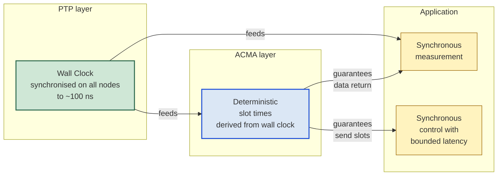

# Do I Need PTP, ACMA, or Both? — A Decision Guide

When designing a 10BASE-T1S system that requires "time-synchronous
measurement and control with 1 µs resolution", a frequent question
arises: is **PTP** alone enough, is **ACMA** alone enough, or do I
need **both**? This document gives a precise, decomposable answer.

**Created:** 2026-04-28
**Sister documents:**

- [readme_acma.md](readme_acma.md) — ACMA + Event-Generator-0 + PTP
  architecture sketch
- [readme_acma_use_cases.md](readme_acma_use_cases.md) — concrete
  application classes
- [readme_results.md](readme_results.md) — PTP feasibility analysis
  on multidrop
- [../pdf/lan86xx_family.md](../pdf/lan86xx_family.md) — LAN86xx
  silicon family overview

---

## Table of Contents

1. [TL;DR](#1-tldr)
2. [PTP and ACMA Are Two Independent Mechanisms](#2-ptp-and-acma-are-two-independent-mechanisms)
3. [Decomposing the Requirement](#3-decomposing-the-requirement)
4. [The Four Possible Configurations](#4-the-four-possible-configurations)
5. [Why Either Mechanism Alone Falls Short](#5-why-either-mechanism-alone-falls-short)
6. [What the Combination Delivers](#6-what-the-combination-delivers)
7. [Four Possible Readings of "1 µs Resolution"](#7-four-possible-readings-of-1-µs-resolution)
8. [When ACMA Is Not Needed Despite Timing Requirements](#8-when-acma-is-not-needed-despite-timing-requirements)
9. [Decision Matrix by Application Type](#9-decision-matrix-by-application-type)
10. [Architectural Hierarchy](#10-architectural-hierarchy)
11. [Practical Recommendation](#11-practical-recommendation)

---

## 1. TL;DR

> **For "time-synchronous measurement *and* control with 1 µs
> resolution" you generally need both — but they solve different
> problems:**
>
> - **PTP** synchronises the wall clock across all nodes (~100 ns
>   accuracy possible on LAN8651 hardware).
> - **ACMA** guarantees deterministic transmit slots so data and
>   commands arrive within a bounded latency.
>
> The exact answer depends on whether your "1 µs resolution"
> applies to **measurement timing**, **control reaction time**, or
> **both**. See §7.

---

## 2. PTP and ACMA Are Two Independent Mechanisms

A common misconception is that ACMA and PTP are coupled. They are
not. They sit in different layers and can be enabled or disabled
independently:

| Mechanism | What it provides | Where it sits in the chip |
|---|---|---|
| **PLCA** | collision-free fair bus access (best-effort latency) | PHY / vendor-specific registers (MMS 4) |
| **PTP** | sub-µs wall-clock synchronisation across nodes | TSU in MAC (LAN8650/1) or as a side-block (LAN8670/1/2) |
| **ACMA** | deterministic TDMA-style transmit slots | PHY-side gate before TXEN, MMS 4/10 |

PTP works fine on a pure-PLCA bus without ACMA — that is the
default configuration of Microchip's AN1847 demo and of this
project's `mult-sync` branch. ACMA works without PTP too, but
without PTP its slot times will drift between nodes.

---

## 3. Decomposing the Requirement

The phrase "time-synchronous measurement and control with 1 µs
resolution" actually contains **two separate requirements** that
need to be analysed independently:

### Requirement A — "Time-synchronous, 1 µs resolution"

All nodes must be able to refer to the **same instant in absolute
time**. If node 1 says "I sampled at 12:00:00.000123456", node 7 must
be able to sample at *the same absolute time* with sub-µs deviation
between their wall clocks.

→ This is what **PTP** solves. ACMA is irrelevant for this.

### Requirement B — "Measurement *and control* at predictable points in time"

When the master says "all nodes, send your data at 12:00:00.000123",
the nodes must reliably hit that send window — without colliding with
each other, without arriving too late.

→ This is what **ACMA** solves. PTP alone cannot guarantee this.

The two requirements are **orthogonal**. Whether you need one, the
other, or both depends on which aspect of "time-synchronous" matters
in your application.

---

## 4. The Four Possible Configurations

| PLCA | ACMA | PTP | Functional? | What you get |
|---|---|---|---|---|
| ✅ | ❌ | ❌ | yes | Plain bus connectivity, best-effort timing |
| ✅ | ❌ | ✅ | yes — **`mult-sync` branch today** | Sub-µs synchronised wall clocks, no TDMA determinism |
| ❌ | ✅ | ❌ | yes, but: requires external sync trigger | Deterministic transmit slots, but slot times drift between nodes |
| ❌ | ✅ | ✅ | yes — **fully deterministic configuration** | TDMA + synchronised wall clocks. The `readme_acma.md` target architecture |

Each of these is a valid system. The choice depends on what
guarantees the application demands.

---

## 5. Why Either Mechanism Alone Falls Short

### PTP without ACMA

You have synchronised wall clocks (~100 ns inter-node accuracy ✓)
but bus access remains **PLCA**: each node waits for its turn.
Consequences:

- **Synchronous measurement triggering — yes** ✓ (each node uses its
  local Event Generator triggered by the synchronised wall clock)
- **Data return within bounded latency — no** ✗ (PLCA slot waiting +
  bus load + other nodes' bursty traffic)
- **Control commands reaching nodes at the same moment — no** ✗
  (transit time depends on bus state at issue time)

Synchronous **sampling** works (local EG trigger), but synchronous
**actuation** with hard latency bounds is not guaranteed.

### ACMA without PTP

You have deterministic bus slots, but each node's wall clock drifts
with its own ±50 ppm crystal. Consequences:

- **Bus access is deterministic** ✓ (every slot is used)
- **Slot start times drift between nodes** ✗ (up to 50 µs after one
  second of operation)
- **Synchronous measurement triggers are not possible** ✗ (the wall
  clocks are not in agreement to begin with)
- **Slot boundaries diverge over time** ✗ (without PTP correcting
  the wall clock that drives EG0, the slot pulses fall out of step
  across nodes)

Deterministic bus, but no actual time synchronisation between nodes.

---

## 6. What the Combination Delivers



**How to read this:** PTP synchronises the wall clock. ACMA derives
slot times from that wall clock so all nodes open the *same* send
windows simultaneously. The application uses both — the wall clock
for trigger timestamps, the ACMA slots for deterministic data
transport.

---

## 7. Four Possible Readings of "1 µs Resolution"

The answer to the question depends on which of these four readings
applies:

### Reading (a) — "Wall-clock accuracy of 1 µs"

> "When I timestamp a measurement on a node, my deviation from the
> master's clock is at most 1 µs."

- **PTP**: required
- **ACMA**: not required
- Achievable with PLCA + AN1847-style PTP on LAN8651 (Microchip
  measured 100 ns p-p / 25 ns σ in AN60001847)

### Reading (b) — "End-to-end reaction time under 1 µs"

> "The master sends a control command, the actuator reacts within
> 1 µs."

- **Not achievable** on 10BASE-T1S — even a minimum 64-byte frame
  takes ~75 µs to transmit at 10 Mbit/s
- ACMA can guarantee latency on the order of one bus cycle (typically
  1-10 ms), not sub-µs
- For sub-µs control reaction, you need a different physical layer
  (e.g. dedicated trigger lines, 1 Gbit/s+ Ethernet)

### Reading (c) — "Synchronous sampling window across N nodes < 1 µs"

> "When 8 nodes sample at the same nominal time, the actual ADC
> samples are at most 1 µs apart."

- **PTP**: required for wall-clock sync (~100 ns achievable)
- Each node uses its **local Event Generator** as the ADC trigger;
  no data transport during the 1 µs window
- **ACMA**: only required for the *data return* phase after the
  sample, if that data return needs guaranteed latency

### Reading (d) — "Control with worst-case 1 µs reaction"

Same as (b) — not achievable on 10BASE-T1S regardless of PTP/ACMA.

---

## 8. When ACMA Is Not Needed Despite Timing Requirements

If your application looks like this:

> "Master tells everyone to measure at time T. All nodes sample
> locally at wall-clock time T using their Event Generators. Data is
> returned to the master *eventually* — latency does not matter."

Then **PTP alone is sufficient**, because the time-critical part is
the *measurement trigger*, not the data transport. Data aggregation
can be buffered.

**Examples:**

- Scientific datalogging over long durations
- Quality-monitoring systems where samples are correlated
  post-acquisition
- Vibration analysis with offline frequency-domain processing
- PMU-style power monitoring where the time stamp matters more than
  the transport latency

ACMA only becomes necessary when the **data transport itself** has a
hard latency bound — which is typical for **control** applications
where data influences the next action.

---

## 9. Decision Matrix by Application Type

| Application | Need PTP? | Need ACMA? |
|---|---|---|
| Pure data logging with timestamp correlation | **yes** | not necessary |
| Synchronous sampling with non-time-critical data return | **yes** | not necessary |
| Distributed control with hard reaction-time bound | **yes** | **yes** |
| Real-time control loop (master ↔ sensor ↔ actuator < 1 ms) | **yes** | **yes** |
| Trigger distribution for external actuators | **yes** | optional (PLCA + heartbeat often enough) |
| TDMA bus architecture (Industry 4.0) | **yes** | **yes** |
| Beamforming with phase coherence between channels | **yes** | optional (data return only) |
| Multi-axis motion control with deterministic latency | **yes** | **yes** |
| LiDAR/ToF cluster avoiding cross-talk | optional | **yes** (slot-exclusive light pulses) |
| Distributed audio with synchronous playback | **yes** | **yes** |
| Safety-critical bus with watchdog | **yes** | **yes** |

The rule of thumb:

- **Synchronous measurement** → PTP
- **Synchronous control with latency bound** → PTP + ACMA
- **Synchronous trigger only** (no data return) → PTP
- **Bandwidth-fair multi-sender data return** → ACMA

---

## 10. Architectural Hierarchy

The mechanisms layer cleanly:

```
PLCA          → Standard 10BASE-T1S bus access (IEEE 802.3 Clause 148)
   |
   +-- PTP    → optional: synchronise wall clocks across nodes
   |
   +-- ACMA   → optional: TDMA instead of PLCA fair-share slot selection
   |
   +-- ACMA + PTP → fully deterministic TDMA with synchronised slot times
```

Each branch is independently selectable. PTP can run on any of the
three lower configurations. ACMA can run with or without PTP. The
combination is the most powerful but also the most software-complex.

---

## 11. Practical Recommendation

For a 1 µs time-synchronous measurement and control system on
10BASE-T1S:

1. **Start with PTP** on PLCA — the easier, lower-risk path. This is
   where the `mult-sync` branch is today.
2. **Verify the wall-clock synchronisation** works on real hardware
   first. Measured ~100 ns p-p on Microchip's reference setup; ~200-
   400 ns expected in production.
3. **Decide whether you also need bounded transport latency.**
   Inspect your application:
   - Pure measurement with later aggregation? → stop here, PTP
     alone is enough
   - Real-time control with master→slave→actuator chain? → continue
4. **Add ACMA** if step 3 says "yes". Implement following
   [readme_acma.md](readme_acma.md), accepting the errata-s9
   single-shot Event-Generator workaround.
5. **Keep the layers architecturally separate** so you can disable
   ACMA later if it turns out unnecessary or if Microchip ever
   deprecates it.

The most common mistake is jumping straight to ACMA when only PTP
was needed — that adds significant code complexity (the ISR-driven
re-arm pattern from `readme_acma.md` §7) for a guarantee that may
not actually be required by the application.

---

**Status 2026-04-28.** This document distills a recurring
architectural question into a yes/no decision matrix. When new
application categories arise, extend §9 and §7 accordingly.
