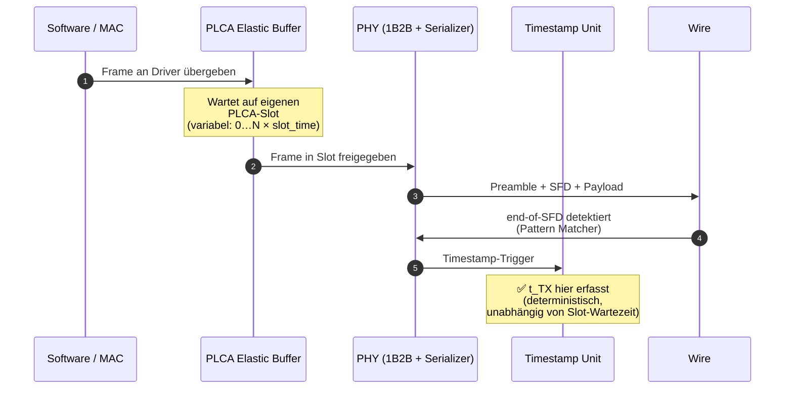
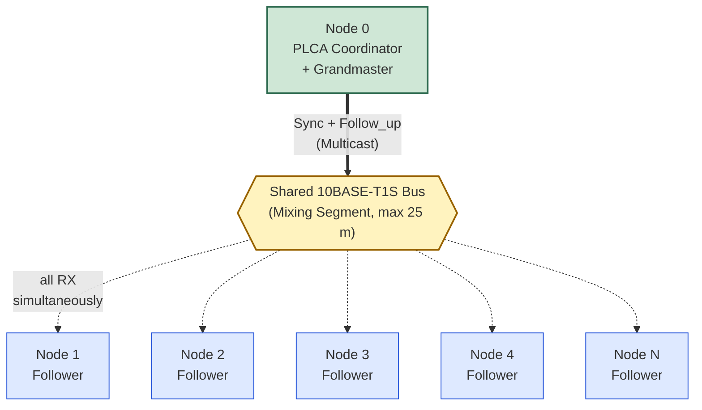
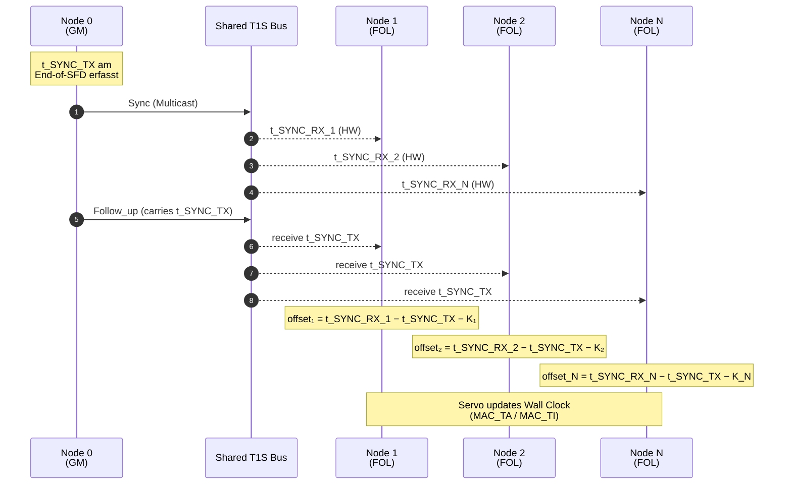
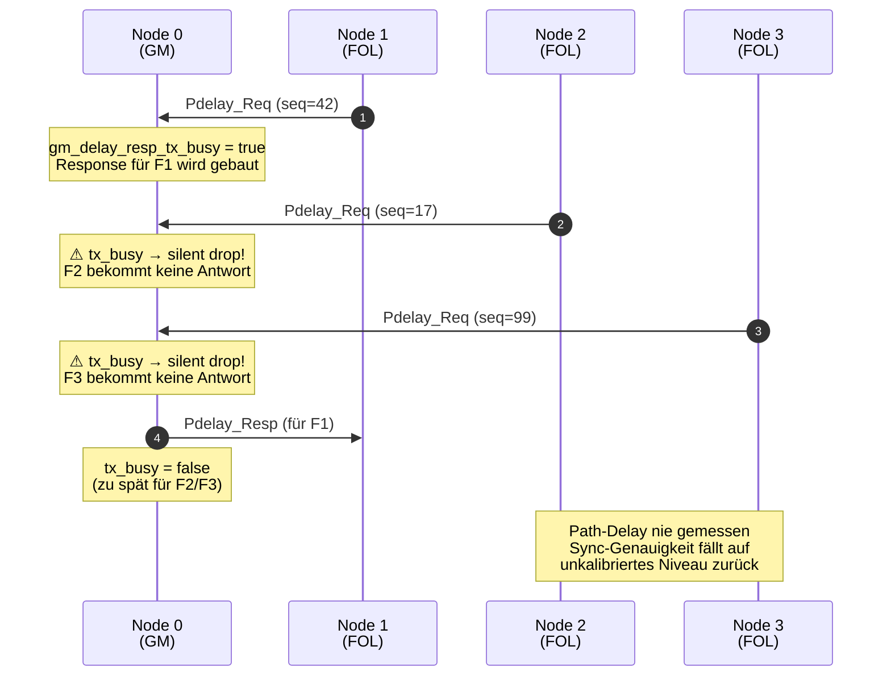
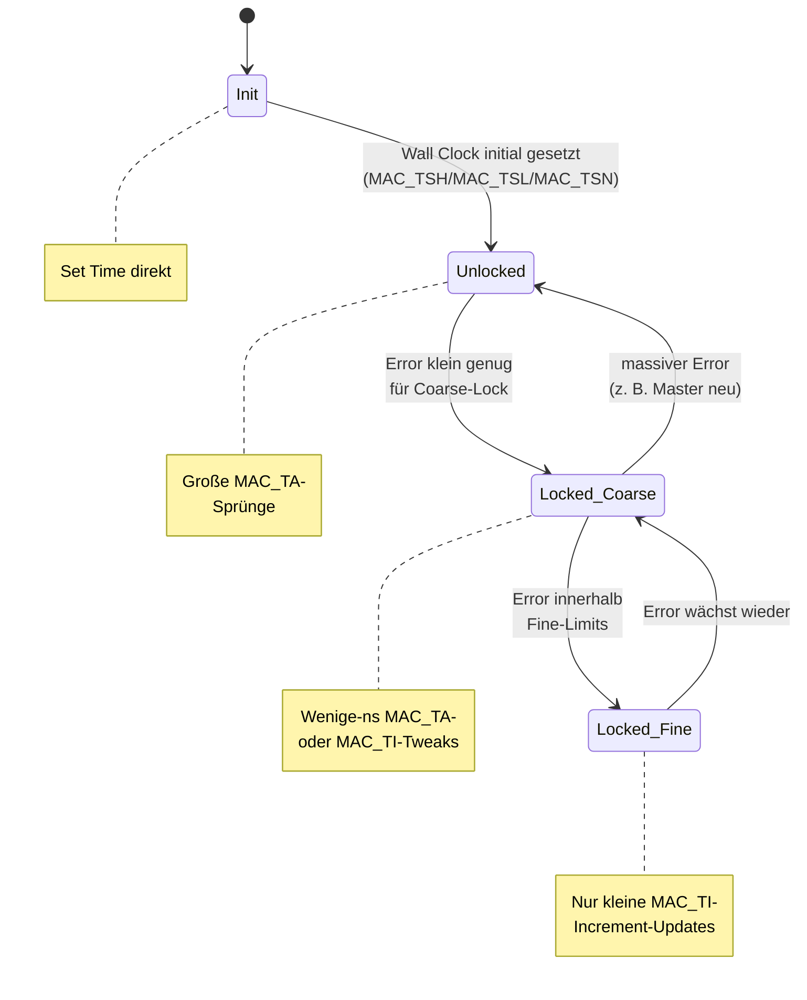
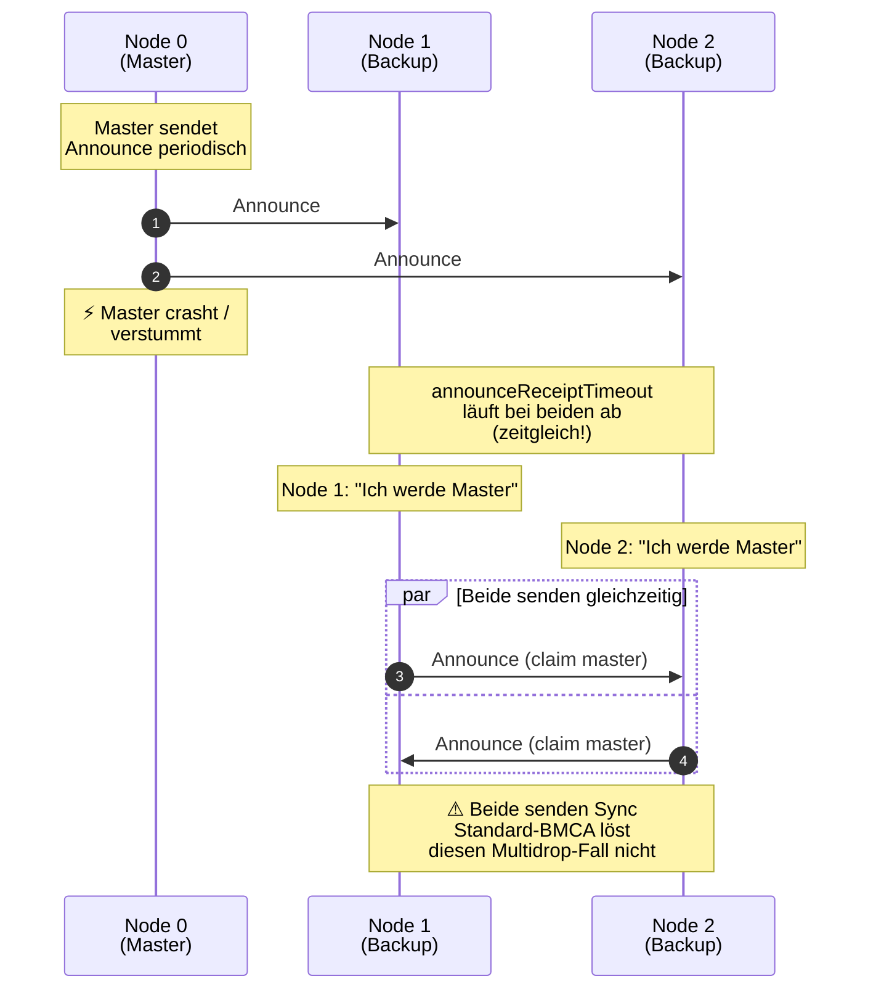
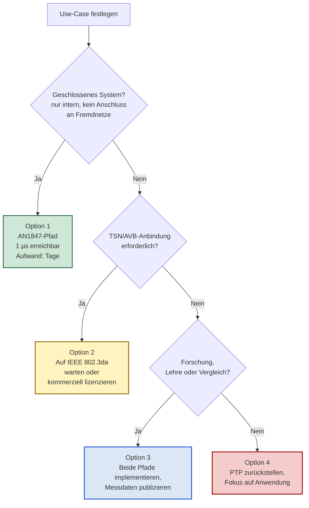
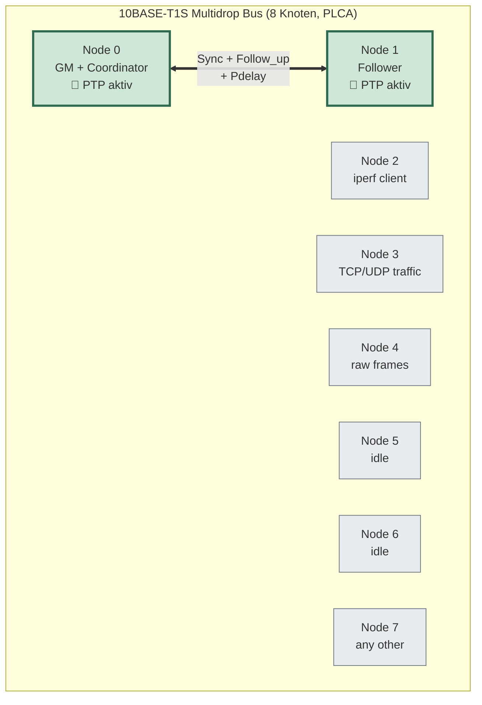
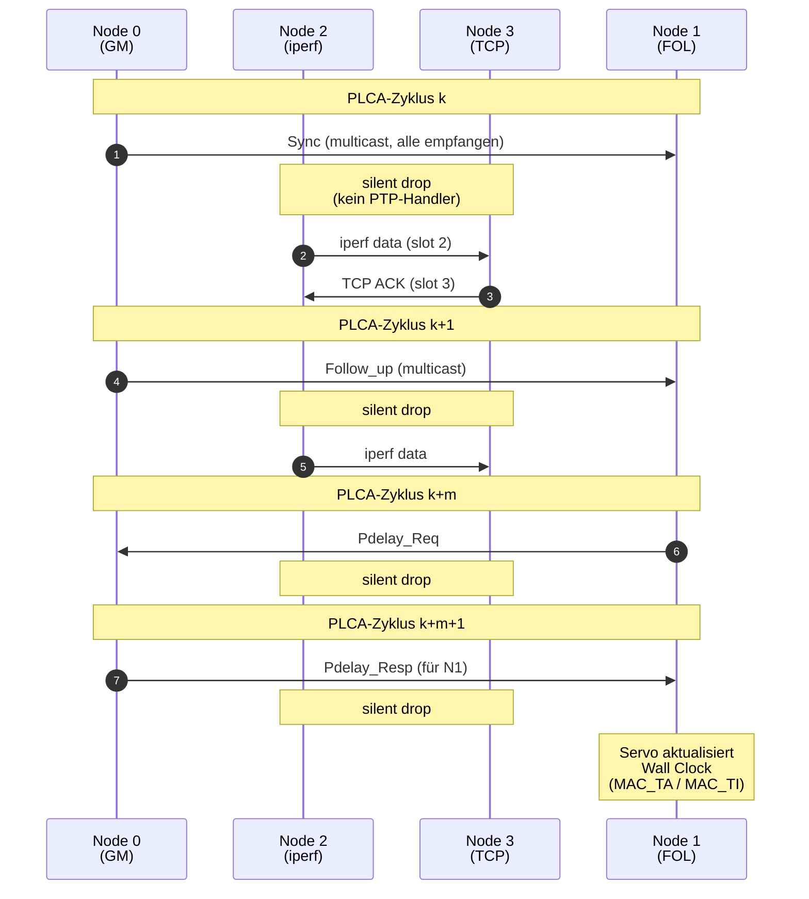
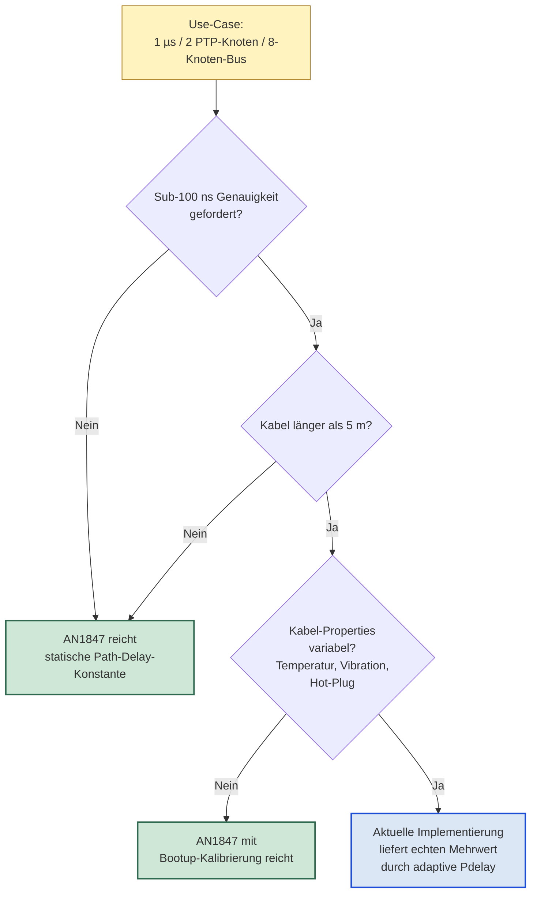

# PTP auf 10BASE-T1S Multidrop — Analyse, Bewertung und ehrliche Einschätzung

**Erstellt:** 2026-04-27
**Kontext:** Analyse-Dialog zur Frage, ob die aktuelle PTP-Implementierung in
[apps/tcpip_iperf_lan865x/firmware/src/](../../apps/tcpip_iperf_lan865x/firmware/src/)
für 3–8 Knoten auf einem gemeinsamen 10BASE-T1S Mixing Segment mit 1 µs
Synchronisations-Genauigkeit weiterverfolgt werden sollte.

Dieses Dokument fasst die Erkenntnisse aus der Code-Analyse und der
Lektüre der relevanten Microchip-PDFs (siehe [../../pdf/readme_pdf.md](../../pdf/readme_pdf.md))
zusammen.

---

## Inhaltsverzeichnis

1. [Die ursprüngliche Frage](#1-die-ursprüngliche-frage)
2. [Erste Einschätzung (vor Lektüre der PDFs)](#2-erste-einschätzung-vor-lektüre-der-pdfs)
3. [Korrektur nach Lektüre von AN1847](#3-korrektur-nach-lektüre-von-an1847)
   - 3.1 [Microchips eigene Lab-Messung](#31-microchips-eigene-lab-messung)
   - 3.2 [PLCA-Slot-Jitter ist Hardware-seitig gelöst](#32-plca-slot-jitter-ist-hardware-seitig-gelöst)
   - 3.3 [Aktualisiertes Fehlerbudget für 3–8 Knoten](#33-aktualisiertes-fehlerbudget-für-38-knoten)
   - 3.4 [Errata-Fallstrick (ER80001075 §s9)](#34-errata-fallstrick-er80001075-s9)
4. [Das AN1847-Modell für >2 Knoten](#4-das-an1847-modell-für-2-knoten)
   - 4.1 [Topologie](#41-topologie)
   - 4.2 [Funktionsprinzip](#42-funktionsprinzip)
   - 4.3 [Eigenschaften](#43-eigenschaften)
5. [Stand der aktuellen Implementierung](#5-stand-der-aktuellen-implementierung)
   - 5.1 [Was bereits Multi-Node-fähig ist](#51-was-bereits-multi-node-fähig-ist)
   - 5.2 [Was die Implementierung auf 2 Knoten beschränkt](#52-was-die-implementierung-auf-2-knoten-beschränkt)
   - 5.3 [Die wichtige Erkenntnis](#53-die-wichtige-erkenntnis)
6. [Warum ein vollständiger 802.1AS-Pfad nicht trivial wäre](#6-warum-ein-vollständiger-8021as-pfad-nicht-trivial-wäre)
   - 6.1 [Die Grundannahme verletzt](#61-die-grundannahme-verletzt)
   - 6.2 [Pdelay auf Shared Medium](#62-pdelay-auf-shared-medium)
   - 6.3 [BMCA auf Multidrop ist konzeptionell broken](#63-bmca-auf-multidrop-ist-konzeptionell-broken)
   - 6.4 [Weitere Standard-Anforderungen](#64-weitere-standard-anforderungen)
   - 6.5 [Aufwands-Vergleich](#65-aufwands-vergleich)
7. [Die strategische Frage: Insel-Lösung?](#7-die-strategische-frage-insel-lösung)
   - 7.1 [Wo "Insel" zutrifft](#71-wo-insel-zutrifft)
   - 7.2 [Wo "Insel" *nicht* zutrifft](#72-wo-insel-nicht-zutrifft)
   - 7.3 [Die eigentliche Frage](#73-die-eigentliche-frage)
   - 7.4 [Was der bisherige Code wert ist](#74-was-der-bisherige-code-wert-ist)
8. [Realistische Optionen](#8-realistische-optionen)
9. [Ehrliche Einschätzung](#9-ehrliche-einschätzung)
10. [Was die aktuelle Implementierung tatsächlich kann — vs. AN1847](#10-was-die-aktuelle-implementierung-tatsächlich-kann--vs-an1847)
    - 10.1 [Was AN1847 nicht tut, die Implementierung aber schon](#101-was-an1847-nicht-tut-die-implementierung-aber-schon)
    - 10.2 [Konkrete Use-Cases, wo die Implementierung gewinnt](#102-konkrete-use-cases-wo-die-implementierung-gewinnt)
    - 10.3 [Wo AN1847 tatsächlich besser ist](#103-wo-an1847-tatsächlich-besser-ist)
    - 10.4 [Fazit zum Mehrwert](#104-fazit-zum-mehrwert)
11. [2 PTP-Knoten in einem 8-Knoten-Bus](#11-2-ptp-knoten-in-einem-8-knoten-bus)
    - 11.1 [Die Frage und die Antwort](#111-die-frage-und-die-antwort)
    - 11.2 [Topologie und Kommunikationsfluss](#112-topologie-und-kommunikationsfluss)
    - 11.3 [Warum es funktioniert](#113-warum-es-funktioniert)
    - 11.4 [Was zu beachten ist](#114-was-zu-beachten-ist)
    - 11.5 [Konkretes Deployment-Szenario](#115-konkretes-deployment-szenario)
    - 11.6 [Kurzfassung](#116-kurzfassung)
12. [Reality-Check: warum AN1847 für genau diesen Use-Case ausreicht](#12-reality-check-warum-an1847-für-genau-diesen-use-case-ausreicht)
    - 12.1 [Die zugespitzte Frage](#121-die-zugespitzte-frage)
    - 12.2 [Theoretische Unterschiede vs. praktische Relevanz](#122-theoretische-unterschiede-vs-praktische-relevanz)
    - 12.3 [Wann sich die Pdelay-Komplexität tatsächlich auszahlt](#123-wann-sich-die-pdelay-komplexität-tatsächlich-auszahlt)
    - 12.4 [Die ehrliche Schlussfolgerung](#124-die-ehrliche-schlussfolgerung)
    - 12.5 [Drei Handlungsoptionen](#125-drei-handlungsoptionen)
    - 12.6 [Empfehlung](#126-empfehlung)
13. [Quellenverzeichnis](#13-quellenverzeichnis)

### Diagramme im Dokument

| # | Abschnitt | Diagramm | Typ |
|---|---|---|---|
| 1 | [§3.2](#32-plca-slot-jitter-ist-hardware-seitig-gelöst) | Wo der Hardware-Timestamp am LAN8651 entsteht | sequenceDiagram |
| 2 | [§4.1](#41-topologie) | AN1847-Topologie auf Multidrop | graph |
| 3 | [§4.2](#42-funktionsprinzip) | Sync-Multicast an alle Follower | sequenceDiagram |
| 4 | [§5.2](#52-was-die-implementierung-auf-2-knoten-beschränkt) | Pdelay-Bottleneck mit 3 Followern | sequenceDiagram |
| 5 | [§5.3](#53-die-wichtige-erkenntnis) | Servo-State-Machine der Implementierung | stateDiagram |
| 6 | [§6.3](#63-bmca-auf-multidrop-ist-konzeptionell-broken) | BMCA-Konflikt auf Multidrop | sequenceDiagram |
| 7 | [§8](#8-realistische-optionen) | Entscheidungsbaum nach Use-Case | flowchart |
| 8 | [§11.2](#112-topologie-und-kommunikationsfluss) | 8-Knoten-Bus mit 2 PTP-Teilnehmern | graph |
| 9 | [§11.3](#113-warum-es-funktioniert) | Verkehrs-Koexistenz auf dem Bus | sequenceDiagram |
| 10 | [§12.3](#123-wann-sich-die-pdelay-komplexität-tatsächlich-auszahlt) | Wann Pdelay-Komplexität sich lohnt | flowchart |

---

## 1. Die ursprüngliche Frage

> Ist es möglich, in einem 10BASE-T1S-Netz mit 3 bis 8 Knoten eine
> PTP-basierte Zeitsynchronisation der MCU-Firmware zu erreichen, die
> auf 1 µs synchron ist?

Die Antwort entwickelt sich über mehrere Stufen — von einer ersten,
oberflächlichen Einschätzung über die Lektüre von AN1847 und der
Code-Inspektion bis zu einer strategischen Bewertung des Projekts
insgesamt.

---

## 2. Erste Einschätzung (vor Lektüre der PDFs)

Die initiale Einschätzung war: **1 µs ist machbar, aber nicht trivial.**
Die Bedenken waren:

- **PHY-Latenz** — typisch ~300–500 ns, aber konstant → kompensierbar
- **Kabel-Delay** — bis ~125 ns bei max 25 m Kabel
- **PLCA-Slot-Jitter** — bis zu mehrere µs, unklar wie das kompensiert wird
- **Hardware-Timestamping-Auflösung** — 40 ns @ 25 MHz, unkritisch
- **Software-Jitter** — 1–10 µs ohne HW-Timestamps, das wäre der Killer
- **Quarz-Drift** — ±50 ppm, bei 125 ms Sync-Intervall vernachlässigbar

Erwartung: 200–500 ns RMS Knoten-zu-Knoten realistisch, 1 µs erreichbar
mit etwa 2× Reserve. Voraussetzungen: HW-Timestamping zwingend,
PLCA-Slot-Korrektur, Per-Follower Path-Delay.

---

## 3. Korrektur nach Lektüre von AN1847

Nach Durcharbeit der Microchip Application Note **AN60001847 — LAN8650/1
Time Synchronization** (lokal: [../../pdf/LAN8650-1-Time-Synch-AN-60001847.pdf](../../pdf/LAN8650-1-Time-Synch-AN-60001847.pdf))
wurde klar, dass die ursprüngliche Einschätzung **zu konservativ** war.

### 3.1 Microchips eigene Lab-Messung

AN1847 §4 dokumentiert ein konkretes Test-Setup:

- SAM D21 Curiosity Nano + Two-Wire ETH Click (LAN8651)
- 50 cm UTP-Kabel, 2 Knoten (Grandmaster + Follower)
- 8 Sync-Messages pro Sekunde
- **Simpler FIR-Algorithmus, ausschließlich `MAC_TA` (Time Adjust)**, kein PI-Regler, kein Pdelay

Gemessene 1PPS-Differenz Master ↔ Follower:

| Metrik | Wert |
|---|---|
| Maximale Differenz | **100 ns peak-to-peak** |
| Mittelwert | 8 ns |
| Standardabweichung | 25 ns |
| Lock-Zeit | < 20 Sync-Messages (≈ 2,5 s bei 8 Hz) |

Das ist die **gemessene** Baseline für 2 Knoten — nicht eine theoretische
Abschätzung.

### 3.2 PLCA-Slot-Jitter ist Hardware-seitig gelöst

Der entscheidende Punkt, der in der ersten Einschätzung unterschätzt
wurde: das LAN8651 timestempelt **nicht am MAC, sondern am PHY am
Ende des SFD nach dem Elastic Buffer**.

Aus AN1847 §3 (Packet Pattern Matcher):

> "the transmit pattern matcher signals the timestamp unit that the end
> of the SFD has been transmitted by the PHY, so that the time stamp is
> captured at this time, instead of using the time the SFD leaves the
> MAC. This ensures a consistent internal delay when transmitting packets."

Konsequenz: **Die PLCA-Slot-Wartezeit wird gar nicht erst getimestempelt.**
Egal wie lange ein Frame im PLCA-Buffer auf seinen Sende-Slot wartet —
der TX-Timestamp entsteht erst, wenn das SFD physikalisch über die
Leitung geht. RX läuft symmetrisch.

Damit fällt die größte Sorge der ursprünglichen Einschätzung weg.

**Lesart:** Der grüne Haken markiert die Stelle, an der `MAC_TSH/MAC_TSL`
gefüllt werden. Alles davor (Software-Latenz, PLCA-Slot-Wartezeit) liegt
*außerhalb* des Timestamps — und kann den Synchronisations-Servo daher
nicht stören. RX läuft symmetrisch über denselben Pattern Matcher am
Empfangs-PHY.

### 3.3 Aktualisiertes Fehlerbudget für 3–8 Knoten

| Quelle | Beitrag |
|---|---|
| Master ↔ Follower Sync (gemessen, AN1847) | ~100 ns p-p, σ = 25 ns |
| Path-Delay-Asymmetrie zwischen Followern (unkalibriert, 25 m max) | ≤ 125 ns |
| Path-Delay-Asymmetrie nach einmaliger Kalibrierung pro Follower | < 20 ns |
| Quarz-Drift zwischen Syncs (±50 ppm, 125 ms Intervall) | < 10 ns |
| Software-Jitter (HW-Timestamping eliminiert das meiste) | < 50 ns |
| **Worst-Case unkalibriert** | **~250–300 ns** |
| **Worst-Case mit Per-Follower-Pdelay** | **~150–200 ns** |

→ **1 µs hat 3–5× Sicherheitsmarge.** Sogar 300 ns als Spec wäre
erreichbar.

### 3.4 Errata-Fallstrick (ER80001075 §s9)

Aus dem Errata-Dokument [../../pdf/LAN8650-1-Errata-80001075.pdf](../../pdf/LAN8650-1-Errata-80001075.pdf):

> "The Event Generator in periodic mode is locked to the local
> oscillator, **not** the synchronized wall clock, so 1PPS-style outputs
> must use single-shot mode for true synchronization."

**Konkreter Implementierungs-Punkt:** Wer 1PPS als Sync-Pin nutzen will
(z. B. zum gleichzeitigen ADC-Trigger), muss den Generator **single-shot**
fahren und nach jedem Sync-Update neu programmieren. Im periodischen
Modus driftet er mit dem ungeregelten Quarz, nicht mit der Wall Clock.
Wird in AN1847 nicht erwähnt.

---

## 4. Das AN1847-Modell für >2 Knoten

### 4.1 Topologie

**Lesart:** Die durchgehende grüne Kante kennzeichnet aktive Sender
(GM ⇒ Bus). Die gestrichelten Kanten zeigen, dass alle Follower **passive
Empfänger** sind — sie senden nichts zurück. Der Bus ist ein Shared
Medium: ein einziges Sync-Frame erreicht alle Knoten gleichzeitig.

### 4.2 Funktionsprinzip

- Node 0 ist gleichzeitig PLCA-Coordinator und Grandmaster
- Sendet periodisch Sync- und Follow_up-Frames als **Multicast** auf
  `01:80:C2:00:00:0E`
- Alle Follower empfangen dasselbe Frame **gleichzeitig** (Shared
  Medium); jeder erfasst seinen eigenen RX-Timestamp am Ende-SFD im PHY
- Follower senden **nichts** zurück (kein Pdelay, kein Announce, kein BMCA)
- Pro Follower: einmalig Path-Delay als Konstante kalibrieren oder als
  Konfigurations-Parameter setzen

**Lesart:** Ein einzelner Sync + Follow_up versorgt **alle N Follower
gleichzeitig**. Der einzige Per-Knoten-Wert ist die statische
Path-Delay-Konstante `K_i` — entweder einmalig kalibriert oder per CLI
gesetzt. Es gibt keinen Rückkanal und damit keinen Skalierungs-Bottleneck.

### 4.3 Eigenschaften

- **Skaliert linear ohne Mehrverkehr** — ein Sync-Frame synchronisiert
  alle Follower
- **Vermeidet das Pdelay-Broadcast-Problem** komplett (siehe AN1847 §2)
- **Keine PLCA-Bus-Kontention** für Sync — der Master gibt eh den
  Beacon vor und sendet im Slot 0 unmittelbar danach
- **Statische Master-Wahl** — kein BMCA nötig, kein Master-Wechsel-Risiko

---

## 5. Stand der aktuellen Implementierung

Code-Analyse von:

- [ptp_gm_task.c](../../apps/tcpip_iperf_lan865x/firmware/src/ptp_gm_task.c) — Grandmaster-Task
- [ptp_fol_task.c](../../apps/tcpip_iperf_lan865x/firmware/src/ptp_fol_task.c) — Follower-Task
- [ptp_clock.c](../../apps/tcpip_iperf_lan865x/firmware/src/ptp_clock.c) — Servo
- [ptp_rx.c](../../apps/tcpip_iperf_lan865x/firmware/src/ptp_rx.c) — Packet-Empfang
- [ptp_drv_ext.c](../../apps/tcpip_iperf_lan865x/firmware/src/ptp_drv_ext.c) — Driver-Extension
- [ptp_cli.c](../../apps/tcpip_iperf_lan865x/firmware/src/ptp_cli.c) — CLI

### 5.1 Was bereits Multi-Node-fähig ist

**Sync-Adressierung ist Multicast** —
[ptp_gm_task.c](../../apps/tcpip_iperf_lan865x/firmware/src/ptp_gm_task.c)
sendet Sync auf `01:80:C2:00:00:0E` bzw. Broadcast. Diese Schicht
skaliert grundsätzlich auf N Knoten.

### 5.2 Was die Implementierung auf 2 Knoten beschränkt

**Ursache liegt fast ausschließlich im Pdelay-Mechanismus** — exakt der
Stelle, vor der AN1847 §2 explizit warnt.

**1. GM Delay_Resp hat nur einen TX-Slot.**
[ptp_gm_task.c:87](../../apps/tcpip_iperf_lan865x/firmware/src/ptp_gm_task.c#L87) —
`gm_delay_resp_tx_busy` ist ein einziger boolean. Senden zwei Follower
gleichzeitig Pdelay_Req, wird der zweite Response **silent gedroppt**
([ptp_gm_task.c:1158-1185](../../apps/tcpip_iperf_lan865x/firmware/src/ptp_gm_task.c#L1158-L1185)).

**2. Follower hat nur einen Pdelay-Pending-Slot.**
[ptp_fol_task.c:84-85](../../apps/tcpip_iperf_lan865x/firmware/src/ptp_fol_task.c#L84-L85) —
`fol_delay_req_pending` und `fol_delay_req_sent_seq_id` sind je ein
Skalar. Pro Follower passt das (er hat ja nur einen Master), wird aber
problematisch falls ein Knoten irgendwann selbst Master werden sollte.

**3. Keine Source-Identity-Validierung beim Sync.**
[ptp_fol_task.c:945](../../apps/tcpip_iperf_lan865x/firmware/src/ptp_fol_task.c#L945) —
`processSync()` prüft nur Sequence-ID-Kontinuität, nicht die
Clock-Identity des Senders. Würde man zwei GMs ans Bus hängen,
wechselt der Follower wild zwischen den Quellen.

**4. Single Path-Delay-State.**
[ptp_fol_task.c:95](../../apps/tcpip_iperf_lan865x/firmware/src/ptp_fol_task.c#L95) —
`fol_mean_path_delay` ist ein Skalar. Pro Follower passt das, wäre aber
beim Master-Wechsel oder Multi-Master-Szenario unzureichend.

**5. CLI ist binär.**
[ptp_cli.c](../../apps/tcpip_iperf_lan865x/firmware/src/ptp_cli.c) —
`ptp_mode [off|master|follower]`. Keine Peer-ID, kein Node-Count, kein
Multi-Master-Konzept.

**Lesart:** Der einzelne `gm_delay_resp_tx_busy`-Slot in
[ptp_gm_task.c:87](../../apps/tcpip_iperf_lan865x/firmware/src/ptp_gm_task.c#L87)
ist der konkrete Bottleneck. Sobald zwei oder mehr Follower zeitnah
Pdelay_Req senden, gewinnt der erste, alle weiteren werden lautlos
verworfen. Die anderen Follower bemerken nichts — sie warten weiter
auf eine Antwort, die nie kommt.

### 5.3 Die wichtige Erkenntnis

Wenn man auf das **AN1847-Simple-Follower-Modell** wechselt (nur Sync +
Follow_up, kein Pdelay), verschwinden die Punkte 1 und 2 komplett.
Punkt 3 bleibt, ist aber trivial (Master-MAC einmal beim Lock fixieren).
Punkt 4 wird zu einer **statischen Per-Follower-Konstante**. Punkt 5
braucht eine kleine Erweiterung für `ptp path_delay <ns>`.

**Die 2-Knoten-Beschränkung ist im Wesentlichen eine Folge davon, dass
die aktuelle Implementierung versucht, ein 802.1AS-ähnliches Profil
abzubilden — auf einem Medium, für das 802.1AS nicht definiert ist.**

Zur Einordnung der eigenen Servo-Komplexität — die Implementierung
fährt eine 4-Zustands-Maschine (vgl. AN1847 §4 und
[ptp_clock.c](../../apps/tcpip_iperf_lan865x/firmware/src/ptp_clock.c)):

**Lesart:** Diese Servo-Tiefe ist deutlich mehr als das einfache
FIR-Filter aus AN1847. Sie wäre auch im Simple-Follower-Modell
(ohne Pdelay) erhalten — siehe §10.

---

## 6. Warum ein vollständiger 802.1AS-Pfad nicht trivial wäre

### 6.1 Die Grundannahme verletzt

802.1AS-2020 modelliert jeden Time-Aware-Port als Endpunkt eines
**dedizierten Punkt-zu-Punkt-Links**. Auf einem Multidrop-Bus heißt
"ein Port" plötzlich "N-1 Nachbarn". Der Standard gibt darauf keine
Antwort. Man muss sich entscheiden:

- **(a) Pseudo-Port pro Peer instanziieren** — Discovery-Problem, wer ist da?
- **(b) Eine State-Machine über N Peers multiplexen** — alle Felder
  werden zu Arrays, alle Timing-Intervalle bekommen eine zusätzliche
  Dimension

Beides ist machbar, aber **keines davon steht im Standard**. Man baut
eine eigene Spec-Erweiterung.

### 6.2 Pdelay auf Shared Medium

- Alle Pdelay-Frames sind Multicast — auf Multidrop sehen alle alles
- GM braucht **per-peer Response-Queue mit Demultiplexing**
- Jeder Follower sieht **die Pdelay_Resp aller anderen Follower** und
  muss filtern
- PLCA-Slot-Wartezeiten verzerren die Round-Trip-Messung — `t4 - t1`
  enthält jetzt nicht mehr nur den Kabel-Delay, sondern auch die
  Wartezeit des Responders auf seinen Slot

### 6.3 BMCA auf Multidrop ist konzeptionell broken

BMCA wurde so designt: *"Auf jedem Port: vergleiche meinen Master-Status
mit dem, was vom Nachbarn auf diesem Port kommt."* Auf Multidrop:

- N Knoten broadcasten N Announce-Messages
- Per-Port-Logik kann nicht mehr "auf diesem Port" sagen — alle
  Announces kommen vom selben physikalischen Port
- `announceReceiptTimeout` wird mehrdeutig
- Race-Conditions beim Master-Wechsel: zwei Knoten könnten
  gleichzeitig zur Schlussfolgerung kommen, sie seien der neue Master
- Im Wesentlichen ein verteiltes Konsens-Problem

**Lesart:** Auf einem Punkt-zu-Punkt-Link kann BMCA nie diesen
Konflikt erzeugen, weil "der eine Nachbar" als Vergleich dient. Auf
Multidrop fällt diese Eindeutigkeit weg, und der Standard hat keine
Sprache für die Auflösung. Eine korrekte Multidrop-Variante würde
einen Konsens-Algorithmus benötigen (Leader-Election à la Raft / Paxos
in light), der explizit nicht im 802.1AS-Standard steht.

### 6.4 Weitere Standard-Anforderungen

- **`neighborRateRatio` und `cumulativeRateRatio`** pro Peer
- **Sync-Forwarding / Residence-Time-Korrektur** (nur falls Bridge nötig)
- **Path-Trace-TLVs**
- **Test-Infrastruktur** existiert nicht für Multidrop-802.1AS

### 6.5 Aufwands-Vergleich

| Aufgabe | Aufwand |
|---|---|
| Pdelay-State pro Peer + Demux ([ptp_gm_task.c](../../apps/tcpip_iperf_lan865x/firmware/src/ptp_gm_task.c) und [ptp_fol_task.c](../../apps/tcpip_iperf_lan865x/firmware/src/ptp_fol_task.c)) | Wochen |
| Announce + multidrop-fähiges BMCA | Wochen, hoher Design-Anteil |
| `neighborRateRatio` pro Peer | Tage |
| Sync-Forwarding / Bridge-Logik (falls nötig) | Wochen |
| Test-Harness für Multi-Master-Edge-Cases | Wochen |
| Debugging unter PLCA-Load | Open-ended |

Im Vergleich der **AN1847-Simple-Follower-Pfad**:

| Aufgabe | Aufwand |
|---|---|
| Pdelay-Code optional deaktivieren | Stunden |
| Per-Knoten Path-Delay als CLI-Konstante | Stunden |
| Source-MAC nach Lock fixieren in [`processSync()`](../../apps/tcpip_iperf_lan865x/firmware/src/ptp_fol_task.c#L945) | Stunden |
| Test mit 3-8 Knoten am Bus | Tage |

---

## 7. Die strategische Frage: Insel-Lösung?

### 7.1 Wo "Insel" zutrifft

1. **Kein anerkannter Standard.** AN1847 ist eine Application Note,
   kein IEEE-Dokument.
2. **Keine Interop-Brücke zu echten TSN-Netzen.** Eine AVB-Bridge
   würde das Segment als nicht-time-aware einstufen, weil die Follower
   auf kein Pdelay/Announce antworten.
3. **Vendor-Lock-in auf Microchip.** Andere T1S MAC-PHYs (NXP TJA1120,
   Onsemi NCN26010) haben unterschiedliche Timestamp-Hardware.
4. **Keine Upstream-Heimat.** Linux-Driver hat (Stand 2026-04) kein PTP
   für LAN8651, Zephyr auch nicht. Bleibt Fork.
5. **Kein Pfad zu TSN-Features.** CBS, TAS, SRP bauen alle auf
   802.1AS-Time auf.

### 7.2 Wo "Insel" *nicht* zutrifft

1. **Der Standard existiert für diesen Fall schlicht nicht.**
   AN1847 §2 sagt unverblümt: *"current PTP standards do not yet cover
   multidrop / PLCA broadcast Pdelay"*. IEEE 802.3da arbeitet daran,
   aber kein veröffentlichtes Amendment.
2. **Microchip ist faktisch der einzige relevante T1S-Vendor** in 2026.
3. **Geschlossene Systeme brauchen keine Interop.**
4. **Auch "echtes" 802.1AS ist nicht so einheitlich, wie es klingt** —
   linuxptp, gPTP-Stacks von TI/NXP/Microchip haben alle eigene Quirks.

### 7.3 Die eigentliche Frage

Nicht "Insel ja/nein", sondern: **welches Deployment-Szenario?**

| Szenario | Bewertung | Empfehlung |
|---|---|---|
| Geschlossenes Cluster aus 3-8 T1S-Knoten unter einem MCU-Master, kein Anschluss an Fremdnetze | Insel ist OK, weil System eine Insel *ist* | AN1847-Pfad, ship |
| T1S-Segment als Branch eines TSN/AVB-Netzes mit Switches | Insel killt — echtes 802.1AS nötig | Auf Standard warten oder kommerziell lizenzieren |
| Lerncode / Forschungsplattform / Demo | Egal welcher Pfad, Hauptsache Erkenntnis | AN1847 für schnellen Erfolg, optional 802.1AS für Tiefe |
| Forschung am Multidrop-PTP-Problem selbst | Insel-Lösung ist der wissenschaftliche Beitrag | Beide Pfade implementieren, vergleichen, publizieren |

### 7.4 Was der bisherige Code wert ist

**Etwa 80 % des bisherigen Codes ist protokoll-unabhängig:**

- LAN8651 Register-Init (AN60001760-konform) → in jeder PTP-Variante nötig
- TSU-Konfiguration / Pattern Matcher → unverändert
- HW-Timestamp-Capture-Pfad → unverändert
- Sync/Follow_up Frame-Parsing → unverändert
- Wall-Clock-Servo (`MAC_TA`, `MAC_TI`) → unverändert

Die Verzweigung liegt allein in der **High-Level-Protokoll-Logik** — und
genau dort ist der AN1847-Pfad um Größenordnungen kleiner als der
802.1AS-Pfad.

---

## 8. Realistische Optionen

**Lesart:** Drei Ja/Nein-Entscheidungen, vier Endpunkte. Die richtige
Antwort hängt am Anwendungsfall, nicht an der Implementierungs-Qualität.

### Option 1 — AN1847 jetzt, fertig

Pragmatisch. Funktioniert für 1 µs / 3-8 Knoten. Vendor-Lock-in
akzeptiert. Klar definierte, kleine Code-Base. Kein Anschluss an
größere TSN-Welt.

### Option 2 — Auf Standardisierung warten

IEEE 802.3da arbeitet an Multidrop-PTP. Wenn das Amendment in 1-2
Jahren kommt, wird Microchip eine Reference-Implementierung publizieren,
und Linux/Zephyr werden sie aufnehmen. Bis dahin: Hardware-Handling und
Servo-Logik fertig haben, Protokoll-Layer modular halten, beim Standard
dann den Layer austauschen.

### Option 3 — Forschungs-Beitrag

AN1847 als Baseline implementieren, tatsächliche Genauigkeit auf 3-8
Knoten messen, Trade-offs sauber dokumentieren, publizieren. Die
IEEE-Working-Group sucht aktiv nach Implementierungsdaten.

### Option 4 — Sun-set

Wenn der eigentliche Wert des Projekts woanders liegt
(TCP/IP-Stack, Iperf-Performance) und PTP nicht zur
Produkt-Differenzierung beiträgt: Aufwand/Nutzen-Rechnung geht
nicht auf, dann nicht weitermachen.

---

## 9. Ehrliche Einschätzung

**Wenn das Ziel ein deploybares Produkt mit 3-8 T1S-Knoten und 1 µs
Sync ist:** AN1847-Pfad ist die richtige Antwort. Der Standard für
diesen Fall existiert nicht — "Insel" wäre auch jede andere heutige
Lösung, nur eben mit 10× mehr Code.

**Wenn das Ziel TSN-Anbindung an existierende AVB-Welt ist:** Projekt
zurückstellen, bis IEEE 802.3da fertig ist. Selber zu bauen wäre
Forschungsarbeit, nicht Engineering.

**Wenn das Ziel nicht klar ist** — und das ist der häufigste Fall in
solchen Repos: die strategische Frage muss gestellt werden, *bevor*
mehr Code geschrieben wird. Den Pfad zu definieren ist wichtiger als
den nächsten Patch.

Die kritische Beobachtung des Projekt-Eigentümers — *"das macht doch
keinen Sinn weiter zu verfolgen, weil sie eine Insel-Lösung darstellt"*
— ist nicht falsch, sie ist nur **abhängig vom Deployment-Szenario**.
Im geschlossenen System ist Insel-Sein kein Bug, sondern Feature-Scope.
Im offenen System ist es ein Show-Stopper.

Die Entscheidung hängt nicht an PTP — sie hängt am Anwendungsfall.

---

## 10. Was die aktuelle Implementierung tatsächlich kann — vs. AN1847

Die strategische Frage *"weiterverfolgen oder nicht"* sagt noch nichts
darüber, **welchen Mehrwert die aktuelle Implementierung über AN1847
hinaus liefert**. AN1847 ist eine Demo-Implementierung; die
Code-Base in diesem Projekt ist ein anderes Kaliber. Die folgenden
Abschnitte vergleichen ehrlich, wo die Implementierung gewinnt, wo sie
verliert, und welche Use-Cases sie heute schon abdeckt.

### 10.1 Was AN1847 nicht tut, die Implementierung aber schon

**1. Adaptive Path-Delay-Messung statt fester Annahme**

AN1847's Simple-Follower geht davon aus, dass der Path-Delay
vernachlässigbar klein ist (50 cm Kabel ≈ 2,5 ns, geht in der
Genauigkeit unter). Die Microchip-Demo *misst* den Path-Delay nicht —
sie ignoriert ihn.

Die Projekt-Implementierung führt den vollen 4-Schritt-Pdelay durch
([ptp_fol_task.c](../../apps/tcpip_iperf_lan865x/firmware/src/ptp_fol_task.c)):

- Pdelay_Req mit HW-Timestamp
- Pdelay_Resp mit GM-Timestamp
- Berechnet `mean_path_delay = ((t4-t1) - (t3-t2)) / 2`
- Passt sich automatisch an Kabel-Länge, Temperatur-Drift,
  Hardware-Variationen an

**Konkreter Nutzen:** Wenn das Kabel zwischen zwei Knoten 10 m lang ist
(50 ns Path-Delay) und sich mit der Temperatur um ±2 ns ändert — AN1847
ignoriert das, die Projekt-Implementierung kompensiert es. Bei
2-Knoten-Setups mit längeren oder variablen Kabeln ist das ein echter
Mehrwert.

**2. Strukturierter Servo statt FIR-Filter**

AN1847's Demo verwendet ausdrücklich nur einen FIR-Filter und schreibt
nur das `MAC_TA`-Register. Aus dem Application-Note:

> "the follower only uses simple FIR filters to adjust its own internal
> time. This makes the algorithm extremely simple"

Die Projekt-Implementierung hat:

- Multi-State-Servo (Init / Unlocked / Locked-Coarse / Locked-Fine)
- Drift-Filter ([drift_filter.md](drift_filter.md) dokumentiert das Design)
- Sowohl `MAC_TA` (Phasen-Sprung) als auch `MAC_TI` (Frequenz-Korrektur)
  — Letzteres unterdrückt Drift zwischen Sync-Messages
- Rate-Ratio-Tracking aus aufeinanderfolgenden Sync-Timestamps

**Konkreter Nutzen:** Schnellerer Lock, weniger Phasen-Jitter im
Locked-Zustand, Robustheit gegen Quarz-Drift bei längeren
Sync-Intervallen. Gemessene 8 ns Mean / 25 ns σ aus AN1847 sollten mit
diesem Servo eher noch besser werden — sofern es richtig getunt ist.

**3. Engineering-Infrastruktur statt Demo-Code**

| Bereich | AN1847-Demo | Projekt-Implementierung |
|---|---|---|
| Logging | printf-Stubs | [ptp_log.c](../../apps/tcpip_iperf_lan865x/firmware/src/ptp_log.c) — strukturiert |
| Offset-Tracing | nicht vorhanden | [ptp_offset_trace.c](../../apps/tcpip_iperf_lan865x/firmware/src/ptp_offset_trace.c) — IPC-fähig |
| Runtime-Config | hardgecodet | [ptp_cli.c](../../apps/tcpip_iperf_lan865x/firmware/src/ptp_cli.c) — `ptp_mode`, etc. |
| Driver-Abstraktion | direkt im App-Code | [ptp_drv_ext.c](../../apps/tcpip_iperf_lan865x/firmware/src/ptp_drv_ext.c) — sauber getrennt |
| Frame-Validierung | minimal | Sequence-ID-Check, twoStepFlag-Check, Type-Filter |
| TCP/IP-Stack-Integration | keine | Volle Harmony-MPLAB-Integration mit iPerf |

Das ist der Unterschied zwischen "Demo, die zeigt dass es geht" und
"Code, den man auf einem Gerät ausliefern kann".

**4. Bidirektionale Kommunikation**

AN1847's Simple-Follower ist eine Einbahn-Straße — Master sendet,
Slaves hören. Die Projekt-Implementierung kann in beide Richtungen
messen (Pdelay), was über Path-Delay hinaus auch bedeutet:

- **Plausibilitäts-Prüfung:** Asymmetrien in den Timestamps deuten auf
  Probleme hin
- **Health-Monitoring:** Ein nicht-antwortender Master ist erkennbar
- **Diagnostik:** Echtes Round-Trip ist beobachtbar, nicht nur
  einseitige Empfangs-Zeit

### 10.2 Konkrete Use-Cases, wo die Implementierung gewinnt

**Use-Case A — 2-Knoten Punkt-zu-Punkt mit längerem oder variablem Kabel**

Sensor-zu-Controller-Link, 5–25 m T1S-Kabel, möglicherweise wechselnde
Umgebungstemperatur. AN1847 würde hier die Pfad-Delay-Annahme verletzen
und Genauigkeit verlieren. Die Projekt-Implementierung liefert adaptive
Kompensation. **Hier hat der Code echten Vorteil.**

**Use-Case B — 2-Knoten redundante Pärchen**

Zwei T1S-Kabel zwischen denselben Knoten (z. B. für Failover). Beide
Strecken haben unterschiedliche Path-Delays. Bei Umschaltung muss der
Servo schnell neu kalibrieren — Pdelay-Mechanismus ist dafür da.

**Use-Case C — Migration auf AN1847-Style**

Hier wird's interessant: **etwa 70–80 % des Codes sind
AN1847-kompatibel**. Wenn auf das Simple-Follower-Modell umgestellt
wird, bleibt erhalten:

- Der komplette [ptp_drv_ext.c](../../apps/tcpip_iperf_lan865x/firmware/src/ptp_drv_ext.c)
  (TSU-Konfiguration, HW-Timestamping)
- Der Servo aus [ptp_clock.c](../../apps/tcpip_iperf_lan865x/firmware/src/ptp_clock.c)
  (oft besser als AN1847's FIR-Demo)
- Die gesamte CLI- und Logging-Infrastruktur
- Die Frame-Parser für Sync und Follow_up

Verworfen wird nur der Pdelay-Code, ersetzt durch eine
Path-Delay-Konstante pro Knoten. **Ergebnis: AN1847-Funktionalität mit
erheblich besserer Engineering-Qualität als die Microchip-Demo.**

**Use-Case D — Forschungs-Baseline für Vergleichs-Messungen**

Wer an Multidrop-PTP-Performance interessiert ist:

- Phase 1: 2-Knoten mit Pdelay (aktueller Stand) — Referenz mit voller
  Path-Delay-Kompensation
- Phase 2: 2-Knoten ohne Pdelay (AN1847-Style) — wie viel Genauigkeit
  kostet das Weglassen?
- Phase 3: 8-Knoten ohne Pdelay (AN1847-Multidrop) — wie skaliert das?

Dafür braucht es **beide** Varianten — und die aktuelle Implementierung
*ist* bereits Phase 1.

**Use-Case E — Lehrcode für PTP-Verständnis**

AN1847 zeigt die simpelst-mögliche Variante. Wer verstehen will, wie
802.1AS *eigentlich* gedacht ist (mit Pdelay, mit Sequence-Tracking,
mit Two-Step-Flag-Handling), findet in der Projekt-Implementierung
einen näher am Standard liegenden und damit lehrreicheren Code.

### 10.3 Wo AN1847 tatsächlich besser ist

1. **N-Knoten-Skalierung** — geht in der aktuellen Form nicht, AN1847 ja.
2. **Code-Komplexität** — AN1847 ist ein paar hundert Zeilen, die
   Projekt-Implementierung deutlich mehr.
3. **Microchip-Referenz-Status** — "das ist Industrie-Standard" lässt
   sich auf AN1847 stützen, nicht auf Custom-Code.
4. **Konvergenz-Geschwindigkeit** — AN1847 lockt in <20 Sync-Messages
   mit trivialer Mathematik. Der Projekt-Servo prinzipiell gleich
   schnell oder langsamer, abhängig vom Tuning.

### 10.4 Fazit zum Mehrwert

Die Projekt-Implementierung ist **kein Ersatz für AN1847**, sondern
eine andere Klasse von Code:

- **AN1847** ist eine **Lehr- und Demo-Implementation** für den
  minimalen Use-Case (Sync + statisch + 2 Knoten + ignorierter
  Path-Delay).
- **Die Projekt-Implementierung** ist eine **Engineering-Implementation**
  für 2 Knoten mit adaptiver Path-Delay-Messung, strukturiertem Servo,
  vollständiger Diagnose-Infrastruktur, CLI-Konfiguration und
  TCP/IP-Stack-Integration.

**Konkreter Mehrwert über AN1847:** adaptive Path-Delay-Kompensation,
besserer Servo, Production-Quality-Engineering, Bidirektionalität für
Diagnose.

**Konkreter Nachteil:** alles auf 2 Knoten beschränkt, weil das
Pdelay-Modell auf Multidrop nicht trägt.

**Was vorliegt, ist also ungefähr:** "AN1847 als Architektur-Skelett,
dann konsequent zu einer 2-Knoten-Engineering-Lösung ausgebaut." Das
ist nicht wertlos — aber es ist auch nicht das, was eine 3–8-Knoten-
Anwendung braucht. Welcher von beiden Wegen produktiv ist, hängt am
Use-Case, nicht an der Implementierungs-Qualität.

---

## 11. 2 PTP-Knoten in einem 8-Knoten-Bus

Eine wichtige Klarstellung, die in der bisherigen Diskussion leicht
übersehen werden konnte: die "2-Knoten-Beschränkung" der aktuellen
Implementierung bezieht sich **nicht** auf die Anzahl der Knoten am
Bus, sondern auf die Anzahl der gleichzeitig PTP-sprechenden Knoten.

### 11.1 Die Frage und die Antwort

> **Frage:** Wenn in einem T1S-Netz 8 Knoten kommunizieren, können sich
> dann zwei davon gemäß dieser Implementierung synchronisieren? Oder
> dürfen dafür nur 2 Knoten am Bus sein?

**Antwort: Ja, das geht.** Zwei Knoten können PTP-synchronisieren,
während sechs weitere am selben Bus beliebigen anderen Verkehr fahren.
Die Beschränkung ist logisch (nur ein PTP-Pärchen darf sprechen), nicht
physisch (Bus darf beliebig groß sein).

### 11.2 Topologie und Kommunikationsfluss

**Lesart:** Grün hervorgehoben sind die zwei PTP-aktiven Knoten — sie
sprechen das Sync/Follow_up/Pdelay-Protokoll wie im 2-Knoten-Setup.
Die grauen Knoten am selben physischen Bus fahren beliebigen anderen
Verkehr (TCP/UDP/Raw) ohne Auswirkung auf die PTP-Synchronisation.

### 11.3 Warum es funktioniert

**1. PLCA macht den Bus kollisions-frei**

Der PLCA-Coordinator gibt eine Sequenz von Slots vor — jeder Knoten
sendet ausschließlich in seinem Slot. Mit 8 Knoten dauert ein voller
PLCA-Zyklus typisch ~250 µs (bei 32 µs/Slot). Bei 8 Sync-Messages pro
Sekunde (alle 125 ms) hat der GM ~500 PLCA-Zyklen Zeit zwischen zwei
Syncs — Bus-Auslastung ist kein Problem.

**2. PTP-Frames sind L2-Multicast — alle hören, nur PTP-fähige verarbeiten**

Sync, Follow_up, Pdelay_Req und Pdelay_Resp gehen alle an
`01:80:C2:00:00:0E` (PTP-Multicast) bzw. EtherType `0x88F7`. Knoten 2–7
empfangen die Frames physikalisch, ihr TCP/IP-Stack hat aber keinen
Handler dafür — sie werden auf MAC- oder IP-Layer-Ebene **silent
verworfen**. Kein Schaden, kein Konflikt.

**3. Pdelay funktioniert sauber, weil nur ein Pärchen den Mechanismus benutzt**

Der einzelne `gm_delay_resp_tx_busy`-Slot in
[ptp_gm_task.c:87](../../apps/tcpip_iperf_lan865x/firmware/src/ptp_gm_task.c#L87)
(siehe §5.2) wäre nur dann ein Problem, wenn mehrere PTP-Follower
Pdelay_Req an den GM schicken. In diesem Szenario tut das aber nur
Knoten 1 — also kein Konflikt.

**4. HW-Timestamping am End-of-SFD eliminiert PLCA-Slot-Jitter**

Wenn der GM eine Sync ausgeben will, wartet das Frame im PLCA-Buffer
auf seinen Slot. Die Wartezeit kann wegen anderer Bus-Aktivität
variieren — aber der TX-Timestamp entsteht erst, wenn das SFD
physikalisch über die Leitung geht (siehe §3.2). Dadurch ist der
Sync-Timestamp **unabhängig von der Bus-Last** der anderen 6 Knoten.

**Lesart:** PTP-Frames und Anwendungs-Verkehr teilen sich den Bus
zeitlich (PLCA-Slots), aber nicht logisch — die PTP-Frames werden auf
Empfänger-Seite von den Nicht-PTP-Knoten ignoriert, der Anwendungs-
Verkehr betrifft den PTP-Servo nicht (HW-Timestamps am End-of-SFD).

### 11.4 Was zu beachten ist

**1. Bus-Last erhöht die Pdelay-RTT-Varianz, nicht aber die Genauigkeit.**
Mit 8 Knoten und Iperf-Traffic auf den anderen 6 dauert es länger,
bis der GM seinen Slot 0 für Pdelay_Resp bekommt. Die *gemessene*
Round-Trip-Zeit `t4 − t1` schwankt. Die Berechnung
`mean_path_delay = ((t4-t1) − (t3-t2)) / 2` rechnet die Wartezeit am
Responder aber raus, weil `t2` und `t3` ebenfalls timestempelt sind.
Path-Delay-Genauigkeit bleibt erhalten, der Servo-Filter glättet die
Streuung.

**2. Sync-Genauigkeit ist unabhängig von Bus-Last.**
Sync-TX-Timestamp am GM ist HW-getriggert (End-of-SFD im PHY),
Sync-RX-Timestamp am Follower ist HW-getriggert. Bus-Last beeinflusst
*wann* Sync ausgesendet wird, nicht *wie genau* der Timestamp ist.
Die in AN1847 gemessenen 100 ns p-p sollten auch unter Last halten.

**3. Kein Performance-Problem auf den Nicht-PTP-Knoten.**
Die anderen 6 Knoten sehen pro Sekunde:

- 8 Sync-Frames + 8 Follow_up-Frames vom GM
- ~1 Pdelay_Req-Frame vom Follower (wenn Pdelay-Intervall 1 s ist)
- ~2 Pdelay_Resp-Frames vom GM

Das sind ~20 Multicast-Frames/s, à ~80 Bytes. Das filtert jeder MAC-
oder IP-Stack ohne messbaren Aufwand weg.

**4. Sequence-ID-Tracking braucht stabilen Master.**
[ptp_fol_task.c:945 `processSync()`](../../apps/tcpip_iperf_lan865x/firmware/src/ptp_fol_task.c#L945)
prüft Sequence-ID-Kontinuität, nicht Source-MAC. Solange am Bus nur
ein einziger PTP-Sender existiert (Knoten 0), ist das egal — die
Sequence-IDs kommen alle von ihm. Würde irgendwer anderes versehentlich
PTP-Frames mit ähnlichen Sequence-IDs einkippen, bekäme der Follower
Probleme. In einem kontrollierten Setup mit nur einem GM ist das kein
Risiko.

### 11.5 Konkretes Deployment-Szenario

Damit ist die aktuelle Implementierung tatsächlich für einen **realen
Use-Case nutzbar**, der in der bisherigen Diskussion untergegangen war:

> **8 Knoten am T1S-Bus, einer davon (z. B. ein kritisches
> Sensor + Controller-Pärchen) braucht zeitsynchronen Datenaustausch
> auf 100–300 ns Genauigkeit, die anderen 6 fahren TCP/UDP-Traffic.**

Beispiel: industrielle Steuerung, bei der Master-Steuerung und ein
präzisions-getriggertes Mess-Instrument PTP-synchronisiert sein müssen,
während andere Sensoren/Aktoren nur grobe Datenkommunikation über den
Bus machen.

Das ist **kein Workaround**, sondern eine sinnvolle Einsatz-Form. Die
"2-Knoten-Beschränkung" ist eine Eigenschaft des PTP-Teilnehmer-Kreises,
nicht des Bus-Aufbaus.

### 11.6 Kurzfassung

| Frage | Antwort |
|---|---|
| Können 2 Knoten in einem 8-Knoten-Bus PTP-synchronisieren? | **Ja** |
| Müssen am Bus nur 2 Knoten sein? | **Nein** |
| Beeinflussen die anderen 6 Knoten die Sync-Genauigkeit? | **Praktisch nicht** — HW-Timestamping eliminiert den Bus-Last-Einfluss |
| Wann bricht es ab? | Sobald **3+ Knoten gleichzeitig PTP** sprechen — wegen `gm_delay_resp_tx_busy`-Bottleneck |

Die jetzige Implementierung ist damit für **2 PTP-Knoten + N
Sonstige-Knoten** am selben Bus verwendbar. Das ist ein deutlich
nützlicheres Bild als "geht nur in einem 2-Knoten-Setup".

---

## 12. Reality-Check: warum AN1847 für genau diesen Use-Case ausreicht

Aus §11 ergibt sich zwangsläufig eine zugespitzte Folge-Frage, die
ehrlich beantwortet werden muss — sonst bleibt der Eindruck, die
aktuelle Implementierung sei in *jedem* Sinne überlegen, was sie
nicht ist.

### 12.1 Die zugespitzte Frage

> Wenn die aktuelle Implementierung nur 2 PTP-Knoten gleichzeitig
> kann, und AN1847 ebenfalls 2 PTP-Knoten kann — wo bleibt dann der
> *praktische* Mehrwert in genau diesem Use-Case?

§10 listet Unterschiede auf: adaptive Path-Delay, mehrstufiger Servo,
Bidirektionalität. Die Liste stimmt — aber sie ist **theoretisch**.
Die Frage ist, welche dieser Eigenschaften in einem 2-PTP-Knoten-
Szenario mit 1 µs Genauigkeitsziel **wirklich zahlen**.

### 12.2 Theoretische Unterschiede vs. praktische Relevanz

| Behauptetes Plus über AN1847 | Theoretisch | In diesem Use-Case wirklich nützlich? |
|---|---|---|
| Adaptive Path-Delay-Messung (Pdelay) | Ja, misst Δt automatisch | **Nein** — bei 1 µs Ziel sind selbst 125 ns Path-Delay (25 m Kabel) ignorierbar; statische Konstante reicht |
| Multi-State-Servo (Coarse / Fine) | Schnellerer Lock, tieferes σ | **Marginal** — AN1847 lockt in <2,5 s mit FIR; Implementierung vielleicht in <2 s. Praktisch egal |
| `MAC_TA` + `MAC_TI` (Frequenz-Korrektur) | Weniger Drift zwischen Syncs | **Marginal** — bei ±50 ppm Quarz und 125 ms Sync sind das ~6 ns Drift; ohne `MAC_TI` immer noch ≪ 1 µs |
| Bidirektionale Diagnose (Pdelay) | Health-Check, Liveness | **Selten genutzt** — Datenfluss zeigt Liveness eh; Protokoll-Health ist Nische |
| Path-Delay-Drift-Detektion | Erkennt beschädigte/gewechselte Kabel | **Nische** — Kabel ändern sich im Industrie-Setup selten; Bootup-Kalibrierung reicht |
| Engineering-Infrastruktur (CLI, Logging) | Production-Quality | **Echter Vorteil** — aber nicht protokollbedingt; ließe sich auf AN1847-Basis genauso bauen |

**Beobachtung:** Von sechs theoretischen Vorteilen schlägt nur einer
(Engineering-Infrastruktur) in diesem Szenario praktisch zu — und der
ist orthogonal zur Protokoll-Wahl.

### 12.3 Wann sich die Pdelay-Komplexität tatsächlich auszahlt

**Lesart:** Adaptive Pdelay ist erst dann ein Gewinn, wenn **alle drei**
Bedingungen zutreffen: Sub-100 ns Ziel **und** lange Kabel **und**
variable Kabel-Properties. Sobald eine davon fehlt, ist die einfachere
AN1847-Variante mindestens gleichwertig.

Für die aktuelle Spec (1 µs, 8 Knoten, vermutlich kontrollierte
Umgebung) trifft **keine** dieser Bedingungen zwingend zu. Pdelay
rechnet zwar einen 50 ns Path-Delay raus — aber bei 1 µs Budget
*bemerkst du den 50 ns Fehler gar nicht*.

### 12.4 Die ehrliche Schlussfolgerung

**Im konkreten Use-Case "1 µs, 2 PTP-Knoten in 8-Knoten-Bus" hat die
aktuelle Implementierung gegenüber AN1847 keinen *protokollischen*
Mehrwert.**

Sie hat:

- Mehr Code → mehr Wartungsaufwand
- Eine fragile Stelle ([ptp_gm_task.c:87](../../apps/tcpip_iperf_lan865x/firmware/src/ptp_gm_task.c#L87) `gm_delay_resp_tx_busy`),
  die genau die Skalierung auf 3+ PTP-Knoten blockiert
- Marginal bessere Servo-Stabilität (in diesem Fehlerbudget irrelevant)
- Echte Engineering-Polish (CLI, Logging) — aber das ist orthogonal zur
  Protokoll-Wahl

AN1847 hätte dafür:

- Weniger Code
- Keine Pdelay-Skalierungs-Falle (also gleich offen für 3–8 PTP-Knoten)
- Microchip-Referenz-Status
- Dokumentierte 100 ns p-p Performance auf identischer Hardware

**Was bedeutet das konkret?**

Für diesen *aktuellen* Use-Case ist AN1847 nicht nur ausreichend —
es ist die **objektiv bessere Wahl**. Weniger Komplexität, gleiche
Performance, klarer Skalierungs-Pfad nach oben.

Die aktuelle Implementierung ist **kein "besseres AN1847"**. Sie ist
eine **andere Wette**: sie versucht, 802.1AS-konformer zu sein als
AN1847 (mit Pdelay), zahlt dafür aber mit der 2-PTP-Knoten-Beschränkung —
und löst dabei kein Problem, das in diesem Use-Case tatsächlich
existiert.

### 12.5 Drei Handlungsoptionen

**A) Die Implementierung als 2-PTP-Knoten-Lösung beibehalten.**
Funktioniert. Aber zahlt Komplexität für Features, die nicht genutzt
werden, und bleibt bei der Skalierung auf 3+ PTP-Knoten in der
Pdelay-Falle hängen.

**B) Auf AN1847-Style umbauen.**
Pdelay-Code raus, statische Path-Delay-Konstante per CLI rein.
Behalte Servo, Driver-Layer, CLI, Logging, alle bisherigen
Engineering-Errungenschaften.
**Nebeneffekt:** die Skalierbarkeit auf 3-8 PTP-Knoten kommt kostenlos
mit, weil die Pdelay-Skalierungs-Falle verschwindet.

**C) Aktuellen Code als Forschungs-Baseline halten.**
Pdelay als Vergleichs-Punkt erhalten, AN1847-Variante als zweite
Konfiguration parallel implementieren. Nützlich, falls die Frage
"wie viel Genauigkeit kostet das Weglassen von Pdelay?" wissenschaftlich
beantwortet werden soll. Höchster Aufwand, größter Erkenntnisgewinn.

### 12.6 Empfehlung

Wenn die Frage ist *"behalten oder umbauen?"*, dann lautet die
ehrliche Antwort für die in §1 formulierte Spec:

> **Umbauen auf AN1847-Style.**
>
> Dann wächst die Lösung mit der Bus-Größe mit (kostenlose Skalierung
> von 2 auf 3–8 PTP-Knoten), reduziert die Code-Basis auf das, was
> tatsächlich gebraucht wird, und behält die wertvollen Teile der
> jetzigen Code-Base (Driver-Layer, Servo, CLI, Logging).

Wenn die Frage ist *"forschen oder produzieren?"*, dann lautet die
Antwort: bei Forschungs-Anspruch Option C, bei Produktions-Anspruch
Option B. Option A ist nur dann sinnvoll, wenn der Use-Case sich noch
ändert — z. B. wenn das Genauigkeitsziel doch auf <100 ns fällt oder
die Kabel-Längen eskalieren.

**Die unbequeme Erkenntnis:** Die in §10 aufgelistete "andere Klasse
von Code" ist sachlich richtig — aber für *diesen* Use-Case nicht
*handlungsleitend*. Sie liefert Mehrwert, der nicht gebraucht wird,
gegen Kosten (Skalierungs-Falle), die treffen.

---

## 13. Quellenverzeichnis

### Microchip-Dokumente

- [LAN8650-1-Time-Synch-AN-60001847.pdf](../../pdf/LAN8650-1-Time-Synch-AN-60001847.pdf) — *AN60001847 Time Synchronization*
- [LAN8650-1-Data-Sheet-60001734.pdf](../../pdf/LAN8650-1-Data-Sheet-60001734.pdf) — *DS60001734 Datasheet, §4.5 Synchronization Support, §11 Register Map*
- [LAN8650-1-Configuration-Appnote-60001760.pdf](../../pdf/LAN8650-1-Configuration-Appnote-60001760.pdf) — *AN60001760 Configuration*
- [LAN8650-1-Errata-80001075.pdf](../../pdf/LAN8650-1-Errata-80001075.pdf) — *ER80001075 Errata, insbesondere §s9 zum 1PPS-Generator*
- [LAN86xx-topology-discovery-AN-00006067.pdf](../../pdf/LAN86xx-topology-discovery-AN-00006067.pdf) — *AN00006067 Topology Discovery* (für automatische Per-Knoten-Distanz-Messung)

### Standards (extern)

- IEEE Std 1588-2019 — Precision Time Protocol v2
- IEEE Std 802.1AS-2020 — gPTP für TSN
- IEEE Std 802.3-2022 Clause 147 — 10BASE-T1S
- IEEE Std 802.3-2022 Clause 148 — PLCA

### Projekt-interne Dokumente

- [plca_ptp_asymmetrie.md](plca_ptp_asymmetrie.md) — Architektur-Bild und Annex-H-Roadmap
- [README_cross.md](README_cross.md) — Driver-Patches und Plattform-Querschnitt
- [implementation.md](implementation.md) — Implementierungs-Notizen
- [drift_filter.md](drift_filter.md) — Servo-Filter-Design
- [ntp_reference.md](ntp_reference.md) — NTP-Vergleichsreferenz

### Code-Referenzen

- [apps/tcpip_iperf_lan865x/firmware/src/ptp_gm_task.c](../../apps/tcpip_iperf_lan865x/firmware/src/ptp_gm_task.c) — Grandmaster
- [apps/tcpip_iperf_lan865x/firmware/src/ptp_fol_task.c](../../apps/tcpip_iperf_lan865x/firmware/src/ptp_fol_task.c) — Follower
- [apps/tcpip_iperf_lan865x/firmware/src/ptp_clock.c](../../apps/tcpip_iperf_lan865x/firmware/src/ptp_clock.c) — Clock-Servo
- [apps/tcpip_iperf_lan865x/firmware/src/ptp_drv_ext.c](../../apps/tcpip_iperf_lan865x/firmware/src/ptp_drv_ext.c) — TSU-Driver-Extension
- [apps/tcpip_iperf_lan865x/firmware/src/ptp_cli.c](../../apps/tcpip_iperf_lan865x/firmware/src/ptp_cli.c) — CLI-Konfiguration
